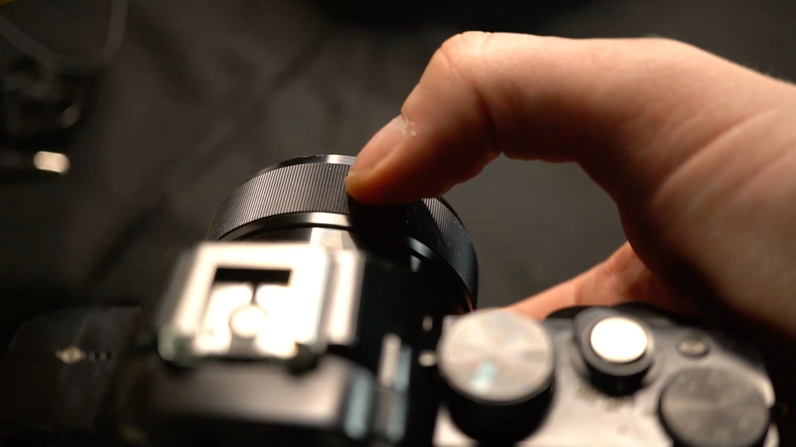

# Fokus auf Kameraeinstellungen

>[!WARNING]
>
> Die Unterstützung für 3D-Erfassungen wurde ab der Sampler-Version 5.1 entfernt.

## Kameraeinstellungen - Fokus

<b>Die Blende</b> ist die komplexeste Kameraeinstellung. Daher erläutern wir sie in diesem Benutzerhandbuch in der Tiefe.

Sie möchten sich diesen Leitfaden lieber als Video-Tutorial ansehen? Sie finden ihn hier [&#128279;](https://youtu.be/kFZ71ZWuap0?si=MDuvyO9w96rFpsQ9 "Blende und Fokus in der 3D-Erfassung").

## Fokussieren eines Objektivs

Standardmäßig steuert das Autofokus-System deiner Kamera dies und stellt den Fokus automatisch ein. Das macht Sinn, wenn du Menschen, große Umgebungen oder etwas Dynamisches fotografierst, aber für unser kontrolliertes, statisches Motiv könnte es sogar Probleme verursachen; Autofokus kann Fehler machen und ein Foto ruinieren, auch wenn es zwischen zwei Aufnahmen liegt.

Jeder DSLR kann vom Autofokus zu einem vollständigen <b>manuellen Fokus</b> wechseln. Das bedeutet, dass du den Fokus vollständig kontrollieren kannst, indem du den Fokusring auf dem Objektiv verdrehst. So kannst du sicher sein, dass der Fokus nicht zwischen den Aufnahmen hin- und herspringt. Wenn du dein Kamerahandbuch liest, gibt es wahrscheinlich Einstellungen, die dir helfen, z. B. &quot;Fokus-Peaking&quot;, bei dem ein Farbeffekt über das Kameradisplay gezeichnet wird. So siehst du, welcher Teil des Bildes scharf ist. Es kann sogar eine Zoom-Lupe geben, bei der die Anzeige einen kleinen, aufgeblasenen Teil der aktuellen Ansicht anzeigt, sodass Sie einen pixelgenauen Fokus erreichen. Besonders diese Zoom-Lupe ist wichtig, damit du den Fokus nicht verwackeln musst.

Die Verwendung des manuellen Fokus hilft Ihnen, besser zu sehen und zu verstehen, was mit Ihrer <b> Blende</b> und <b>Fokus</b> passiert. Der Nachteil ist, dass Sie <b>Ihren Fokus jedes Mal neu einstellen müssen, wenn sich Ihre Kamera oder Ihr Motiv bewegt</b>. Es ist leicht, ein Foto zu vergessen und zu ruinieren. Überlege dir also, ob du es dir zur Gewohnheit gemacht hast.

## Wahl des Blendenwerts

<b>Aperture</b> ist knifflig, da es <b>Fokus</b> und <b>Schärfe</b> betrifft. Wir wollen nicht, dass Teile unseres Motivs nicht scharf sind. Das führt zu Problemen beim Photogrammmetrie-Prozess. Das bedeutet, dass eine große Blende, bei Standardlinsen in der Regel zwischen f1.8 und f3.5, ein Problem darstellen wird. Auf der anderen Seite, mit der kleinstmöglichen Blendenöffnung, ist f/32 auch nicht großartig, die Dinge werden auch an diesem Ende weniger scharf, und die Menge des einfallenden Lichts ist winzig, was zu Problemen mit der Unterbeleuchtung führt.

Während die Tiefe des Bildes mit kleineren Blenden breiter wird, wird es auch mit dem Fokusabstand skaliert. Das bedeutet, dass du in der Nähe mehr Schärfentiefe hast und in weiter Ferne viel weniger, bis hin zu vollständiger Schärfe. Das kann bei kleinen Objekten problematisch sein, wenn sie den größten Teil des Fotos aufnehmen sollen.

Was ist also der richtige Blendenwert? Als Faustregel solltest du herausfinden, welcher Blendenbereich für dein Objektiv am schärfsten ist. Beginne mit diesem Wert. Dies ist wahrscheinlich <b> F8 oder f11, bis zu f16</b>.  Überprüfen Sie, ob <b>alles im Fokus ist</b>, falls nicht, reduzieren Sie Schritt für Schritt bis f20 oder so. Wenn das Objekt immer noch nicht vollständig scharf ist, kannst du versuchen, dich etwas weiter von ihm weg zu bewegen. Schon 10-15 cm Abstand können bei kleinen Objekten einen Unterschied machen.

Denke auch daran, dass deine Wahl des Objektivs einen Unterschied machen kann. Die mit einer Kamera gelieferten Standard-Kit-Objektive sind in der Regel nicht die schärfste oder höchste Qualität, und es kann sich lohnen, in ein höherwertiges Objektiv zu investieren. Besonders für Nahaufnahmen können Makroobjektive nützlich sein, da sie den Fokus viel näher an das Objektiv heranführen.

## Fokusklammern

Es gibt einen speziellen Trick, den Sie tun können, um perfekte Schärfe zu erzielen, wenn alles andere fehlschlägt. <b>Fokusklammern</b> bedeutet, dass Sie <b>mehrere Bilder</b> mit <b>unterschiedlichen Fokusabständen</b> aufnehmen und in Photoshop kombinieren. Es ist <b>viel zusätzliche Arbeit</b> erforderlich, insbesondere bei vollständigen Schleifenserien. Daher sollte es nur als letztes Mittel verwendet werden.

Wenn du zwei oder mehr Fotos mit unterschiedlichem Fokus hast, lade sie in verschiedene Ebenen.

Wählen Sie alle Ebenen aus und gehen Sie zu <b>Bearbeiten</b>. > <b>Ebenen automatisch ausrichten</b>. Alles OK mit den Standardeinstellungen. Photoshop versucht, alle ausgewählten Ebenen pixelgenau auszurichten

Wechseln Sie als Nächstes zu <b>Bearbeiten</b> > <b>Ebenen automatisch überblenden</b>. Wählen Sie wieder &quot;OK&quot; mit allen Standardeinstellungen. Photoshop verblendet die schärfsten Bereiche deiner Ebenen.

Wenn alles gut gelaufen ist, haben Sie jetzt ein perfekt scharfes Foto. Es lohnt sich, zumindest einige dieser Schritte in eine aufgezeichnete Aktion umzuwandeln, damit Sie etwas Zeit sparen.

Nachdem Sie nun alles über Aperture und Focus für die 3D-Erfassung gelernt haben, erfahren Sie mehr über [wie Sie eine ideale Beleuchtungskonfiguration erstellen](3d-capture-lighting-substance-3d-sampler.md).
