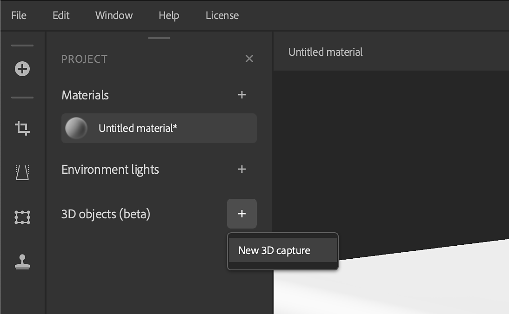

# Verarbeitung erweiterter 3D-Aufnahmen

>[!WARNING]
>
> Die Unterstützung für 3D-Erfassungen wurde ab der Sampler-Version 5.1 entfernt.

## Verarbeitung erweiterter 3D-Aufnahmen in Substance 3D Sampler

In diesem Benutzerhandbuch werfen wir einen Blick in die Tiefe auf die Verarbeitung Ihrer 3D-Erfassungen-Datensätze in Substance 3D Sampler.

Sie möchten dies als Video-Tutorial ansehen? Sie finden ihn hier [&#128279;](https://youtu.be/vJQ756Up55Y?si=GiAnajXRGkb5gyTH "Tutorial &quot;Erweiterte 3D-Erfassung - Aufnahmeverarbeitung&quot;").

Bei der 3D-Erfassung oder der Photogrammmetrie besteht die meiste Anstrengung darin, gute Fotos zu machen, welche Schritte in den vorherigen Artikeln des Benutzerhandbuchs beschrieben werden. Denke auch daran, dass wir die 3D-Erfassung für Objekte bis zu menschlicher Größe entwickelt und fokussiert haben. Bei der Verwendung eines sehr großen Datensatzes (d. h. über 6 Giga-Pixel, d. h. 500 Fotos mit 12 Megapixeln) können Probleme auftreten.

## Starten der 3D-Erfassung

Für den Einstieg in Sampler müssen Sie ein <b>neues Projekt</b> erstellen. Im Projektfenster wird ein neuer Abschnitt mit 3D-Objekten angezeigt. Klicken Sie daneben auf das Pluszeichen (+), und wählen Sie &quot;<b>Neues 3D-Objekt</b>&quot; aus, um mit der 3D-Erfassung in einem neuen, eigens dafür vorgesehenen Fenster zu beginnen.

Wähle alle Fotos im Explorer aus, und ziehe sie in das Fenster &quot;3D-Erfassung&quot;. Nachdem Sie Ihre Fotos für eine Weile geladen haben, werden sie in einer Liste und als Galerie mit Eigenschaften für die Auswahl auf der rechten Seite angezeigt.

Die Liste der Fotogruppen auf der linken Seite basiert auf der Kamera und der Linse, die für die Fotos verwendet wurden. Wenn Sie Fotos von mehreren Geräten mischen, z. B. von einem Mobiltelefon, einer DSLR-Kamera oder einer Drohne, erhalten Sie hier <b>separate Gruppen</b>.

Wenn die Gruppe ausgewählt ist, erhalten Sie einen Überblick über ihre Eigenschaften. Manchmal fehlen die <b>Brennweite</b> und die <b>Sensorgröße</b>. es ist möglich, diese <b>manuell</b> auszufüllen, wenn wir die Zahlen kennen. Diese Informationen können helfen, die Verarbeitung ein wenig zu verbessern.

## Generieren von Masken

Die wichtigste Option befindet sich im Abschnitt <b>Maske</b>. Da die Fotos auf einem Plattenteller aufgenommen wurden, änderte sich der Hintergrund nicht sehr, aber das Objekt änderte sich. Dies kann dazu führen, dass der Ausrichtungsprozess vollständig fehlschlägt. Hinzu kommt, dass der Hintergrund überhaupt keine aussagekräftigen Informationen enthält. Um dieses Problem zu lösen, maskiere das Motiv für jedes Foto.

Am einfachsten ist es, die automatische Stapelgenerierung zu verwenden. Wählen Sie <b>Generieren</b>, dann <b>Neuer Stapel</b>, und warten Sie, bis Sampler die Masken erstellt hat. Hier wird die Adobe Sensei-Technologie &quot;Motiv auswählen&quot; verwendet, genau wie in Photoshop. Bei 72 Fotos dauert dieser Vorgang etwas, bis er abgeschlossen ist, also sei am besten geduldig.

Sie können eine einzelne Maske überprüfen, indem Sie <b>ein Foto </b> auswählen und rechts unten neben dem Maskenpfad auf das <b>Augensymbol </b> klicken. Hier sehen Sie eine Graustufenvorschau der Maske. Wenn die automatische Maskierung einen Fehler macht und Teile des Hintergrunds beibehalten, keine Sorge, ein paar falsche Masken sind kein Problem.

Bei den meisten Masken sollte es sich nur um das Motiv handeln. Aus diesem Grund ist es wichtig, Ihre Fotos auf einem <b>einheitlichen, einfachen Hintergrund</b> aufzunehmen; die automatische Maskierung funktioniert viel einfacher. Wenn die meisten Masken nicht korrekt sind, kannst du entweder alle manuell korrigieren oder die Fotos mit einem geeigneteren Hintergrund neu aufnehmen.

Möglicherweise versuchen Sie ein Dataset mehrmals, und Sie möchten vermeiden, die Masken jedes Mal neu zu generieren, da Sampler diese löscht, sobald Sie die App schließen. Ihre Masken werden in Ihren Dokumenten\Adobe\Adobe Substance 3D Sampler\3DCapture\p1 zwischengespeichert. Wenn Sie mehrere Assets in einer Sitzung ausführen, erhalten Sie Ordner mit den Namen p2, p3 usw. Es empfiehlt sich, <b>die zwischengespeicherten Masken an einen sicheren Speicherort mit Ihrem Dataset zu kopieren</b>. Sie können daher Zeit sparen, wenn Sie dieses Dataset erneut aufrufen müssen.

## Ausrichtung

Mit den richtigen Masken kannst du nun zur Ausrichtung übergehen. Drücken Sie die <b>blaue Senden-Schaltfläche</b> oben rechts. Sie erhalten zwei Optionen: <b>Genauigkeit</b> und <b>Fotobestellung</b>.

* <b>Genauigkeit</b> kann die Ausrichtung verbessern. Es empfiehlt sich, bei &quot;Niedrig&quot; zu beginnen. Wenn Sie fehlerhafte Fotos erhalten, versuchen Sie es erneut mit &quot;Hoch&quot;.
* <b>Fotobestellung</b> bezieht sich auf die Reihenfolge, in der Sie Ihre Fotos aufgenommen haben. Wenn du dich um ein Objekt gekümmert und in spiralförmigen Kreisen gedreht hast, kannst du zu einer Sequenz wechseln, um etwas Zeit zu sparen. Die Standardeinstellung ist jedoch die sicherste Option, auch wenn die Ausrichtung etwas länger dauern kann.

Klicken Sie auf <b>Prozess</b>, und warten Sie, bis die Ausrichtung abgeschlossen ist. Dies kann einige Minuten dauern, also am besten noch einmal geduldig sein. Wenn du fertig bist, siehst du eine Punktwolkendarstellung deines Objekts, um die herum jedes Foto als Kamera gleitet. Ein orangefarbenes Warndreieck oben links bedeutet, dass einige Fotos <b> nicht ausgerichtet werden konnten</b>. Probieren Sie es mit der Option &quot;Hohe Präzision&quot; und der Standardbestellung aus, falls Sie dies noch nicht getan haben. Einige Fotos können immer noch nicht ausgerichtet werden. Das bedeutet, dass es zu wenig Überlappungen oder zu wenig Details gibt. Möglicherweise musst du deinen Fotografierprozess überdenken, um dieses Problem zu lösen, oder du kannst sie einfach ignorieren, wenn es nur wenige Fotos sind.

Betrachtet man die Punktwolkendaten, sieht man möglicherweise <b>Streupunkte, die um das Objekt herum schweben</b>, die nicht als Teil des Objekts vorgesehen sind. Dies ist in der Regel auf eine schlechte Maskierung zurückzuführen. In diesem Fall haben einige schlechte Masken dazu geführt, dass die Maske bei einigen Dust-Partikeln übernommen wurde. Y<b>Sie können diese ausschneiden</b>, indem Sie das Augensymbol rechts neben dem Fokusbereich verwenden. <b>Verschieben Sie einfach die quadratischen Griffe</b>, die um das Objekt herum anscheinend enger eingepasst sind. Alle Punkte außerhalb dieses Felds, die in Dunkelgrau angezeigt werden, werden nicht in Ihr endgültiges 3D-Modell aufgenommen. Sie können diesen Begrenzungsrahmen auch verwenden, um Ihr Modell <b> vorab zu drehen und besser auszurichten.</b>

Manchmal haben Punktwolken viel dichtere Punkte als andere. Das ist kein Problem. Weniger Punkte bedeuten, dass die Oberfläche weniger kleine geometrische Details aufweist. Es kommt aus einem Mangel an Details und Kontrast in einigen Teilen des Objekts, während andere mehr Details haben.

## Geometrie-Details

Es gibt nur noch eine Einstellung, bevor wir unseren Mesh erstellen. Unter Geometriedetails können Sie die anfängliche Geometriedetailstufe auswählen.

* <b>Raw</b> ist die <b>nicht dezimierte Mes</b>h. Es wird nicht wirklich empfohlen, diese Option zu verwenden, es sei denn, Sie sind sicher, dass Sie diese benötigen.
* <b>Voll in Entwurf</b> sind <b>dezimierte Mesh</b>. Sie sollten niedrigere Optionen auswählen, um ein Testergebnis schneller zu erhalten, höhere Optionen, um mehr Details auf Kosten einer langsameren Verarbeitung zu erhalten.

Klicken Sie auf <b>Senden, um die Verarbeitung des Meshs zu starten</b>. Dieser Vorgang kann eine Weile dauern und länger dauern als jeder der vorherigen Schritte.

## Vorschau und Nachbearbeitung

Wenn das Gitter fertig ist, können wir es im finalen Fenster in der Vorschau anzeigen und nachbearbeiten, bevor wir es zu unserem Sampler-Projekt hinzufügen. Dieser Modus enthält einige Schaltflächen am unteren Rand, um Ihren Mesh mit <b>Textur</b>, <b>schattierter Farbfläche</b>, als <b>Drahtgitter</b> und mit einem <b>UV-Checker-Material</b> anzuzeigen. Über die Nachbearbeitungseinstellungen können Sie eine neue Version Ihres Meshs generieren. Das heißt, du hast ein neues getesseltes Gitter mit neuen automatischen UVs und eine Struktur, die aus dem ursprünglichen Gitter verbacken ist. Mit den Hauptsteuerelementen können Sie die Anzahl der Zielflächen festlegen und zwischen Normal, Height und AO Backen umschalten. Es gibt zahlreiche erweiterte Einstellungen, die angepasst werden müssen, aber die Standardeinstellungen funktionieren in der Regel einwandfrei.

Sie können diesen Maschenverarbeitungsschritt auch anschließend ausführen, sobald das Gitter zu Sampler hinzugefügt wurde. Nachdem du sie zu Sampler hinzugefügt hast, kannst du ihr einen Namen geben. Dieser wird dann in deiner Projektliste angezeigt.

Sie können das Gitter und die Texturen bearbeiten, aber Sie können Ihr Ergebnis bereits mit <b>Freigeben</b> exportieren. > <b>Dialogfeld &quot;Exportieren als</b>&quot;. Mit <b>Allgemeine Einstellungen</b> können Sie Name und Pfad auswählen, mit <b>Mesh-Einstellungen</b> können Sie das 3D-Mesh-Format auswählen, und mit <b>Material-Einstellungen</b> können Sie das Material des Meshs konfigurieren. Sie können Mesh oder Material deaktivieren, um nur einen davon einzeln zu exportieren. Der exportierte Mesh kann in anderen 3D-Anwendungen verwendet werden.

Erfahren Sie jetzt, wie Sie [Ihre erfassten 3D-Meshes in Sampler weiter bearbeiten](editing-3d-captured-meshes.md).
