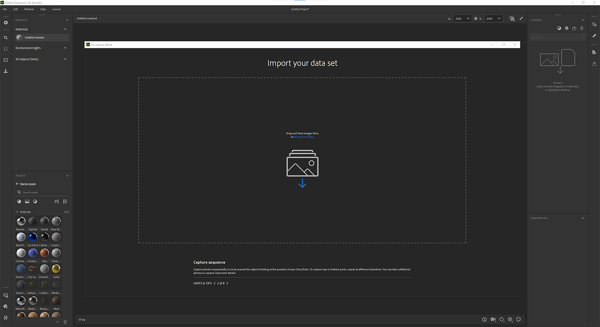
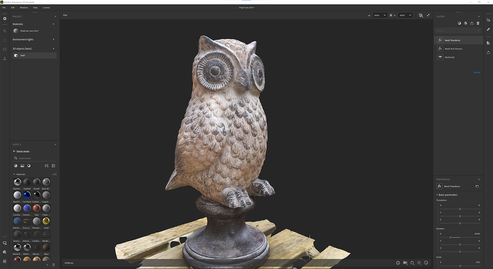

# 3D-Aufnahme

## Erste Schritte

## Was ist Photogrammmetrie?

Sampler verwendet die Photogrammmetrie, um Bilder in einen Mesh mit Texturen transformieren. Die Fotogrammetrie ist die Wissenschaft, Messungen anhand von Bildern vorzunehmen. Es wird verwendet, um Informationen aus Fotos zu extrahieren, 3D-Modelle und Texturen zu erstellen. Dabei fotografiert man ein Objekt aus unterschiedlichen Blickwinkeln und verarbeitet die Bilder, um Informationen über Form und Lage der Gesichtsmerkmale zu gewinnen.

Es wird angestrebt, die jeweiligen Merkmale der Abbildungen aufeinander abzustimmen, um die Relativpositionen der Kamera für jedes Abbild festzulegen. Aus den angepassten KEs wird ein 3D-Modell des Objekts rekonstruiert. Im letzten Schritt werden die Texturen auf das 3D-Modell projiziert.

## Hardware-Anforderungen

Die 3D-Erfassung ist unter Windows und MacOS Monterey oder Ventura verfügbar.

Windows/Linux

Wir empfehlen:

* GPU mit 8 GB VRAM
* 16 GB RAM. Idealerweise 32 GB und 64 GB.
* Mindestens 10 GB Festplattenspeicher

[Linux-Konfiguration](https://helpx.adobe.com/de/substance-3d/unlisted/documentation/sadoc/3d-capture-set-up-on-linux-255426606.html)

Mac

* Apple Silicon-Geräte werden dringend empfohlen (M1 oder M2)
* Intel- und AMD-GPU mit mindestens 4 GB VRAM- und Raytracing-Unterstützung

## Neue 3D-Erfassung erstellen

## Datensatz importieren

## Vorbereitung des Datensatzes

Ziehen Sie Ihre Fotos per Drag &amp; Drop oder klicken Sie auf , um den Explorer Ihres Betriebssystems zu durchsuchen.

>[!NOTE]
>
> **Dataset-Empfehlungen**
> 
> Es wird empfohlen, ein Dataset zu verwenden, das mindestens <b>20 Images</b> enthält, damit die 3D-Erfassung reibungslos ausgeführt werden kann.

Für iPhone-Benutzer wird das .HEIC-Format noch nicht unterstützt. Sie können Lightroom verwenden, um eine .jpeg-Datei zu konvertieren.

In MacOS können Sie Ihre Bilder mit [Schnellaktionen](https://support.apple.com/en-gb/guide/mac-help/mchl97ff9142/mac) konvertieren.

Für Kameras-RAW-Formate empfehlen wir die Verwendung von Lightroom, um Ihre Fotos in .jpeg zu konvertieren.

>[!NOTE]
>
> **Dataset-Einschränkungen**
> 
> **Windows**: Ihr Datensatz muss insgesamt kleiner als 6 G Pixel (6 000 000 000 Pixel) sein. Es repräsentiert 500 Fotos mit 12 Millionen Pixeln

Sobald die Fotos importiert sind, können Sie auf ein Foto klicken, um es vollständig anzuzeigen.

Fotogruppendefinition:

Ihr Datensatz kann in mehrere Fotogruppen aufgeteilt werden. Fotogruppen gruppieren Fotos nach Eigenschaften (Sensorgröße, Brennweite, Drehung,...)

## Maskierung

Die Verwendung von Masken hat viele Vorteile. Es ermöglicht dem photogrammmetrischen Prozess, Merkmale zu erkennen und nur nicht maskierte Bereiche zu rekonstruieren.

Dies ermöglicht es auch, das Objekt während der Aufnahme zu verschieben, da die Masken den Hintergrund auf allen Fotos verbergen.

Um Masken zu verwenden, wählen Sie eine Fotogruppe aus und öffnen Sie die Registerkarte **Maske** auf der rechten Seite.

Sie können Masken importieren, indem Sie eine Benennungskonvention einhalten:

* [image\_name].file\_extension
* [image\_name]\_mask.file\_extension

Mit unserer KI-gestützten Technologie kannst du Masken automatisch anhand von Fotos generieren.

## Ausrichtung

Die Ausrichtung besteht darin, alle Bilder so zu verarbeiten, dass sie extrahiert werden, und die zugehörigen Features so anzupassen, dass die Relativpositionen der Kamera für jedes Bild festgelegt werden.

## Einstellungen

Genauigkeit

Es gibt zwei Optionen: &quot;Niedrig&quot; und &quot;Hoch&quot;.

* Niedrig: Empfohlen für die meisten Datensätze.
* Hoch: Erhöhen Sie die Punktzahl. Es wird empfohlen, mehr Bilder abzugleichen, wenn das Motiv nicht genügend Textur hat oder die Bilder klein sind. Diese Einstellung verlangsamt die Verarbeitung. Wir empfehlen Ihnen, die niedrige Option zuerst auszuprobieren.

Fotoreihenfolge

Es gibt zwei Optionen: &quot;Standard&quot; und &quot;Sequenz&quot;.

Dies kann mithilfe verschiedener Algorithmen für den Funktionsabgleich berechnet werden:

* Standard: Die Auswahl basiert auf mehreren Kriterien, darunter Ähnlichkeit zwischen Bildern.
* Sequenz: Verwenden Sie nur Nachbarbilder innerhalb der angegebenen Entfernung, die für die Verarbeitung einer einzelnen Sequenz von Fotos empfohlen werden, wenn der Standardmodus fehlgeschlagen ist. Die Fotoeinfügungsreihenfolge muss der Sequenzreihenfolge entsprechen.

## Punktwolke und Kameras-Position

Das Ergebnis des Ausrichtschrittes ist eine spärliche Punktwolke mit allen erkannten Funktionen und der Lage aller Kameras.

Wenn die Bildkontur grün ist, wurde das Bild korrekt ausgerichtet.

Wenn die Bildkontur orange ist, wurde das Bild nicht korrekt ausgerichtet und es wurde keine Funktion aus diesem Bild extrahiert.

Klicke auf das linke Bedienfeld, um die Punktwolke auf der zugehörigen Kamera Rahmen.

Du kannst auf eine Kamera klicken, um einen Rahmen mit der Punktwolke darauf zu erstellen.

## Wiederaufbau

Der Rekonstruktionsschritt erzeugt aus den angepassten KEs ein 3D-Modell des Objekts, indem die Texturen auf das 3D-Modell projiziert werden.

## Einstellung

Geometrie-Details Diese Option legt die Präzisionsstufe in Eingabefotos fest, was zu mehr oder weniger Details im berechneten 3D-Modell führt.

## Fokusbereich

Bevor Sie das 3D-Modell generieren, können Sie den Bereich festlegen, der mithilfe des Begrenzungsrahmens um die Punktwolke herum rekonstruiert werden soll.

Sie können den Rahmen in 3 Achsen Kamera bewegen, skalieren und drehen.

Wenn Sie beim Skalieren die Umschalttaste drücken, wird das Rechteck von der Mitte aus skaliert.

<table>
<tr style="border: 0;">
<td style="border: 0;" valign="top">

</td>
<td style="border: 0;" valign="top">

</td>
</tr>
</table>

## Nachbearbeitung

Die Nachbearbeitung hilft Ihnen dabei, Ihren Mesh und Ihre Texturen an Ihre Bedürfnisse und die Art und Weise, wie Sie ihn verwenden möchten, anzupassen und zu optimieren.

Das Ergebnis der Rekonstruktion kann einen Mesh mit Millionen von Polygonen und bis zu 16K Texturen erzeugen. Oft ist dies nicht für Rendering, Echtzeit oder AR-Erlebnisse optimiert.

Sie müssen das Ergebnis nachbearbeiten, um die Anzahl der Polygone zu reduzieren, ohne Details zu verlieren.

Der Nachbearbeitungsschritt verkettet automatisch 4 Schritte:

* Dezimation: Reduzieren Sie die Anzahl der Polygone, indem Sie die Anzahl der gewünschten Flächen festlegen
* UV entpackt: Definiert automatisch Nähte, entpackt und verpackt UVs des dezimierten Meshs
* Reprojektion: Neuprojektion der farbigen Textur des photogrammmetrischen Meshs auf den dezimierten Mesh
* Baking: Baking führe Normal-, Height- und AO-Angaben aus dem photogrammmetrischen Mesh auf den dezimierten Mesh. Dadurch wird sichergestellt, dass alle während der Dezimierung verlorenen Mesh-Daten in Texturen-Maps übertragen werden.

## Version

Um verschiedene Optionen nach dem Prozess einfach zu iterieren und zu testen, können Sie mehrere Versionen erstellen und die Version auswählen, die Ihrem Projekt hinzugefügt werden soll.

Um Ihnen zu helfen, können Sie den Mesh in einem anderen Modus anzeigen.

Durchgezogener Modus

Drahtgitter

UV Raster

## Arbeitsablauf ohne Zerstörung

Sobald eine Version dem Projekt hinzugefügt wurde, wird ein Ebenenstapel mit mehreren Ebenen erstellt.

Die erste Ebene ist das Ergebnis der Rekonstruktion.

Die zweite Ebene (wenn Sie eine Nachbearbeitung durchgeführt haben) ist die Mesh-Nachbearbeitungsebene mit den im Fenster &quot;3D-Erfassungen&quot; definierten Werten. Sie können die Parameter in diesem Schritt weiterhin bearbeiten, wenn Sie andere Einstellungen verwenden möchten.

Die dritte Ebene ist eine im Mesh transformieren Ebene, auf der du dein 3D-Objekt skalieren, Kamera bewogen und drehen kannst.

In dieser Phase können Sie Filter hinzufügen, die Sie auf Materials anwenden, um die Texturen des 3D-Objekts zu bearbeiten.

## Exportieren

Im Exportfenster können Sie das Mesh- und Material-Format definieren (dieselben Einstellungen, wenn Sie ein Material exportieren).

## Tutorials

[Zu den erweiterten Tutorials](https://substance3d.adobe.com/tutorials/courses/Advanced-3D-Capture/youtube-f8iCtZ3Gmzs)

## FAQ

**Was sind die besten Aufnahmebedingungen für die Photogrammmetrie?**

Damit die Photogrammmetrie präzise Ergebnisse liefert, ist es wichtig, bestimmte Best Practices beim Aufnehmen von Bildern zu befolgen.

1. Beleuchtung: Die Fotogrammetrie funktioniert am besten, wenn Bilder bei guten Lichtverhältnissen aufgenommen werden. Vermeide es, Bilder bei schlechten Lichtverhältnissen oder mit kontrastreicher Beleuchtung aufzunehmen, da diese die präzise Extraktion von Gesichtsmerkmalen erschweren können. Die besten Lichtverhältnisse für die Photogrammmetrie sind bewölkte Tage oder schattige Bereiche.
1. Überlappung: Um sicherzustellen, dass die Bilder genügend Informationen enthalten, um Funktionen exakt zu extrahieren, ist es wichtig, Bilder mit signifikanten Überschneidungen aufzunehmen. Als Faustregel gilt, dass sich die Bilder sowohl horizontal als auch vertikal zu mindestens 60 % überlappen.
1. Kamera: Verwenden Sie eine hochauflösende Kamera und ein Objektiv, die eine gute Bildqualität und Schärfe aufweisen. Vermeiden Sie Kameras mit einem Fischaugenobjektiv oder einem Weitwinkelobjektiv, da dies zu geometrischen Verzerrungen führen kann, die sich auf das Endergebnis auswirken können.
1. Ausrichtung: Achte beim Fotografieren darauf, dass die Kamera waagerecht und senkrecht zum Boden verläuft. Aus einem Winkel aufgenommene Bilder können das Extrahieren von Gesichtsmerkmalen erschweren und zu verzerrten Ergebnissen führen.
1. Kalibrierung der Kamera : Achte vor der Aufnahme darauf, dass die Kamera kalibriert ist. Auf diese Weise lassen sich Linsenfehler und andere Verzerrungen korrigieren, die sich auf die Genauigkeit der Endergebnisse auswirken können.

**Wie funktioniert es für Specular und reflektierende Objekte?**

Bei der Arbeit mit stark reflektierenden oder Specular-Objekten kann die Photogrammmetrie eine Herausforderung darstellen, da die hellen Reflexionen das Extrahieren von Gesichtsmerkmalen erschweren können. Hier einige Strategien, mit denen sich diese Herausforderungen bewältigen lassen:

1. Beleuchtung: Versuche, bei Aufnahmen von stark reflektierenden Objekten direktes Sonnenlicht zu vermeiden, und fotografiere stattdessen bei bedecktem oder schattigem Himmel. So kannst du die Intensität von Reflexionen reduzieren und leichter Merkmale aus den Bildern extrahieren.
1. Matte-Finish: Die matte Oberfläche der reflektierenden Elemente kann die Intensität der Reflexionen reduzieren und das Extrahieren von Gesichtsmerkmalen vereinfachen.
1. Mehrere Bilder aufnehmen: Die Aufnahme mehrerer Bilder desselben Objekts aus verschiedenen Winkeln kann helfen, die Wirkung von Reflexionen zu reduzieren und die Wahrscheinlichkeit erhöhen, dass aus mindestens einigen der Bilder Merkmale extrahiert werden können.
1. Bildbearbeitung: In der Nachbearbeitung können bestimmte Bildbearbeitungssoftware wie Lightroom verwendet werden, um Reflexionen zu reduzieren und Funktionen in den Bildern zu verbessern, wie z. B. die Erhöhung des Kontrasts oder die Farbkorrektur.

Bedenke, dass reflektierende Objekte möglicherweise eine aufwändigere Einrichtung und Behandlung benötigen und es möglicherweise nicht in allen Fällen möglich ist, perfekte Ergebnisse zu erzielen. Es empfiehlt sich, mit verschiedenen Techniken zu experimentieren.

**Was ist die Empfehlung zwischen einem Mobiltelefon und einer DSLR-Kamera für die Photogrammmetrie?**

Sowohl Mobiltelefone als auch DSLR-Kameras können für die Photogrammmetrie verwendet werden, haben aber unterschiedliche Stärken und Schwächen. Bei der Entscheidung, welche Art von Kamera verwendet werden soll, sind folgende Punkte zu beachten:

1. Lösung: DSLR-Kameras haben in der Regel eine viel höhere Auflösung als Mobiltelefone, was zu detaillierteren und genaueren Ergebnissen führen kann. Mit den jüngsten Fortschritten bei der Kamera von Mobiltelefonen weisen einige hochwertige Mobiltelefon-Kameras jedoch eine ähnliche Auflösung und Bildqualität auf wie einige untere DSLR-Kameras.
1. Kalibrierung der Kamera: Die Photogrammmetrie beruht auf einer präzisen Kamera-Kalibrierung, die mit Kameras von Mobiltelefonen in der Regel schwieriger zu erreichen ist als mit DSLR-Kameras. Einige Handy-Kameras verfügen über integrierte Kalibrierungsparameter, die Sie verwenden können, aber sie sind möglicherweise nicht so genau wie die richtige Kalibrierung einer DSLR-Kamera.
1. Akkulaufzeit und Lagerung: Handy-Kameras haben eine eingeschränktere Akkulaufzeit als DSLR-Kameras. Daher müssen Sie planen, während der Arbeit das Telefon aufzuladen oder zusätzliche Akkus mitzunehmen. Darüber hinaus müssen Sie sicherstellen, dass das Telefon über genügend Speicherkapazität verfügt, um große Bilddateien zu verarbeiten.
1. Kosten: DSLR-Kameras sind in der Regel teurer als Mobiltelefone und erfordern zudem zusätzliches Zubehör wie Stative und externe Blitzgeräte.
1. Portabilität: Ein Mobiltelefon ist tragbarer als eine DSLR-Kamera, und es ist wahrscheinlicher, dass Sie Ihr Mobiltelefon dabei haben, wenn Sie auf ein interessantes Objekt oder eine Szene stoßen, die Sie für die Photogrammmetrie festhalten möchten.

Zusammenfassend lässt sich sagen, dass es wirklich von Ihren spezifischen Bedürfnissen und den Merkmalen des Projekts abhängt. Für Projekte mit geringerer Auflösung kann ein Mobiltelefon ausreichen. Wenn jedoch hohe Präzision und Auflösung erforderlich sind, ist eine DSLR-Kamera möglicherweise die bessere Wahl. Wenn du planst, regelmäßig oder für ein langfristiges Projekt zu fotografieren, kann die Investition in eine DSLR-Kamera langfristig eine kostengünstigere Lösung sein.

**Wie sollte ich meine Kamera kalibrieren, um die Weichzeichnung auf mein Objekt zu beschränken?**

Die Objektivkalibrierung ist ein wichtiger Schritt im photogrammmetrischen Prozess, der dabei hilft, Objektivfehler und andere Verzerrungen zu korrigieren, die die Kamera der Endergebnisse beeinflussen können. Im Folgenden finden Sie einige Schritte, die Sie ausführen können, um Ihre Kamera zu kalibrieren und den Weichzeichner auf Ihr Objekt zu beschränken:

1. Verwenden Sie ein Stativ: Um die Kamera stabil zu halten und Unschärfen zu verringern, ist es wichtig, bei der Aufnahme von Bildern für die Photogrammmetrie ein Stativ zu verwenden. Dadurch wird sichergestellt, dass sich die Kamera für jede Aufnahme in derselben Position befindet, und die Kamera kann so minimiert werden.
1. Fernauslöser verwenden: Um die Kamerabewegung weiter zu reduzieren, kannst du einen Fernauslöser oder einen Selbstauslöser an der Kamera verwenden, um die Kameras aufzunehmen. So lassen sich Verwacklungen der Kamera durch Drücken des Auslösers minimieren.
1. Passen Sie die Verschlussgeschwindigkeit an: Um die durch die Bewegung der Kamera verursachten Unschärfen zu reduzieren, solltest du eine kurze Verschlusszeit verwenden. Als Faustregel gilt, eine Verschlussgeschwindigkeit zu verwenden, die mindestens so schnell ist wie der Hin- und Hergang der Brennweite des Objektivs. Wenn du beispielsweise ein 50-mm-Objektiv verwendest, solltest du eine Verschlussgeschwindigkeit von mindestens 1/50 einer Sekunde verwenden.
1. Verwenden Sie einen hohen ISO-Wert: Bei schlechten Lichtverhältnissen ist möglicherweise ein höherer ISO-Wert erforderlich, um eine kurze Verschlusszeit einzuhalten und Unschärfen zu reduzieren. Beachten Sie jedoch, dass ein hoher ISO-Wert auch das Rauschen im Bild erhöhen kann, was sich auf die Genauigkeit der Endergebnisse auswirken kann.
1. Blitzlicht verwenden: In manchen Situationen kannst du mit einem Blitz die Unschärfe verringern, die durch schlechtes Licht verursacht wird. Denke daran, dass Blitzlicht in einigen Fällen auch Reflexionen und andere Probleme verursachen kann. Experimentiere also mit Blitz- und Nicht-Blitzaufnahmen, um herauszufinden, welche für deine spezifische Anwendung am besten geeignet sind.

Denken Sie daran, dass die Kalibrierung ein iterativer Prozess ist und möglicherweise mehrere Versuche erfordert, um gute Ergebnisse zu erzielen.

**Kann ich das Objekt während der Aufnahme für die Photogrammmetrie verschieben?**

In den meisten Fällen wird es nicht empfohlen, das Objekt während der Aufnahme für die Photogrammmetrie zu verschieben. Der Prozess der Fotogrammetrie beruht darauf, dass sich das Objekt in einer festen Position für jedes Bild befindet, da die Software die relativen Positionen von Merkmalen in den Bildern verwendet, um ein 3D-Modell des Objekts zu rekonstruieren.

Wenn das Objekt während der Aufnahme verschoben wird, wird es an einer anderen Position in jedem Bild angezeigt, was es der Software erschwert, die entsprechenden Funktionen zwischen den Bildern abzugleichen. Dies kann zu Ungenauigkeiten im endgültigen 3D-Modell führen und den Bildabgleich erschweren oder unmöglich machen.

Es gibt jedoch einige Fälle, in denen das Verschieben des Objekts von Vorteil sein kann. Zum Beispiel ist es bei kleinen Objekten, bei denen es schwierig ist, Bilder mit signifikanter Überlappung aufzunehmen, möglich, einen Drehtisch zu verwenden und das Objekt zu drehen, um sicherzustellen, dass alle Funktionen aus mehreren Winkeln aufgenommen werden.
