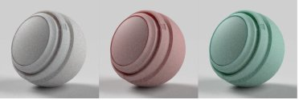
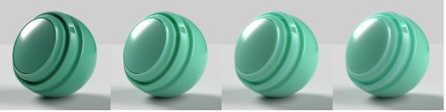
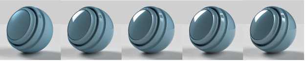

# Adobe-Standardmaterial

>[!NOTE]
>
> Substance 3D Sampler verwendet jetzt standardmäßig das Materialmodell [OpenPBR](openpbr.md) und nicht das Adobe Standard Material.

## Standardeigenschaften von Materialien

## Eigenschaften der Basisoberfläche

**Grundfarbe**

Die Farbe der Oberfläche.

**Raueit**

Wie glatt oder matt die Oberfläche ist.

**Metallisch**

Der metallic Glanzgrad der Oberfläche.

**Deckkraft**

Die Sichtbarkeit der Oberfläche.

**Ambient occlusion**

Schatten aus Hohlräumen und Falten, die verhindern, dass Licht auf die Oberfläche trifft.

**Specular level**

Die Stärke von Lichtreflexionen auf der Oberfläche.

**Specular edge color**

Die Farbe von Lichtreflexionen. Wirkt sich auf die Blickwinkel bei metallic Materialien aus.

**Normal**

Simuliert Oberflächendetails wie Unebenheiten und Risse.

**Normale Skalierung**

Die Stärke des Normaleffekts.

**Normal und Height kombinieren**

Wendet die normale Textur auf die Textur des Heights an.

**Height**

Erstellt Oberflächendetails mithilfe eines Bump- oder Geometrie-Versatzes.

**Height-Skalierung**

Die Skala des Heights in Szenen. Gilt sowohl für Bump als auch für Versatz.

**Height-Ebene**

Der Wert der Textur des Heights, der Null-Versatz darstellt.

**Anisotropy level**

Der Grad, in dem die Reflexionen entlang der Oberfläche in eine Richtung gedehnt werden.

**Winkel der Anisotropie**

Die Drehung des anisotropen Effekts im Gegenuhrzeigersinn.

**Emissionsintensität**

Die Intensität des von der Oberfläche emittierten Lichts.

**Emissionsfarbe**

Die Farbe des emittierten Lichts.

**Deckkraft des Glanzes**

Simuliert die Wirkung mikroskopischer Fasern oder Fuzz auf die Oberfläche.

**Glanzfarbe**

Die Farbe des Effekts &quot;Glanz&quot;.

**Glanz Rauheit**

Weichheit des Effekts &quot;Glanz&quot;.

## Innen-Eigenschaften

**Translucency**

Die Menge an Licht, die durch die Oberfläche übertragen werden kann.

**Absorptionsfarbe**

Das Farblicht wird bei der Absorption konvergiert.

**Entfernung von der Absorption**

Ungefähre Entfernung in Szene, die das Licht zurücklegt, bevor es die Absorptionsfarbe erreicht. Bei einem Wert von Null wirkt sich die Thickness nicht auf die Absorptionsfarbe aus.

**Brechungsindex**

Die Menge an Licht, die sich beim Durchdringen des Objekts beugt.

**Dispersion**

Der Wert, um den sich das Farbspektrum beim Brechen ausbreitet.

**Volumenstreuung**

Streuungen werden unter der Wasseroberfläche beleuchtet, anstatt direkt durch die Oberfläche zu gehen.

**Streufarbe**

Die Farbe unterhalb der Oberfläche, in der das gestreute Licht erscheint.

**Streuungsabstand**

Ungefähre Entfernungen müssen erfasst werden, bevor die Streuung vollständig erreicht wird.

**Streudistanzskala**

Ein Multiplikator des Abstands der Streuung. Kann für jeden Farbkanal unterschiedlich sein.

**Rote Schicht**

Legt fest, dass sich rotes Licht weiter bewegt als andere Lichtfarben. Nützlich für Haut.

**Rayleigh-Streuung**

Legt fest, dass sich orangefarbenes Licht weiter unter der Oberfläche bewegt und blaues Licht weniger.

**Volume-Thickness**

Die Thickness der Fläche relativ zum Begrenzungsrahmen des Objekts. Wird für Inneneffekte verwendet, wenn die tatsächliche Thickness nicht bekannt ist.

**Skalierung der Volume-Thickness**

Multiplikator der Lautstärke-Thickness.

## Fellbeschaffenheit

**Coat opacity**

Simuliert eine Ebene über dem Material. Wird verwendet, um klare Schichten, Lacke und Lacke zu erzeugen.

**Mantelfarbe**

Die Farbe des Fells.

**Coat roughness**

Glätten oder Matte der Felloberfläche

**Brechungsindex der Beschichtung**

Die Lichtmenge bricht sich beim Durchgang durch das Fell.

**Coat specular level**

Die Stärke von Lichtreflexionen auf dem Fell bei Blickwinkeln.

**Coat normal**

Simuliere Oberflächendetails wie Unebenheiten und Risse auf der Mantelfläche.

**Normale Skala beschichten**

Die Festigkeit des Effekts &quot;Fell-Normal&quot;.
