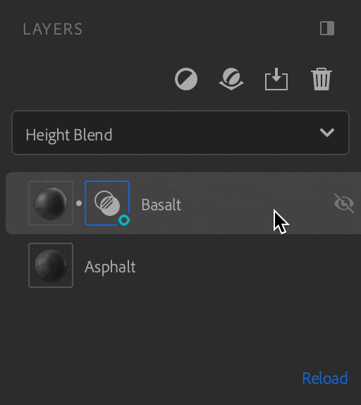

# Exportieren von parametrischen Elementen

Verfügbare Parameter können in anderen Anwendungen geändert werden, ohne dass Sie zu Sampler zurückkehren müssen. Dies verkürzt die Iterationszeit, sodass Sie sich darauf konzentrieren können, das beste Aussehen zu finden, ohne zwischen den Anwendungen hin- und herwechseln zu müssen.

## Belichtungs- und Unbelichtungsparameter

Öffnen Sie das **Eigenschaftenfenster**, um Parameter anzuzeigen. Zeigen Sie mit der Maus oder klicken Sie mit der rechten Maustaste auf den gewünschten Parameter, klicken Sie dann auf das Pin-Symbol oder auf &quot;diesen Parameter anzeigen&quot;.

Es gibt zwei Möglichkeiten, die Anzeige eines Parameters aufzuheben:

* Klicken Sie auf der **Bedienfeld „Veröffentlichte Parameter“** mit der rechten Maustaste auf den Parameter, und wählen Sie &quot;unexpose&quot; aus.

  
* Klicken Sie im **Eigenschaftenbedienfeld** auf das Symbol mit dem gekreuzten Pin, oder klicken Sie mit der rechten Maustaste auf den Parameter, und wählen Sie &quot;diesen Parameter entlarven&quot;.

  

Die Parameter der folgenden Filter können nicht angezeigt werden:

* Bild zu Material (KI-gestützt)
* Inhaltsbasierte Füllung
* Normal zu Height
* Hochskalieren

Wenn Sie einen der Filter über den Ebenen hinzufügen, die exponierte Parameter enthalten, werden diese beim Export nicht angezeigt.\
Um dies zu vermeiden, entfernen Sie den Filter oder platzieren Sie ihn dort, wo er keine Auswirkungen auf Ebenen mit exponierten Parametern hat.

Wenn Sie exponierte Parameter aus einer Angleichung haben, gehen diese verloren, wenn Sie die Ebene am unteren Rand des Stapels verschieben.

## Parameter bearbeiten.

Bearbeiten Sie die Beschriftung des Parameters, indem Sie mit der rechten Maustaste auf der **Bedienfeld „Veröffentlichte Parameter“** darauf klicken, geben Sie den neuen Namen ein und klicken Sie auf &quot;Anwenden&quot;.

Sie können den Parameter auf der **Bedienfeld „Veröffentlichte Parameter“** wie im **Eigenschaftenfenster** verwenden.

## Material exportieren.

So exportieren Sie das Material mit den exponierten Parametern

1. Öffnen Sie das <b>Exportbedienfeld.</b>
1. Klicken Sie auf Exportieren.
1. Wählen Sie SBSAR oder SBS.
1. Klicke auf Exportieren .

Sie können das Material jetzt mit den exponierten Parametern in jeder Software verwenden, die das SBSAR-Dateiformat unterstützt.
