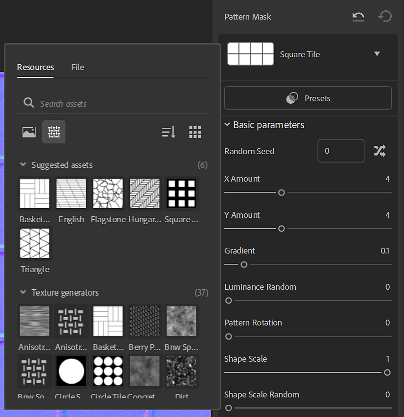

# Texturgeneratoren

Textur-Generatoren bieten eine verbesserte Kontrolle über die Erstellung von Materialien mithilfe von <b>parametrischen Rauschen, Mustern </b> und <b> Grunges</b>-Optionen. Die erzeugten Bilder können in Masken oder Kanalkarten verwendet werden.

<table>
<tr style="border: 0;">
<td style="border: 0;" valign="top">

</td>
<td style="border: 0;" valign="top">

Textur-Generatoren sind ein Elementtyp in Substance 3D Sampler. Sie können im Bedienfeld &quot;Elemente&quot; mit dem Symbol &quot;Textur-Generatoren&quot; gefiltert werden.

</td>
</tr>
</table>

## Textur-Generatoren verwenden

### Kanalzuordnungen

Ziehen Sie einen Kanalgenerator in die 3D-Textur, die 2D-Ansicht oder den Ebenenstapel und wählen Sie einen Kanal aus, um ihn zu verwenden.

Im Stapel wird ein Füllfilter erstellt, wobei der Texturgenerator am rechten Eingang anliegt. Sie können im Eigenschaftenbereich auf die Eigenschaften des Textur-Generators zugreifen.

#### Filter

Einige Filter, wie z. B. <b>Parquet</b>, verwenden standardmäßig Texturen-Generatoren für Mustermasken. Andere verwenden ein Textur oder einen Mustergenerator wie den <b>Pattern</b>-Filter.\
In Filtern können Sie Maskengeneratoren in jeder Bildeigenschaft verwenden, z. B. <b>benutzerdefinierte Texturen</b>.

Filter können Generatoren vorschlagen, mit denen sie arbeiten sollen. Sie werden in der neuen Elementauswahl angezeigt, wenn Sie auf eine Bildeigenschaft klicken.

#### Tutorial

Alle Tutorials zu Substance 3D Sampler finden Sie auf unserer [Lernseite](https://creativecloud.adobe.com/cc/learn/app/substance-3d-sampler).

[Textil-Design mit Sampler Textur Generators](https://creativecloud.adobe.com/cc/learn/substance-3d-sampler/web/fabric-texture-generator?locale=en)

[Carbon Fiber Material in Minuten mit Substance 3D Sampler](https://creativecloud.adobe.com/cc/learn/substance-3d-sampler/web/create-carbon-fiber-material?locale=en)

[Plaid Fabric Material in Minuten mit Substance 3D Sampler](https://creativecloud.adobe.com/cc/learn/substance-3d-sampler/web/create-plaid-fabric-material?locale=en)

## Benutzerdefinierte Generatoren für Texturen erstellen

Sie können Texturen-Generatoren, die mit Adobe Substance 3D Designer erstellt wurden, über die Schaltfläche *Importieren* in den Ebenenstapel-Aktionen importieren. Sie müssen in Designer auf bestimmte Weise erstellt werden, damit sie beim Importieren in Sampler korrekt funktionieren.

### Art

Wählen Sie &quot;Textur-Generator&quot; als Graf <b> Typ </b>.

#### Ausgaben

Für den Ausgabeknoten des Filters muss die <b>Identifizierung</b> oder <b>Verwendung </b> definiert sein:

* Die Hauptausgabe des Texturgenerators sollte keine Verwendung haben. Anschließend kann es von 3D Sampler als Hauptausgabe erkannt werden.

<table>
<tr style="border: 0;">
<td style="border: 0;" valign="top">

</td>
<td style="border: 0;" valign="top">

</td>
</tr>
</table>

* Für die <b>sekundäre Ausgabe</b>(en) des Texturgenerators muss <b>Verwendung</b> verwendet werden.\
  Ihr Gruppenname wäre die Hauptausgabe <b>Identifizierung</b>.

>[!NOTE]
>
> Wenn Sie Ihre eigenen Texturen und Filtergeneratoren erstellen, um zusammenzuarbeiten, empfehlen wir, <b>benutzerdefinierte Verwendungen</b> gemäß den <b>Identifizierungen für die Ausgabe</b> zu verwenden.

<table>
<tr style="border: 0;">
<td style="border: 0;" valign="top">

</td>
<td style="border: 0;" valign="top">

</td>
</tr>
</table>

>[!IMPORTANT]
>
> Wenn Sie möchten, dass Ihr benutzerdefinierter Textur-Generator in einer Filterliste der vorgeschlagenen Elemente enthalten ist, müssen Sie die folgenden Benutzerdaten in Ihren Substance-Graf einfügen:
> 
> alchemist::suggestions=[FilterName,FilterName2];

>[!NOTE]
>
> Die Benutzerdaten können mit [benutzerdefinierten Filtern](../filters/custom-filters.md) verwendet werden.

#### Format

Exportieren Sie den Filter als Substance-Archivdatei (.sbsar)

>[!NOTE]
>
> Es können Filterparameter gelegt werden, um den Filter direkt in Sampler zu steuern. Weitere Informationen zu [hier](https://experienceleague.adobe.com/de/docs/substance-3d-designer/using/substance-graphs/manage-parameters/exposing-a-parameter)
