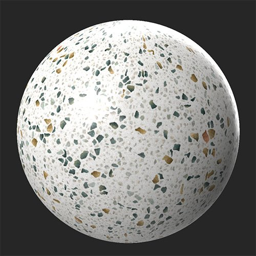
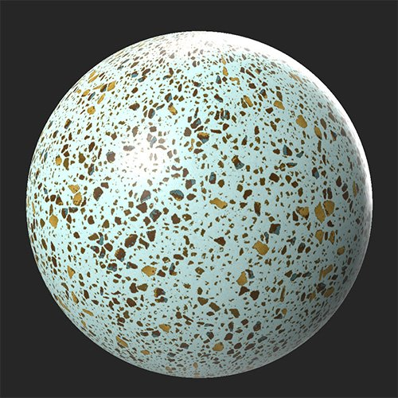

# Farbabweichung

<table>
<tr style="border: 0;">
<td width="41.60%" style="border: 0;" valign="top">

**In:** Korrekturen

</td>
<td width="58.30%" style="border: 0;" valign="top">

## Beschreibung

Mit dem Farbvariationsfilter können Sie mehrere Farben in der Grundfarbe oder im diffusen Kanal gleichzeitig ersetzen. Dies ähnelt dem **Filter zum Farbersetzen**, doch während Sie mit **Farbvariation** mehrere Farben in einem Filter anpassen können, gibt Ihnen **Filter ersetzen** mehr Kontrolle über die Maske, die zum Ersetzen von Farben verwendet wird, und kann auf mehreren Kanälen verwendet werden.

In den folgenden Bildern wurde der **Farbvariationsfilter** verwendet, um nicht nur die zugrunde liegende weiße Farbe so anzupassen, dass sie wie ein heller Türkis aussieht, sondern auch um den Kontrast vieler der kleineren Flecken zu erhöhen.

<table>
<tr style="border: 0;">
<td style="border: 0;" valign="top">

{width="200px"}

</td>
<td style="border: 0;" valign="top">

{width="200px"}

</td>
</tr>
</table>

</td>
</tr>
</table>

## Parameter

**Basisparameter**

* **Farbanzahl**: 1-10\
  Anzahl der Farben ändern, die die Farben des Kanals ersetzen sollen
* **Luminanzvariation**: 0-1\
  Passen Sie an, wie stark die Luminanzwerte von der ersetzten Farbe beeinflusst werden.
* **Segmentierung**:\
  Die Maske zum Anwenden von Farben auf einen anderen Kanal basieren lassen.
* **Farbauswahlmodus**:\
  Legen Sie fest, ob die Quellfarben manuell oder automatisch ausgewählt werden sollen. Wenn der Auswahlmodus **Manuell** ausgewählt ist, verwenden Sie die Handles in der **2D-Ansicht**, um Farben auszuwählen.
  * **Texthilfe anzeigen**: Knebel\
    Dieses Steuerelement ist nur sichtbar, wenn der **Farbauswahlmodus** auf **Manuell** festgelegt ist. Wenn diese Option aktiviert ist, fügt **Texthilfe anzeigen** den Handles in der **2D-Ansicht Textbeschriftungen hinzu**, um Farbauswahlgriffe leichter unterscheiden zu können.
* **Farbe X**: Farbauswahl\
  Die Anzahl der verfügbaren Farbsteuerelemente hängt von dem mit **Farbanzahl** ausgewählten Wert ab. Wähle für jede Farbe die neue Farbe aus, die die ursprüngliche Materialfarbe ersetzen soll.

## Benutzerhandbuch

Mit dem **Farbvariationsfilter** können Sie schnell mehrere Farben des Grundfarbkanals gleichzeitig ändern. Für einige Materialien kann dies hilfreich sein, um kleine Anpassungen vorzunehmen, aber der **Farbvariationsfilter** ist am besten geeignet, um die Farben Ihres Materials mit einem einzigen Filter vollständig zu überarbeiten.

So verwenden Sie den **Farbvariationsfilter**:

1. Fügen Sie den **Farbvariationsfilter** zum Ebenenstapel hinzu.
1. Passen Sie die Anzahl der Farben an, die Sie durch **Farbanzahl** ersetzen möchten. Der Filter ersetzt die gesamte Farbe des Kanals. Mit dem Steuerelement **Farbanzahl** können Sie festlegen, mit wie vielen neuen Farben die vorhandenen Farben ersetzt werden.
1. Wählen Sie optional eine **Segmentation** oder einen anderen Kanal aus, auf dem die Farben basieren sollen. Sie können beispielsweise den metallischen Kanal auswählen und mithilfe von **Farbauswahlmodus > Manuell** einen Handle auf einen schwarzen metallischen Wert und einen anderen auf einen weißen metallischen Wert platzieren. Mit dieser Einstellung können Sie die Farbe von metallischen und nichtmetallischen Teilen Ihres Materials individuell steuern.
1. Wählen Sie einen **Farbauswahlmodus** aus. Wenn der manuelle Modus ausgewählt ist, werden in der **2D-Ansicht** Handles angezeigt, mit denen Sie die ursprüngliche Grundfarbe auswählen können, die durch die neue Farbe ersetzt wird. Aktivieren Sie **Texthilfe anzeigen**, um zu verfolgen, welches Handle mit welcher Farbe verknüpft ist.
1. Ändern Sie die Farbwerte mit den Steuerelementen **Farbe 1 - 10**.
1. Passen Sie die **Luminanzvariation** an, um anzupassen, wie stark die Luminanz durch den Farbaustausch beeinflusst wird. Bei einer niedrigen **Luminanzvariation** können Sie die Farben Ihres Materials vollständig reduzieren oder eine hohe **Luminanzvariation** verwenden, um die Details der Originalfarben beizubehalten.
