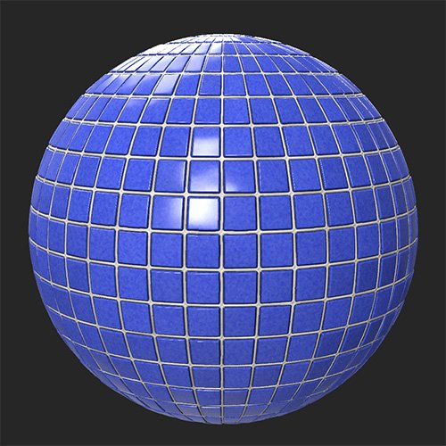

# Farbton/Sättigung

<table>
<tr style="border: 0;">
<td width="41.60%" style="border: 0;" valign="top">

**In:** Korrekturen

</td>
<td width="58.30%" style="border: 0;" valign="top">

## Beschreibung

Mit dem Filter &quot;Farbton/Sättigung&quot; können Sie die Farbe Ihrer Grundfarbe und Ihrer diffusen Kanäle anpassen. Sie können auch eine Maske verwenden, um die Farben nur für Teile Ihres Bildes gezielt zu ändern.

Die folgenden Bilder zeigen den **Filter &quot;Farbton/Sättigung&quot;**, der zum Anpassen des Farbtons eines Kachelmaterials verwendet wird.

<table>
<tr style="border: 0;">
<td style="border: 0;" valign="top">

{width="200px"}

</td>
<td style="border: 0;" valign="top">

{width="200px"}

</td>
</tr>
</table>

</td>
</tr>
</table>

## Parameter

**Basisparameter**

* **Farbton**: -1 bis 1\
  Farbton des Bildes anpassen - dies ist nützlich, um Farben im Workflow &quot;Bild zu Material&quot; zu korrigieren.
* **Sättigung**: -1 bis 1\
  Passe die Sättigung an, um Farben intensiver wirken zu lassen oder die Farbintensität zu reduzieren.
* **Helligkeit**: -1 bis 1\
  Ändere die Helligkeit der Farben.
* **Einfärben**: Knebel\
  Bei deaktivierter Funktion passt der Filter die bereits vorhandenen Farben an. Wenn diese Option aktiviert ist, ersetzt der Filter die Farben basierend auf den Reglern &quot;Farbton&quot;, &quot;Sättigung&quot; und &quot;Helligkeit&quot;, während die Details beibehalten werden.

**Maske**

* **Benutzerdefinierte Maske verwenden**: Knebel\
  Aktivieren oder Deaktivieren der Verwendung einer benutzerdefinierten Maske. Wenn aktiviert, werden die folgenden Parameter angezeigt:
  * **Maske**: Bild/Pinsel\
    Wählen Sie ein Bild aus, das als Maske verwendet werden soll, oder malen Sie mit dem Pinsel eine benutzerdefinierte Maske direkt in der 2D-Ansicht.
  * **Benutzerdefinierte Maske - Weichzeichnen**: 0-1\
    Weichzeichnen der Maske
  * **Benutzerdefinierte Maske - Umkehren**: Knebel\
    Maske umkehren.
