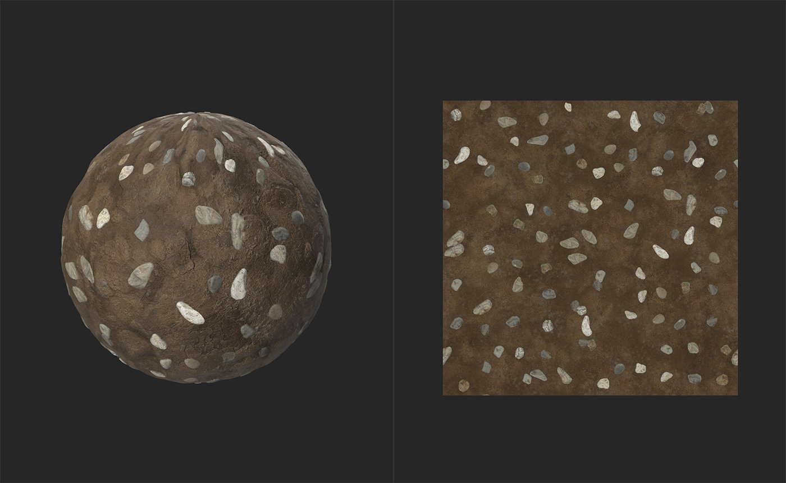

# Atlas Scatter

<table>
<tr style="border: 0;">
<td width="41.60%" style="border: 0;" valign="top">

**In:** Generatoren

</td>
<td width="58.30%" style="border: 0;" valign="top">

## Beschreibung

Der Elementfilter Streuung Instanzen der Material innerhalb eines Atlas- über das zugrunde liegende Material hinweg, wobei die Atlas Scatter ebenfalls angewendet wird. Atlas Scatter ist nützlich, um Blätter, Felsen oder Müll auf natürliche Weise über ein Material zu verteilen.

Die folgenden Abbildungen zeigen den **Aktionsfilter** in Atlas Scatter.

Bevor der **Atlas Scatter-Filter** verwendet wird, verfügen wir über ein einfaches Schlamm-Material - nicht sehr aufregend.

Durch Hinzufügen des **Atlas Scatter-Filters** mit einem Kieselatlas wird das Material interessanter, da Kieselsteine gestreut werden und sich realistisch mit dem darunter liegenden Schlamm vermischen.

</td>
</tr>
</table>

## Parameter

**Basisparameter**

* **X Betrag**: 1-64\
  Anzahl der Instanzen in der X-Achse
* **Y Betrag**: 1-64\
  Anzahl der Instanzen in der Y-Achse
* **Füllmethode**:\
  Methode zum Mischen mit darunter liegenden Ebenen
* **Skalierung**: 0-5\
  Skalierung von Instanzen
* **Position zufällig**: 0-2\
  Erhöhen oder Verringern des zufälligen Versatzes von Instanzen von Raster-Positionen
* **Height-Skalierung**: 0-1\
  Height von Instanzen anpassen
* **Mit Hintergrund konform**: 0-1\
  Ändern, wie stark sich die zugrunde liegenden Height-Werte auf verstreute Instanzen auswirken
* **Farbe aus Hintergrund**:
  * **Farbton:** 0-1\
    Farbton von Instanzen anpassen
  * **Sättigung:** 0-1\
    Anpassen der Sättigung von Instanzen
  * **Wert:** 0-1\
    Wert von Instanzen anpassen

**Maske**

* **Benutzerdefinierte Maske**: Knebel\
  Aktivieren oder Deaktivieren der Verwendung einer benutzerdefinierten Maske. Wenn diese Option aktiviert ist, werden die folgenden Steuerelemente angezeigt:
  * **Benutzerdefinierte Maske:**\
    Wählen Sie eine Datei aus, die als Maske verwendet werden soll, oder verwenden Sie den Pinselmodus, um sie manuell zu maskieren.
  * **Maske umkehren:** umschalten\
    Wert der Maske umkehren
* **Zufällige Maske**: 0-1\
  Einen zufälligen Prozentsatz an Instanzen ausblenden

**Größe**

* **Zufällige Skalierung**: 0-1\
  Die Menge der randomisierten Skalierung, die auf jede Instanz angewendet werden soll
* **Keine Überlappung skalieren**: 0-1\
  Passen Sie die Skalierung jeder Instanz an, um Überschneidungen von Instanzen zu vermeiden.

**Height**

* **Height-Offset**: -1 bis 1\
  Versatz des Heights von Instanzen von der Basisebene 0
* **Height-Offset zufällig**: 0-1\
  Zufallswert zum Height-Offset für jede Instanz hinzufügen
* **Neigung von Bg-Steigung**: 0-1\
  Anpassen der Neigung von Normalen basierend auf der Steigung des Hintergrunds
* **Smoothness im Hintergrund**: 0-2\
  Smoothness des Hintergrunds anpassen

**Drehung**

* **Drehung**: 0-1\
  Alle Instanzen um einen bestimmten Wert drehen
* **Drehung zufällig**: 0-1\
  Zufallswert zur Drehung jeder Instanz hinzufügen
* **Drehung aus Bg-Steigung**:\
  Instanzen anhand der Steigung des zugrunde liegenden Materials drehen

**Atlas-Material-Anpassungen**

* **Farbkorrektur**:\
  Anpassen der HSV-Werte für den Atlas
* **Farbzufall**:\
  Hinzufügen der Zufälligkeit zu den HSV-Werten, die in **Farbanpassung** festgelegt wurden
* **Raueit aus dem Hintergrund**: 0-1\
  Verwenden Sie statt der Rauheit jeder Instanz die Rauheit des Hintergrunds.
* **Anpassung der Rauheit**: -1 bis 1\
  Werte für Rauheiten hinzufügen oder entfernen.
* **Normaler Zufallswert**: 0-1\
  Normale jeder Instanz um einen zufälligen Wert pro Instanz drehen
* **Umlauffähige Verdeckung erneut berechnen**: Knebel\
  Wenn aktiviert, werden die Ambient occlusion-Werte auf der Grundlage der geänderten Height-Werte neu berechnet.

**Erkennung von Atlasformen**

* **Musterbereich**:\
  Beschränken Sie die verfügbaren Elemente aus dem Atlas basierend auf der Position. Belassen Sie die X- und Y-Werte bei 0, um alle Elemente aus dem Atlas zu verwenden.
* **Atlas-Deckkraft herunterskalieren**: 0-4
* **Genauigkeit der Formerkennung**:\
  Wählen Sie den Algorithmus aus, der Formen erkennt. Verschiedene Atlanten werden für verschiedene Detektionsalgorithmen geeignet sein. Kein Fehlermodus ist rechnerisch teurer als jede der anderen Optionen.
* **Form wird kleiner als** ignoriert: 0-1\
  So vermeiden Sie, sehr kleine Formen als einzelne Elemente zu erfassen.

Benutzerhandbuch

Mit dem Filter &quot;Atlas Scatter&quot; können Sie Streuungen für Elemente im gesamten Material vornehmen, z. B. Blätter, Steine oder Müll. Um den Filter &quot;Atlas Scatter&quot; verwenden zu können, benötigen Sie ein Atlas-Material, das der Filter verarbeiten soll.

>[!NOTE]
>
> Ein Atlas-Material ist ein Material mit einer Sammlung (oder einem Atlas) separater Elemente. Zum Beispiel enthält Sampler standardmäßig das Material &quot;Trockene Lorbeerblätter&quot; (Dry Laurel Leaves) - dies ist ein Atlasblatt, da es eine Laubsammlung in einem einzigen Material enthält, in dem jedes Blatt vom anderen Blatt getrennt ist. Der Elementknoten verwendet einen Algorithmus, um jedes Blatt des Atlas-Materials als separates Atlas Scatter zu behandeln.

So verwenden Sie den Filter &quot;Atlas Scatter&quot;:

1. Atlas Scatter zu Ebenenstapel hinzufügen.
1. Unter der Atlas Scatter-Ebene wird ein Eingangssteckplatz angezeigt.
1. Ziehen Sie das Atlas-Material in den Atlas Scatter-Eingangssteckplatz

Sie können die Parameter für die Streuung im **Eigenschaften-Bedienfeld** anpassen, indem Sie die Atlas Scatter-Ebene auswählen.

Sie können die Parameter des Atlas-Materials im **Eigenschaften-Bedienfeld** anpassen, indem Sie das Material im Eingangssteckplatz auswählen.
