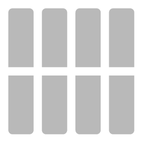

# Bodenfliesen

<table>
<tr style="border: 0;">
<td width="41.60%" style="border: 0;" valign="top">

**In:** Generatoren

</td>
<td width="58.30%" style="border: 0;" valign="top">

## Beschreibung

Der Bodenfliesen-Filter löst das darunter liegende Material auf und wandelt es in eine Anordnung von Bodenfliesen um.

Die folgenden Bilder zeigen ein Betonmaterial, das mit einem Schachbrettmuster in Bodenfliesen umgewandelt wurde.

<table>
<tr style="border: 0;">
<td style="border: 0;" valign="top">

{width="200px"}

</td>
<td style="border: 0;" valign="top">

{width="200px"}

</td>
</tr>
</table>

</td>
</tr>
</table>

Parameter

<b>Basisparameter</b>

* <b>Zufallsparameter</b>: \
  Der Zufallswert bestimmt die Zufallswerte anderer Parameter, die den Zufallswert in diesem Filter verwenden.
* <b>Anzahl der Materialien</b>: \
  Ändern Sie die Anzahl der Materialien, die in Bodenfliesen konvertiert werden sollen. Das erste Material wird durch Schichten unter der Bodenfliesen-Filterschicht bestimmt. Wenn ausgewählt, kann die zweite als Eingabe hinzugefügt werden.
* <b>Intensität der Eingabematerialien</b>: 0-1 \
  Wie viele Details der Eingabematerialien werden in den Kacheln angezeigt?
* <b>Materialien umkehren</b>: Umschalten \
  Tauschen Sie bei der Verwendung von zwei Materialien die Stelle aus, an der sie auf den Kacheln erscheinen.
* <b>Farbvariation</b>: 0-1 \
  Gibt an, wie stark die Farbe zwischen den einzelnen Kacheln desselben Materials variiert.
* <b>Abgeflachter Radius</b>: 0-1 \
  Größe der Fliese im Vergleich zur Größe des Mörtels
* <b>Tiefe abschrägen</b>: 0-1 \
  Tiefe des Mörtels
* <b>Rundheit abschrägen</b>: 0-1 \
  Bestimmt die äußeren Winkel der Kacheln
* <b>Oberflächenkorn</b>: 0-1 \
  Bestimmt, wie detailliert das Originalmaterial auf den Normal- und Height-Maps der Kacheln angezeigt wird.
* <b>Mustermaske</b>: Eingabe.  \
  Jede Maske für Bodenfliesen-Muster verfügt über einen anderen Satz von Parametern. Hier werden nur die verfügbaren Parameter für <b>Kachelquadrat</b> behandelt.

  * <b>Zufallswert </b>\
    Der Zufallswert bestimmt die Zufallswerte anderer Parameter, die den Zufallswert in diesem Filter verwenden.
  * <b>X Betrag </b>\
    Anzahl der Kachelspalten anpassen
  * <b>Y Betrag</b> \
    Anpassen der Anzahl der Kachelzeilen
  * <b>Verlauf </b> \
    Passt das Verhältnis der Fliesengröße zur Mörtelgröße an.
  * <b>Luminanzzufall</b>\
    Da die Luminanz die Height-Map beeinflusst, entfernt dieser Parameter zufällig einige Kacheln
  * <b>Musterrotation</b>: 0-1 \
    Dreht den Winkel der Kacheln und hält sie voneinander weg, um Überlagerungen zu vermeiden
  * <b>Formskalierung:</b> 0-1 \
    Passt das Verhältnis der Fliesengröße zur Mörtelgröße an.
  * <b>Zufällige Formskalierung </b>\
    Fügt zufällig einen Unterschied in der Größe der Kacheln hinzu
  * <b>Formgröße </b>\
    Anpassen der Länge und Breite der Kacheln
  * <b>Zufällige Formgröße </b>\
    Länge und Breite der Kacheln zufällig anpassen.
  * <b>Versatzmodus für Position</b>: Dropdown-Liste
  * <b>Positionsversatz </b>\
    Verschiebt die Kachelspalten nach dem Zufallsprinzip, sodass sie nicht horizontal ausgerichtet sind
  * <b>Position zufällig</b> \
    Positioniert die Kacheln willkürlich auf der Oberfläche, mit einer potenziellen Überlagerung zwischen den Kacheln
  * <b>Formdrehung </b>\
    Drehen Sie den Winkel der Kacheln in die gleiche Richtung, während sie so nah wie möglich mit potenzieller Überlagerung
  * <b>Formdrehung zufällig </b>\
    Drehen Sie den Winkel der Kacheln zufällig und halten Sie sie so nah wie möglich mit potenzieller Überlagerung

<b>Lücke</b>

* <b>Farbe für Lücke</b>: Farbauswahl \
  Ändern der Farbe zwischen Musterelementen
* <b>Gap Roughness</b>: 0-1 \
  Ändern Sie den Raueitswert des Materials zwischen Kacheln.
* <b>Gap Metallic</b>: 0-1 \
  Ändern Sie den metallischen Wert des Materials zwischen Kacheln.
* <b>Gap-Height</b>: 0-1 \
  Ändern Sie den Materialwert des Heights zwischen Kacheln.
* <b>Unregelmäßigkeit der Lücke</b>: 0-1 \
  Passen Sie an, wie sauber der Mörtel zwischen den Kacheln aufgetragen wird.

<b>Alter</b>

* <b>Bodenneigung</b>: 0-1 \
  Neigung zu zufälligen Musterelementen hinzufügen.
* <b>Height zufällig</b> \
  Hinzufügen eines Height-Unterschieds zwischen Musterelementen nach dem Zufallsprinzip
* <b>Dirt</b>: 0-1 \
  Kacheln und Lücke mit Dirt versehen.
* <b>Schäden</b>: 0-1 \
  Entfernen Sie einige Scherben von der Kante der Abschrägung jeder Kachel, zufällig
* <b>Unvollkommenheiten</b> \
  Füge kleine Löcher und Makel in den Kacheln hinzu.

<b>Technische Parameter</b>

* <b>Materialskala</b>: 0-1 \
  Skalierung des Materials innerhalb der Kacheln
* <b>Normalintensität</b>: 0-1 \
  Passen Sie die Intensität der Normale des Spalts, der Fliesen und des Materials in

<b>Benutzerhandbuch</b>

Mit dem Filter &quot;Bodenfliesen&quot; können Sie Ihr Material schnell in Kacheln konvertieren. Die meisten Bodenfliesen-Filter sind relativ einfach zu verwenden, außer bei der Verwendung mehrerer Materialien. So verwenden Sie zwei Materialien:

1. Legen Sie <b>Grundlegende Parameter > Anzahl der Materialien</b> auf 2 fest.
1. Ziehe das zweite Material in den Eingangsschlitz, der unter dem Filter &quot;Bodenfliesen&quot; im Ebenenstapel eingeblendet wurde.
1. Passen Sie die Parameter des Eingabematerials an, bis Sie mit dem Ergebnis zufrieden sind.

Obwohl es möglich ist, mehrere Materialien und Filter in einem einzigen Eingangsschlitz hinzuzufügen, ist es im Allgemeinen eine gute Idee, dies zu vermeiden, da es die Komplexität erhöht und es schwieriger machen kann, Ihr Material zu lesen, wenn Sie später darauf zurückkommen. Erstellen Sie stattdessen neue Materialien in Ihrem Projekt und ziehen Sie dann eine Instanz des neuen Materials in den Eingabebereich. Wenn du das Material in deinem Projekt aktualisierst, wird es automatisch im Eingangsbereich aktualisiert. So hast du die volle Kontrolle und kannst den Ebenen-Stapel vereinfachen.
