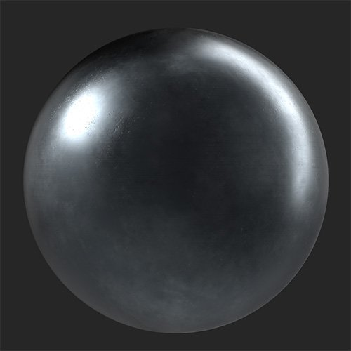

# Bedienfeld

<table>
<tr style="border: 0;">
<td width="41.60%" style="border: 0;" valign="top">

**In:** Generatoren

</td>
<td width="58.30%" style="border: 0;" valign="top">

## Beschreibung

Wandle dein Material in Bedienfelder um. Der Panels-Filter eignet sich besonders gut für metallische Materialien.

*Ein fortlaufendes metallisches Material, das in Fenster konvertiert wurde.*

{width="200px"}

{width="200px"}

</td>
</tr>
</table>

## Parameter

**Vorgaben**

Verwenden Sie Vorgaben, um schnell Parameter zu ändern und einen bestimmten Effekt zu erzeugen.

**Basisparameter**

* **Zufallsparameter**:\
  Der Zufallswert bestimmt die Zufallswerte anderer Parameter, die den Zufallswert in diesem Filter verwenden.
* **X Betrag**: 0-20\
  Anzahl der Bedienfelder in der X-Achse ändern
* **Y Betrag**: 0-20\
  Anzahl der Bedienfelder in der Y-Achse ändern
* **Naht Typ**:\
  Verschiedene Arten von Nähte in verschiedenen Bedienfeldern auswählen
* **Verbindungselemente verwenden**:\
  Fügen Sie Verbindungselemente zwischen Bedienfeldern hinzu. Wenn diese Option aktiviert ist, wird der Abschnitt &quot;Verbindungselemente&quot; in der Liste der Parameter angezeigt.

**Fenster**

* **Versatzbetrag**: 0-1\
  Versetzen Sie jede Zeile des Fensters von der vorhergehenden Zeile um einen bestimmten Prozentsatz der Fenstergröße.
* **Offset zufällig**: 0-1\
  Hinzufügen eines zufälligen Werts zum Offset jeder Zeile
* **Vertikaler Versatz**: Knebel\
  Zwischen horizontalem und vertikalem Versatz wechseln.
* **Spannungsaufschlag**: -1 bis 1\
  Ändern Sie die Normalen jedes Bedienfelds so, dass es aussieht, als ob das Bedienfeld aufgrund von Druck nach innen oder außen gewölbt wäre.
* **Falten**: 0-1\
  Bereiche mit subtilen Dellen und Falten versehen.
* **Farbvariation**: 0-1\
  Variieren Sie die Farbe zwischen einzelnen Bedienfeldern nach dem Zufallsprinzip.
* **Reflexionsvariation**: 0-1\
  Variieren der Rauheit der einzelnen Bedienfelder nach dem Zufallsprinzip

**Nähte**

Die Parameterauswahl in diesem Abschnitt hängt davon ab, welchen Wert Sie unter **Basisparameter > Naht Typ** ausgewählt haben.

* ***Lücke***
  * **Naht**: 0-1\
    Breite zwischen Bedienfeldern ändern.
  * **Lückenvariation**: 0-1\
    Kleine Abstände zwischen den Bedienfeldern, damit die Abstände variieren
  * **Abrundung der Lückenecke**: 0-1\
    Abrunden der Ränder von Bedienfeldern
  * **Gap Bevel**: 0-1\
    Abgeflachte Kanten von Bedienfeldern
* ***Verschweißt***
  * **Naht**: 0-1\
    Breite zwischen Fenstern ändern
  * **Schweißnahtqualität**: 0-1\
    Gleichmäßigkeit der Schweißnaht einstellen
  * **Verschweißte Verfärbung**: 0-1\
    Ändern Sie die Stärke der Verfärbung der Schweißnaht im Vergleich zur Farbe der Fenster.
  * **Verschweißtes Material ersetzen**: Knebel\
    Aktivieren Sie diese Option, um das Material anzupassen, mit dem die Schweißnaht erzeugt wird. Die folgenden zusätzlichen Parameter werden angezeigt, wenn diese Option aktiviert ist:
    * **Farbe des verschweißten Materials**: Farbauswahl\
      Wählen Sie die Farbe der Schweißnaht aus. Dies wird weiterhin durch **Verschweißte Verfärbung** beeinträchtigt.
    * **Raueit des verschweißten Materials**: 0-1\
      Rauheit der Naht der Schweißnaht zwischen Bedienfeldern anpassen
* ***Überlappung***
  * **Naht**: 0-1\
    Breite zwischen Fenstern ändern
* ***Stehende Naht***
  * **Naht**: 0-1\
    Breite zwischen Fenstern ändern

**Verbindungselemente**

* **Befestigertyp**:\
  Wählen Sie den Stil des Verbindungselements aus, der zwischen Bedienfeldern verwendet werden soll.
* **Befestigungsbetrag**: 3-10\
  Ändern Sie die Anzahl der Verbindungselemente, die entlang der Kante zwischen zwei Bedienfeldern verwendet werden sollen.
* **Befestigungsgröße**: 0-1\
  Größe der Verbindungselemente ändern.
* **Befestigungsvariante**: 0-1\
  Position der Verbindungselemente versetzen
* **Befestigungselement-Material ersetzen**: Knebel\
  Ändern Sie das für Verbindungselemente verwendete Material separat vom Basismaterial. Wenn diese Option aktiviert ist, werden die folgenden Parameter angezeigt:
  * **Fastener Material Color**: Farbauswahl\
    Wählen Sie die Farbe des Verbindungsmaterials aus.
  * **Raueit des Befestigungsmaterials**: 0-1\
    Ändern Sie die Rauheit des Materials mit dem Verbindungselement.

**Erweitert**

* **Normal** **Intensität**: 0-3\
  Anpassen der allgemeinen Normalintensität des Materials
* **Nähte Height Bereich**: 0-1\
  Höhe der benutzerdefinierten Nähte über den Bedienfeldern anpassen
* **Bereich des Heights der Verbindungselemente**: 0-1\
  Ändern des Heights der Verbindungselemente
* **AO Height Tiefe**: 0-1\
  Ändern der Stärke von AO
* **AO Radius**: 0-1\
  Ändern des Radius der AO
