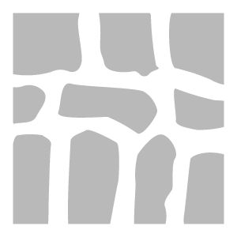

# Stonewall

<table>
<tr style="border: 0;">
<td width="41.60%" style="border: 0;" valign="top">

**In:** Generatoren

</td>
<td width="58.30%" style="border: 0;" valign="top">

## Beschreibung

Mit dem Stonewall-Filter kannst du dein Material schnell in eine alte Steinwand einbetten.

</td>
</tr>
</table>

## Parameter

**Basisparameter**

* **Zufallsparameter**:\
  Die Zufallsgeschwindigkeit, auf der alle anderen Zufallsparameter in diesem Filter basieren.
* **Steinmuster**:\
  Auswählen, welches Muster zum Anordnen der Steine verwendet wird
* **Anzahl Steine**: 4-18\
  Passen Sie die Anzahl der Steine an, in die das Material unterteilt werden soll
* **Steinrundung**: 0-1\
  Den Verschleiß der Steinkanten kontrollieren
* **Anzahl reduzierter Steine**: 0-1\
  Das Height der Steine zum Mörtel zwischen den Steinen anpassen.
* **Mortar-Thickness**: 0-1\
  Anpassen des Abstands zwischen Steinen
* **Mortar-Height**: 0-1\
  Das Height des Mörtels zwischen den Steinen erhöhen oder verringern
* **Mörtelfarbe**: Farbauswahl\
  Farbe des Mörtels zwischen den Steinen anpassen.
* **Grimmiemenge**: 0-1\
  Ändern der auf das Material angewendeten Menge an Schmutz und Dirt
* **Rasterfarbe**: Farbauswahl\
  Auswählen der Farbe des Rasters

**Erweiterte Parameter**

* **Normalintensität**: 0-3\
  Steuern Sie die Stärke der Normalen für das gesamte Material.
