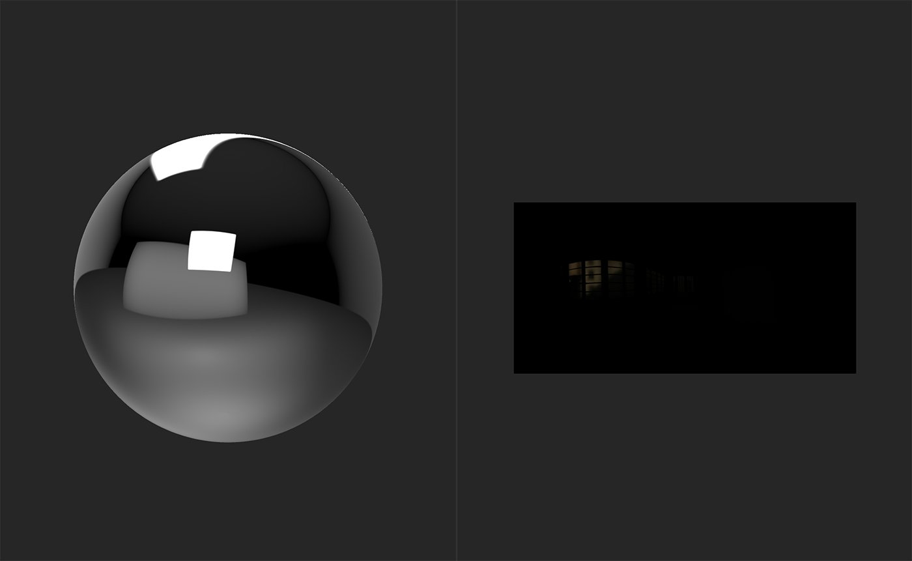

# HDR verbinden

<table>
<tr style="border: 0;">
<td width="41.60%" style="border: 0;" valign="top">

**In:** HDRI-Werkzeugs

</td>
<td width="58.30%" style="border: 0;" valign="top">

## Beschreibung

Mit dem **HDR. Merge** **filter** können Sie eine Sammlung von SDR-Bildern (Standard Dynamic Range) zusammenführen, um ein HDR zu erstellen.

Die folgenden Bilder zeigen die Ergebnisse der **HDR. Zusammenführung**.

Bevor die **HDR. Zusammenführung** abgeschlossen ist, spiegelt die Kugel in der **3D-Ansicht** das standardmäßige Umgebungslicht wider. Die **2D-Ansicht** zeigt standardmäßig die importierten Bilddaten für das erste Scanbild an, das in diesem Fall das am niedrigsten gelegt Bild ist.

Nach dem Hinzufügen von **HDR. Merge** **filter** spiegelt die Kugel ein neues Umgebungslicht wider - das HDR. Bild, das aus den Eingabebildern generiert wurde.

</td>
</tr>
</table>

## TParameter

**Basisparameter**

* **Eingangsbelichtungsdelta (EV)**: 0-2\
  Legen Sie die Belichtungsdifferenz zwischen der höchsten und der niedrigsten Eingangsbelichtung fest. Ein Delta mit hoher Belichtung erhöht den resultierenden Kontrast des Zusammenfügungsvorgangs.
* **Automatische Belichtung der Ausgabe**: Knebel\
  Aktivieren oder deaktivieren Sie die automatische Belichtungskorrektur.
* **Ausgabe-Belichtungskorrektur (EV)**: -5 bis 5\
  Versetze die Belichtung.

## Benutzerhandbuch

Im Folgenden erfahren Sie, wie Sie den **HDR-Zusammenführungsfilter** sowie weitere Filter verwenden, die beim Konvertieren von SDR-Bildern in ein HDR-Umgebungslicht helfen können.

Die grundlegenden Schritte zur Verwendung von **HDR. Merge** **filter**:

1. Importieren Sie den Satz von Bildern, die in den Ebenenstapel eingelesen werden sollen.
1. Fügen Sie den **HDR. Mergefilter** zum Ebenenstapel hinzu.
1. Ändern Sie die Parameter, um sicherzustellen, dass die Belichtungswerte korrekt sind.
