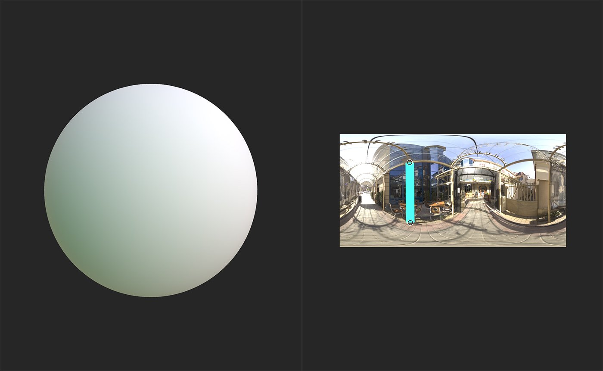

# Linienbeleuchtung

<table>
<tr style="border: 0;">
<td width="41.60%" style="border: 0;" valign="top">

**In:** HDRI-Werkzeugs

</td>
<td width="58.30%" style="border: 0;" valign="top">

## Beschreibung

Fügen Sie Ihrer Umgebungsbeleuchtung eine **Linienbeleuchtung** hinzu.

Die folgenden Bilder zeigen, wie Sie ein **Linienlicht** verwenden können, um die Beleuchtung Ihrer Umgebung anzupassen.

Die Abbildung oben zeigt eine Kugel ohne Änderungen am Umgebungslicht.

Nach dem Hinzufügen eines **Linienlichts** hat sich das Erscheinungsbild der Kugel merklich geändert.

</td>
</tr>
</table>

## Parameter

**Basisparameter**

* **Exposition (EV)**: 0-10\
  Passen Sie die Belichtung oder Helligkeit des Lichts an.
* **Formfarbmodus**:\
  Legen Sie fest, mit welcher Methode die Farbe des Lichts bestimmt werden soll. Die verfügbaren Parameter ändern sich entsprechend dieser Auswahl.
  * **Temperatur (Kelvin)**
    * **Temperatur**: 1000 - 27000\
      Passe die Lichttemperatur an.
  * **RGB**
    * **Farbe**: Farbauswahl\
      Wähle die Farbe des Lichts aus.
  * **Image-Eingabe**
    * **Shape Image Input**: Bild/Pinsel\
      Importieren Sie ein Bild, das als Farbe verwendet werden soll. Sie können das Pinselwerkzeug verwenden, um direkt in der **2D-Ansicht** zu malen, dies kann jedoch zu unvorhersehbaren Ergebnissen mit diesem Filter führen.
  * **Beispielhintergrund**
    * Der Beispielhintergrund stellt keine neuen Parameter zur Verfügung - stattdessen basiert die Lichtfarbe auf den Hintergrundwerten.
* **Positionsmodus**:\
  Ändern Sie die Methode, mit der die Lichtposition bestimmt wird. Die Parameter im Abschnitt **Positionskoordinaten** ändern sich basierend auf der Auswahl. Wenn **Weltposition** ausgewählt ist, verschwinden die Handles aus der **2D-Ansicht**. Verwenden Sie stattdessen die Parameter in **Positionskoordinaten**, um die Position des Lichts zu ändern.

**Form**

* **Zeilendrehung**: 0-1\
  Drehen der Lichtquelle
* **Thickness der Zeile**: 0-1\
  Passe die Thickness der Linie an, die die Lichtquelle bildet.
* **Muster**:\
  Die Form der Linie ändern.
* **Musterhärte**: 0-1\
  Glätten der Kanten des Lichts
* **Muster-UV-Modus**:\
  Passe das Muster an, auf dem das Licht basiert. **Dehnen** dehnt die gesamte Form so, dass sie den Linienendpunkten entspricht. **Nur Mitte dehnen** dehnt die Mitte der Form, wobei die Enden der Linie unverzerrt bleiben. **Wiederholen + Abstand** erstellt Stempel der Form entlang der Zeilenlänge und fügt einen zusätzlichen Parameter hinzu, um den Abstand zu verwalten:
  * **Abstand der Musterwiederholung**: 0-1\
    Breite des Abstands zwischen Forminstanzen anpassen

**Positionskoordinaten**

Verfügbare Parameter hängen von der Auswahl ab, die für **Basisparameter > Positionsmodus** vorgenommen wurde. Wenn **Boden/Decke** oder **Abstand zum Ursprung** ausgewählt ist, sind die folgenden Parameter verfügbar:

* **Absolutes Height der Zeile**: 0-1\
  Ändere die Entfernung des Lichts zur Kamera.
* **Kameraposition**: 0-1\
  Passen Sie die relative Position der Kamera zum Licht in der X-, Y- und Z-Achse an.

Wenn **Weltposition** in **Basisparameter > Positionsmodus** ausgewählt wird, sind die folgenden Parameter verfügbar:

* **Vektor nach oben**:\
  Ändere die Richtung nach oben.
* **Weltrangliste für Punkt 1**: -2 bis 2\
  Passen Sie die Position des ersten Punkts der Linie in der X-, Y- und Z-Achse an.
* **Weltrangliste für Punkt 2**: -2 bis 2\
  Passen Sie die Position des zweiten Punkts der Linie in der X-, Y- und Z-Achse an.
* **Kameraposition**: 0-1\
  Passen Sie die relative Position der Kamera zum Licht in der X-, Y- und Z-Achse an.

**Hintergrund**

* **Grundraster anzeigen**: Knebel\
  Blendet das Grundraster ein oder aus.
* **Bodenbeschneidung aktivieren**: Knebel\
  Lege fest, ob das Licht durch den Boden hindurch geclippt werden kann. Wenn diese Option aktiviert ist, wird das folgende Steuerelement angezeigt:
  * **Ground-Height**: -2 bis 2\
    Passe das Height des Bodens an, um das Licht abzuschneiden.
* **Gamma im Hintergrund**:\
  Wählen Sie das Farbsystem aus, mit dem das Gamma-Hintergrundbild bestimmt wird.
