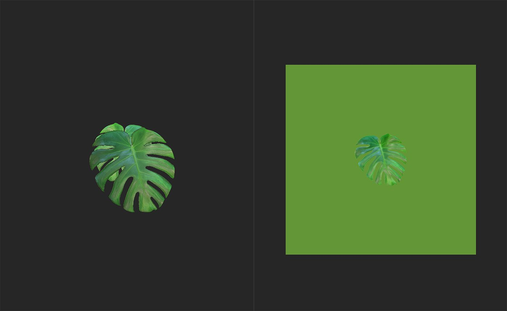

# Atlas Splitter

<table>
<tr style="border: 0;">
<td width="41.60%" style="border: 0;" valign="top">

**In:** Tools

</td>
<td width="58.30%" style="border: 0;" valign="top">

## Beschreibung

Der **Atlas Splitter** ist ein nützliches Tool zum Organisieren und Anzeigen von Atlaselementen.

Die folgenden Abbildungen zeigen den **Atlas Splitter** in Aktion.

Die obige Abbildung zeigt ein Atlasmaterial, das dem Ebenenstapel hinzugefügt wurde. Verwenden Sie den **Atlas Splitter**, um bestimmte Elemente aus dem Atlas auszuwählen.

Nachdem der **Atlas Splitter** dem Ebenenstapel hinzugefügt wurde, kann der Fokus auf ein einzelnes Blatt oder ein anderes Element des Atlasmaterials gerichtet werden.

</td>
</tr>
</table>

## Parameter

**Basisparameter**

* **Rasteransicht**: Knebel\
  Wechseln Sie zwischen der Rasteransicht und der Einzelansicht von Elementen. Wenn diese Option aktiviert ist, werden die folgenden zusätzlichen Parameter angezeigt:
  * **Rasterdeckkraft**: 0-1\
    Deckkraft des Rasters ändern.
  * **Rasterauswahldeckkraft**: 0-1\
    Deckkraft des Rahmens um das ausgewählte Element ändern
  * **Automatische Skalierung**: Knebel\
    Stellt ein, ob Atlas-Elemente so skaliert werden, dass sie jedes Rasterquadrat ausfüllen oder nicht.
* **Automatisches Freistellen**: Knebel\
  Wählen Sie aus, ob die Freistellung der ausgewählten Form angepasst werden soll. Wenn diese Option aktiviert ist, wird eine weitere Option angezeigt:
  * **Modus für automatisches Freistellen**:\
    Wählen Sie aus, wie das ausgewählte Element zugeschnitten wird, um den Raum des Materials zu füllen.
* **Formauswahl**: 1-10\
  Ändern Sie, welches Element des Atlas ausgewählt ist. Bei Atlanten mit mehr als 10 Elementen können Sie eine Zahl in den Wert **Formauswahl** eingeben, um den Bereich des Schiebereglers zu ändern.
* **Drehung**: 0-1\
  Drehen von Elementen

**Erweiterte Parameter**

* **Kleine Formtoleranz**: 0-1\
  Passen Sie die Mindestgröße der Formen an, die vom **Atlas Splitter** aufgenommen werden sollen. Dies ist nützlich, um Artefakte herauszufiltern
* **Automatische Drehung**: Knebel\
  Wenn diese Option aktiviert ist, werden Elemente automatisch gedreht, um ähnliche Ausrichtungen zu erhalten.
* **Deckkraftmaske herunterskalieren**: 0-4\
  Passen Sie die Skalierung der Deckkraftmaske an. Beachten Sie, dass das Erhöhen dieses Werts die Qualität der Deckkraftmaske verringern kann.
* **Genauigkeit der Formerkennung**:\
  Wählen Sie den zu verwendenden Formerkennungsalgorithmus aus.
* **Dilationsbreite**: 0-32\
  Erweiterung ändern - dadurch werden die Farben der Elementgrenzen in den maskierten Bereich extrudiert, um Transparenzprobleme am Rand von Atlaselementen zu vermeiden. Zeigen Sie den Basisfarbkanal in der **2D-Ansicht** an, um die Ergebnisse anzuzeigen.
* **Benutzerdefinierte Hintergrundfarbe**: Knebel\
  Wenn diese Option aktiviert ist, wird ein Steuerelement angezeigt, mit dem die Hintergrundfarbe des normalen Kanals geändert wird:
  * **Normale Bg-Farbe**: Farbauswahl\
    Wählen Sie die Hintergrundfarbe des normalen Kanals in transparenten Bereichen des Materials aus.
* **Height Bg Color**: 0-1\
  Hintergrundfarbe des Height-Kanals anpassen. Im Allgemeinen empfiehlt es sich, den Elementhintergrund mit dem durchschnittlichen Height der Ränder von Atlaselementen abzugleichen, um Artefakte an den Rändern von Heights zu vermeiden.
