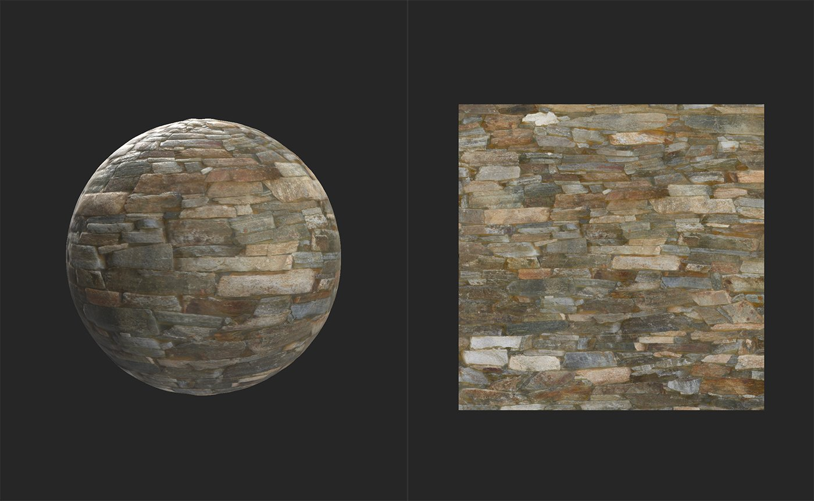

# Delight (KI-gestützt)

<table>
<tr style="border: 0;">
<td width="41.60%" style="border: 0;" valign="top">

**In:** Tools

</td>
<td width="58.30%" style="border: 0;" valign="top">

## Beschreibung

Mit dem Delighter können Sie Beleuchtungsinformationen aus dem Grundfarbkanal entfernen. Dies ist wichtig, wenn Sie Bilder in Materialien konvertieren, da Materialien im Allgemeinen keine Beleuchtungsinformationen enthalten sollten. Ein Material ist eine Sammlung von Informationen, die erklären, wie Licht auf eine Oberfläche reagieren sollte. Wenn also in einem Kanal bereits Lichtinformationen eingebrannt sind, die keine Lichtinformationen enthalten sollten, kann dies die Fähigkeit des Materials beeinträchtigen, die Oberfläche realistisch darzustellen.

*A **n Beispiel für ein Bild vor und nach der Verarbeitung durch den Filter**Delight (AI Powered)**. Beachten Sie, dass die Tiefen und Lichter entfernt wurden und nur die Grundfarbe erhalten bleibt.*

Die folgenden Bilder zeigen ein Material vor und nach der Verarbeitung durch einen **Delight (AI-Powered)-Filter**.

In der obigen Abbildung enthält das Material noch eine beträchtliche Menge an Beleuchtungsinformationen im Grundfarbkanal. Die dunklen Schatten zwischen den Steinen sollten nicht im Grundfarbkanal vorhanden sein.

Nach dem Freuddurchgang wurden die Schatten entfernt, um einen physikalisch akkurateren Grundfarbkanal zu erstellen. Auch wenn die Ergebnisse in diesem Beispiel kaum bemerkbar scheinen, ist die Freude an Bildern ein wichtiger Schritt, um Bilder in Materialien umzuwandeln.

Bei Quellbildern stammt Licht von statischen Quellen, aber Materialien müssen in der Lage sein, Licht aus jedem Winkel zu verarbeiten. Beispiel: Wenn ein Quellbild mit Licht, das von oben nach unten scheint, in ein Material konvertiert wird, ohne einen Freudenschritt durchlaufen zu müssen, kann es in einem 3D-Raum angezeigt werden, in dem das Licht von unten nach oben scheint. Das Material wird schnell unpassend aussehen, weil es gleichzeitig Schatten von mehreren Lichtern zu werfen scheint, wenn es nur eine einzige Lichtquelle gibt.

</td>
</tr>
</table>

## Parameter

Der Delighter hat keine Parameter - er arbeitet automatisch.

## Benutzerhandbuch

Wie benutzt man es?

Fügen Sie den Filter **Delighter** oben im Ebenenstapel hinzu.

### Wann wird sie verwendet?

Wenn Sie **Bild zu Material (B2M)** verwenden, entfernen Sie nach dem Extrahieren aller Kanäle aus Ihren Bildern und dem Kacheln des Materials die Beleuchtungsinformationen aus der Grundfarbe mithilfe des Delighters. **Bild zu Material (KI-gestützt)** enthält einen Freuddurchgang, sodass Sie den **Delighter (KI-gestützt)-Filter** nicht verwenden müssen.
