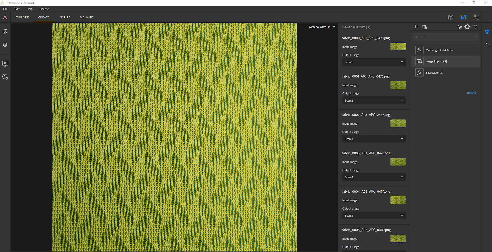

# Mehrwinkel zu Material

Die **Mehrwinkel zu Material**-Vorlage erstellt ein Material aus 2 bis 8 Eingabebildern, die unter bestimmten Lichtbedingungen aufgenommen wurden. Solche Lichtverhältnisse können mit einem Materialscanner erreicht werden.

>[!NOTE]
>
> Weitere Informationen zum Erstellen eines eigenen Materialscanners [&#x200B; finden Sie in diesem Artikel &#x200B;](https://www.adobe.com/products/substance3d/magazine/your-smartphone-is-a-material-scanner-vol-ii.html).

## Beispiel

Hier ist ein Beispiel für ein Material, das aus 8 Eingabebildern erstellt wurde:

* Die ersten 8 Bilder sind die Scan-Bilder, die unter 8 Lichtwinkeln aufgenommen wurden.
* Die unteren Bilder sind die Ausgaben der Vorlage (Grundfarbe, Normal, Height, Metall und Raueit).

{width="400px"}

## Substance 3D Sampler-Konfiguration

Es gibt drei Dinge, die festgelegt und konfiguriert werden müssen, um sicherzustellen, dass die PBR-Kanäle korrekt extrahiert werden:

* Reihenfolge der gescannten Bilder
* Der erste Eingangslichtwinkel
* der nächste Eingangslichtwinkel

{width="450px"}

### Reihenfolge der gescannten Bilder

Vergewissern Sie sich beim Importieren Ihrer Bilder in der Bildimportebene, dass die 8 Bilder aufeinander folgen.

Beispiel: Das erste Bild bei 0° muss **scan1** sein, das Bild bei 45° **scan2** ... und das Bild bei 315° **scan8**.

{width="450px"}

### Erster und nächster Lichtwinkel

Auf der Ebene &quot;Mehrwinkel zu Material&quot;:

* Legen Sie den ersten Eingangslichtwinkel fest. Wenn Ihr **Scan1** bei 180° liegt, der erste Eingangslichtwinkel =0,5 oder wenn Ihr **Scan1** bei 0° liegt, ist der erste Eingangslichtwinkel = 0
* Nächsten Eingangslichtwinkel festlegen: Es definiert die Richtung der Drehung Ihres Bildes. Wenn scan1 0° ist, scan2 45°... ist der Wert **gegen den Uhrzeigersinn**

{width="450px"}
