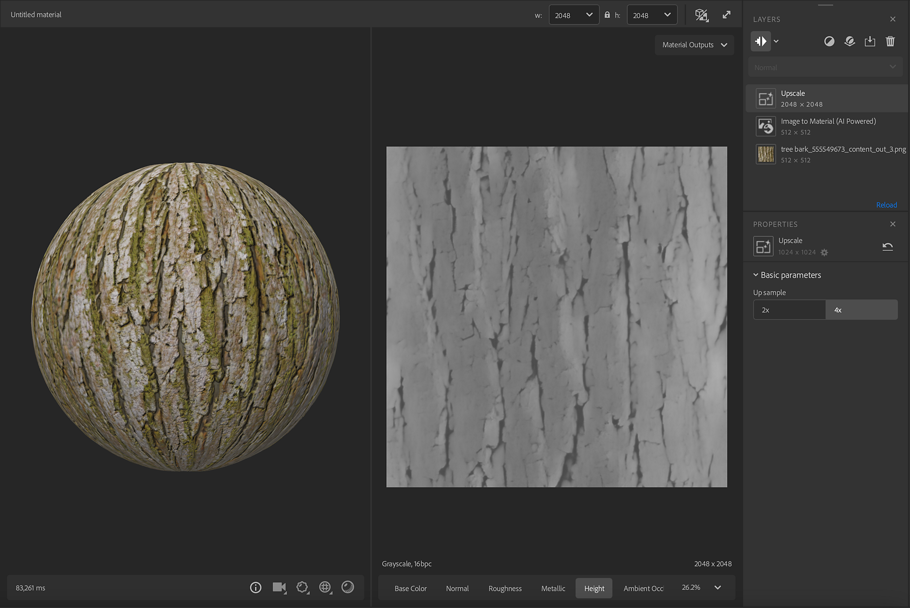

# Hochskalieren

<table>
<tr style="border: 0;">
<td style="border: 0;" valign="top">

**In:** Tools

</td>
<td style="border: 0;" valign="top">

## Beschreibung

Der <b>Hochskalieren </b>-Filter verwendet KI, um die PBR-Kanäle (BaseColor, Rauheit, Normal, Metallic, Height) von den darunter liegenden Ebenen hochzuladen.

<table>
<tr style="border: 0;">
<td style="border: 0;" valign="top">

</td>
<td style="border: 0;" valign="top">

</td>
</tr>
</table>

In diesem Beispiel beginnen wir mit einem Bild mit einer Auflösung von 1024 x 1024 px, aber das Ausgabeergebnis ist 4098 x 4098 px. Die Ergebnisse, die den Filter <b>Hochskalieren</b> verwenden, sind genauer definiert.

</td>
<td style="border: 0;" valign="top">

>[!NOTE]
>
> **Erweiterter Filter**
> 
> <b>Hochskalieren</b> ist ein erweiterter Filter.\
> Um es mit seiner maximalen Kapazität zu verwenden und unscharfe Ergebnisse zu vermeiden, empfehlen wir, die Ebenen unter <b>Hochskalieren</b> in &quot;Ebeneneingabe - Max.&quot; oder &quot;Ebeneneingabe - Min.&quot; festzulegen.
> 
> Die Anzahl der <b>Upscale </b>-Filter ist nicht begrenzt, aber ein Upsampling über eine Auflösung von 8k kann die Leistung erheblich beeinträchtigen.

</td>
</tr>
</table>

## Parameter

<b>Basisparameter</b>

* <b>Beispiel nach oben</b>: Schaltflächengruppe ein/aus\
  Hochskalierungsfaktor für Multiplikation auswählen

## Anleitung

Im Bild oben wird ein Bild mit niedriger Auflösung vom [Bild zu Material (KI-gestützt) verarbeitet](image-to-material.md).

Der Filter <b>Hochskalieren</b> wird hinzugefügt, um die Ergebnisse als Beispiel aufzunehmen. Es halluziniert Details, um eine höhere Auflösung zu erreichen, die die Qualität des Materials beibehält. Sie können in den Eigenschaften auswählen, ob die Neuauflösung um 2 oder um 4 erfolgen soll.
