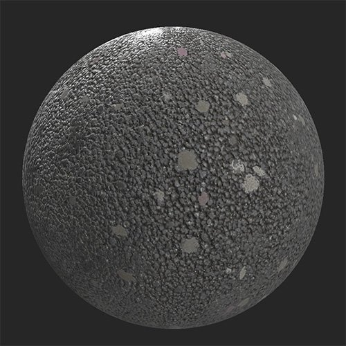

# Abgeworfene Gummen

<table>
<tr style="border: 0;">
<td width="41.60%" style="border: 0;" valign="top">

**In:** Verschleiß und Ende

</td>
<td width="58.30%" style="border: 0;" valign="top">

## Beschreibung

Fügen Sie Ihrem Material gebrauchten Kaugummi hinzu. Dieser Filter eignet sich hervorragend zum Erstellen von Gehwegen oder anderen Materialien für öffentliche Gehbereiche.Vor und nach der Verwendung des Filters **Ausrangierte Gummen** auf einem Asphaltmaterial.

<table>
<tr style="border: 0;">
<td style="border: 0;" valign="top">

{width="200px"}

</td>
<td style="border: 0;" valign="top">

{width="200px"}

</td>
</tr>
</table>

</td>
</tr>
</table>

## Parameter

**Basisparameter**

* **Zufallsparameter**:\
  Der Zufallswert bestimmt die Zufallswerte anderer Parameter, die den Zufallswert in diesem Filter verwenden.
* **Gum-Dichte**: 0-1\
  Die Anzahl der Flecken festlegen.
* **Gummigröße**: 0-1\
  Passe die Skalierung der Flecken an.
* **Gum Color 1**: Farbauswahl.\
  Ändern Sie die Farbe der Flecken.
* **Gum Color 2**: Farbauswahl\
  Ändern Sie die Farbe der Flecken.
* **Gum-Farbverteilungssaldo**: 0-1\
  Passen Sie die relative Häufigkeit der Darstellung jeder Farbe an.
* **Gum Aging**: 0-1\
  Ändere das Erscheinungsbild von Flecken, um sie älter oder jünger erscheinen zu lassen. Wenn dieser Wert auf 0 gesetzt wird, verschwindet der Regler **Alterung der Gum-Variation**.
* **Veränderung der Gum-Alterung**: 0-1\
  Alter von Flecken zufällig ändern
* **Abdunkeln des Gummis, das altert**: 0-1\
  Passen Sie an, wie stark die Flecken aufgrund des Alters abgedunkelt sind.
* **Gum-Dirt**: 0-1\
  Lege fest, wie verschmutzt die Flecken angezeigt werden.
* **Gum Dirt Color**: Farbauswahl\
  Wählen Sie die Farbe des Dirts aus, der über die Flecken gelegt wird.
* **Gum Dirt Variation**:\
  Passe an, wie stark der Dirt an den Flecken variiert.
* **Benutzerdefinierte Maske**: Knebel\
  Aktivieren oder Deaktivieren der Verwendung einer benutzerdefinierten Maske. Das folgende Steuerelement wird angezeigt, wenn **Benutzerdefinierte Maske** aktiviert ist:
  * **Maske**: Bild/Pinsel\
    Wählen Sie ein Bild aus, das als Maske verwendet werden soll, oder malen Sie mit dem Pinsel eine benutzerdefinierte Maske direkt in der 2D-Ansicht.

**Erweiterte Parameter**

* **Gum Height Range**: 0-1\
  Lege fest, wie weit die Punkte über die darunter liegende Oberfläche hinausragen.
* **Normalintensität Gum**: 0-1\
  Passen Sie die Stärke des normalen Aufpralls aufgrund der Flecken an.
