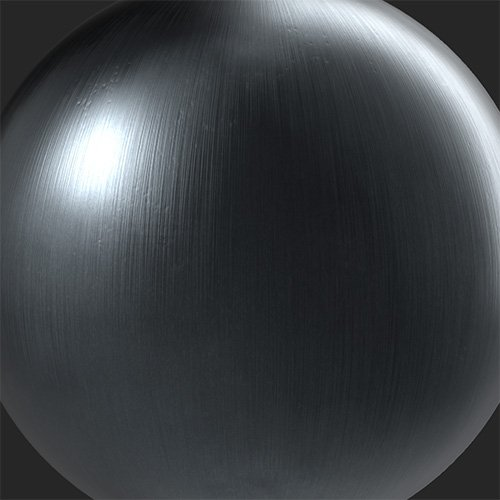

# Metallisierung

<table>
<tr style="border: 0;">
<td width="41.60%" style="border: 0;" valign="top">

**In:** Verschleiß und Ende

</td>
<td width="58.30%" style="border: 0;" valign="top">

## Beschreibung

Wandle dein Material mit einer Reihe von Oberflächen und Stilen in ein Metall um.

*Ein Rohmetallmaterial wird mit dem Filter **Metal Finish in eine gebürstete Metalloberfläche umgewandelt.***

<table>
<tr style="border: 0;">
<td style="border: 0;" valign="top">

{width="200px"}

</td>
<td style="border: 0;" valign="top">

{width="200px"}

</td>
</tr>
</table>

</td>
</tr>
</table>

## Parameter

**Basisparameter**

* **Zufallsparameter**:\
  Der Zufallswert bestimmt die Zufallswerte anderer Parameter, die den Zufallswert in diesem Filter verwenden.
* **Nur Metallic ändern**: Knebel\
  Wenn diese Option aktiviert ist, beschränkt dieser Filter seine Änderungen auf den metallischen Kanal.
* **Metallfarbmodus**:\
  Wähle eine Farbe aus, die auf einem anderen Metall basiert, oder ein eigenes. Wenn **Benutzerdefinierte Farbe** ausgewählt ist, wird das folgende Steuerelement angezeigt:
  * **Metallfarbe**: Farbauswahl\
    Wähle eine eigene Farbe für dein Metall-Finish aus.
* **Typ abschließen**:\
  Wählen Sie einen Stil aus, der auf Ihr Metall angewendet werden soll. Jeder Stil verfügt über verschiedene Parameter, mit denen du sein Erscheinungsbild anpassen kannst. Die folgenden Parameter können angezeigt werden:
  * **Intensität**: 0-1\
    Passen Sie die Intensität des gewählten Finishs an.
  * **Skalierung**: 0-1\
    Ändern Sie die Skalierung des Musters, das das ausgewählte Finish antreibt.
  * **Raueit**: 0-1\
    Steuern Sie den Raueitswert des Metalls.
  * **Perlenskalierung**: 0-1\
    Verfügbar für **Sandblasted**. Legen Sie die Größe der Kügelchen fest, die zum Erstellen des Sandstrahleffekts verwendet werden.
  * **poliert**: 0-1\
    Verfügbar für **Cast**. Passen Sie den Grad der Glättung höherer Teile des Materials an.
  * **Muster**:\
    Verfügbar für **Grinded**. Legen Sie das Muster fest, das vom Schleifgerät verwendet wird.
  * **Relief-Details**: 0-1\
    Verfügbar für **Raw**. Passe die normale Stärke an.
  * **Ausrichtung**: 0-1\
    Verfügbar für **gebürstet**. Ändern Sie die Richtung des Pinseleffekts.
  * **Pinsellänge**: 0-1\
    Verfügbar für **gebürstet**. Ändert die Länge der Pinselstriche, die zum Erzeugen des Pinseleffekts verwendet werden.
  * **Pinsel**: 0-1\
    Verfügbar für **Galvanisiert**. Auf der verzinkten Oberfläche wird ein gebürstetes Aussehen angezeigt.

**Maske**

* **Benutzerdefinierte Maske verwenden**: Knebel\
  Aktivieren oder Deaktivieren der Verwendung einer benutzerdefinierten Maske. Wenn aktiviert, werden die folgenden Parameter angezeigt:
  * **Maske**: Bild/Pinsel\
    Wählen Sie ein Bild aus, das als Maske verwendet werden soll, oder malen Sie mit dem Pinsel eine benutzerdefinierte Maske direkt in der 2D-Ansicht.
  * **Benutzerdefinierte Maske - Weichzeichnen**: 0-1\
    Die Maske weichzeichnen.
  * **Benutzerdefinierte Maske - Umkehren**: Knebel\
    Kehre die Maske um.

**Erweiterte Parameter**

* **Grundfarbe**: Knebel\
  Legt fest, ob der Grundfarbkanal vom Filter beeinflusst wird.
* **Metallisch**: Knebel\
  Legt fest, ob der metallische Kanal durch den Filter beeinflusst wird.
* **Raueit**: Knebel\
  Legt fest, ob der Raueitskanal vom Filter beeinflusst wird.
* **Specular level**: Knebel\
  Legt fest, ob der Specular level-Kanal durch den Filter beeinflusst wird. Wenn aktiviert, wird ein zusätzliches Steuerelement angezeigt:
  * **Specular level** **- Wert**: 0-1\
    Passen Sie den Wert für den Specular-Kanal an.

>[!NOTE]
>
> Es ist derzeit ein Fehler bekannt, durch den das **Specular level**-Steuerelement ausgeblendet werden kann, wenn es deaktiviert ist und kein Steuerelement zum erneuten Aktivieren vorhanden ist. Wenn Sie das **Specular level**-Steuerelement verlieren, es jedoch wieder benötigen, können Sie es mit Rückgängig (Strg + z oder Befehl + z unter macOS) rückgängig machen und deaktivieren.

* **Normal**: Knebel\
  Legt fest, ob der normale Kanal durch den Filter beeinflusst wird. Wenn aktiviert, wird ein zusätzliches Steuerelement angezeigt:
  * **Normalintensität**: 0-1\
    Passen Sie die Stärke der normalen Änderung durch den Filter an.
* **Height**: Knebel\
  Legt fest, ob sich der Filterkanal auf das Height auswirkt.
* **Ausstrahlend**: Knebel\
  Legt fest, ob der Emissionskanal durch den Filter beeinflusst wird. Wenn aktiviert, wird ein zusätzliches Steuerelement angezeigt:
  * **Ausstrahlend - Farbe**: Farbauswahl\
    Legen Sie die Farbe des Emissionskanals fest.
* **Ambient-Verdeckung**: Knebel\
  Legt fest, ob der Kanal für die umgebende Verdeckung durch den Filter beeinflusst wird. Wenn diese Option aktiviert ist, werden die folgenden zusätzlichen Steuerelemente angezeigt:
  * **Umgebungsintensität - Verdeckung**: 0-1\
    Passen Sie die Stärke der generierten AO an.
  * **Umgebungsradius** **- Verdeckung**: 0-1\
    Passen Sie den Radius des AO-Effekts an.
* **Deckkraft**: Knebel\
  Legt fest, ob der Deckkraftkanal vom Filter beeinflusst wird. Wenn aktiviert, wird ein zusätzliches Steuerelement angezeigt:
  * **Deckkraft - Wert**: 0-1\
    Ändert die Deckkraft des Materials.
