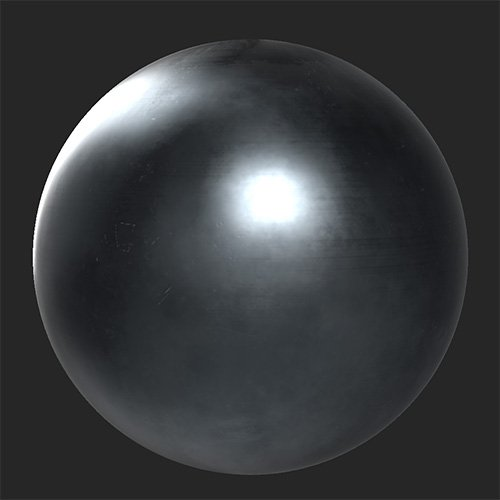

# Schramme

<table>
<tr style="border: 0;">
<td width="41.60%" style="border: 0;" valign="top">

**In:** Verschleiß und Ende

</td>
<td width="58.30%" style="border: 0;" valign="top">

## Beschreibung

Kratzer und Verschleiß auf dem Material hinzufügen.

*Vor und nach Anwendung des **Scratch-Filters**.*

<table>
<tr style="border: 0;">
<td style="border: 0;" valign="top">

{width="200px"}

</td>
<td style="border: 0;" valign="top">

{width="200px"}

</td>
</tr>
</table>

</td>
</tr>
</table>

## Parameter

**Basisparameter**

* **Zufallsparameter**:\
  Der Zufallswert bestimmt die Zufallswerte anderer Parameter, die den Zufallswert in diesem Filter verwenden.
* **Arbeitsschritt**: Knebel\
  Aktivieren oder Deaktivieren von Arbeitsschritten. Wenn aktiviert, wird der Abschnitt **Scratch** angezeigt.
* **Chip**: Knebel\
  So entsteht ein Splittereffekt auf der Oberfläche. Wenn aktiviert, wird der Abschnitt **Chip** angezeigt.
* **Micro-scratch**: Knebel\
  Kratzer auf der Oberfläche hinzufügen. Wenn aktiviert, wird der Abschnitt **Micro-scratch** angezeigt.

**Scratch**

**Grundlegende Parameter > Scratch** müssen aktiviert sein, damit dieser Abschnitt angezeigt wird.

* **Betrag**: 0-1\
  Steuern Sie die Anzahl der angezeigten Kratzer.
* **Intensität**: 0-1\
  Passen Sie die Tiefe und Stärke der Kratzer an.
* **Skalierung**: 1-4\
  Ändern Sie die Größe der Kratzer. Erhöhen Sie diesen Regler, um die Größe des Arbeitsbereichs zu verringern.

**Chip**

**Grundlegende Parameter > Scratch** müssen aktiviert sein, damit dieser Abschnitt angezeigt wird.

* **Betrag**: 0-1\
  Steuern Sie die Anzahl der angezeigten Chips.
* **Intensität**: 0-1\
  Passe Tiefe und Stärke der Chips an.
* **Skalierung**: 1-4\
  Ändern Sie die Größe der Chips. Erhöhen Sie diesen Regler, um die Chipgröße zu verringern.

**Micro-scratch**

* **Betrag**: 0-1\
  Steuern Sie die Anzahl der angezeigten Mikro-Scratches.
* **Intensität**: 0-1\
  Passen Sie die Tiefe und Stärke der Mikrokratzer an.
* **Drehung**: 0-1\
  Drehen Sie die Mikrokratzer.
* **Drehung zufällig**: 0-1\
  Variieren Sie die Rotation der Mikrokratzer nach dem Zufallsprinzip.
* **Skalierung**: 0-2\
  Passen Sie die Größe der Mikro-Kratzer an. Erhöhen Sie diesen Regler, um die Größe des Mikroskratzes zu erhöhen.
* **Zufällige Skalierung**: 0-1\
  Variieren Sie die Größe der Mikro-Kratzer nach dem Zufallsprinzip.
* **Breite**: 0-1\
  Steuern der Breite von Kratzern
* **Breite zufällig**: 0-1\
  Variieren Sie die Breite der Mikro-Kratzer nach dem Zufallsprinzip.
* **Verzerrung**: 0-1\
  Verleihe den Kratzern mehr Verzerrung, um die Gleichmäßigkeit zu beseitigen.
* **Verzerrung zufällig**: 0-1\
  Steuern Sie die Zufälligkeit des Effekts &quot;Verzerrung&quot;.
* **Häufigkeit der Verzerrung**: 0-1\
  Steuern Sie die Frequenzskala des Effekts Verzerrung .

**Maske**

* **Benutzerdefinierte Maske**: Knebel\
  Aktivieren oder Deaktivieren der Verwendung einer benutzerdefinierten Maske. Wenn aktiviert, werden die folgenden Parameter angezeigt:
  * **Maske**: Bild/Pinsel\
    Wählen Sie ein Bild aus, das als Maske verwendet werden soll, oder malen Sie mit dem Pinsel eine benutzerdefinierte Maske direkt in der 2D-Ansicht.
  * **Benutzerdefinierte Maske - Weichzeichnen**: 0-1\
    Die Maske weichzeichnen.
  * **Benutzerdefinierte Maske - Umkehren**: Knebel\
    Kehre die Maske um.

**Erweiterte Parameter**

* **Gesamtdeckkraft**: 0-1\
  Passen Sie die Deckkraft des Effekts **Scratch filter** an.
* **Grundfarbe**: Knebel\
  Legt fest, ob sich der Filterkanal auf die Grundfarbe auswirkt. Wenn aktiviert, wird ein zusätzliches Steuerelement angezeigt:
  * **Grundfarbe - Color**: Farbauswahl\
    Wählen Sie die Grundfarbe der Kratzer und Chips.
* **Metallisch**: Knebel\
  Legt fest, ob der metallic Kanal durch den Filter beeinflusst wird. Wenn aktiviert, wird ein zusätzliches Steuerelement angezeigt:
  * **Metallischer Wert**: 0-1\
    Passen Sie den metallic Wert der zerkratzten Bereiche an.
* **Raueit**: Knebel\
  Legt fest, ob sich der Filterkanal auf die Rauheit auswirkt. Wenn aktiviert, wird ein zusätzliches Steuerelement angezeigt:
  * **Raueit - Wert**: 0-1\
    Passen Sie den Raueitswert der verkratzten Bereiche an.
* **Normal**: Knebel\
  Legt fest, ob der normale Kanal durch den Filter beeinflusst wird. Wenn aktiviert, werden zusätzliche Steuerelemente angezeigt:
  * **Normal - Intensität**: -1 bis 1\
    Passen Sie die Intensität der Normalen an.
  * **Normal -** **Reduzieren**:\
    Reduzieren Sie diesen Wert, um die Normalen zu reduzieren.
* **Height**: Knebel\
  Legt fest, ob sich der Filterkanal auf das Height auswirkt. Wenn aktiviert, wird ein zusätzliches Steuerelement angezeigt:
  * **Height - Intensität**: 0-1\
    Passen Sie den Kontrast des Höhen-Map an.
* **Ausstrahlend**: Knebel\
  Legt fest, ob der Emissionskanal durch den Filter beeinflusst wird. Wenn aktiviert, wird ein zusätzliches Steuerelement angezeigt:
  * **Ausstrahlend - Farbe**: Farbauswahl\
    Legen Sie die emissive-Kanalfarbe fest.
* **Specular level**: Knebel\
  Legt fest, ob der Specular level-Kanal durch den Filter beeinflusst wird. Wenn aktiviert, wird ein zusätzliches Steuerelement angezeigt:
  * **Specular level** **- Wert**: 0-1\
    Passen Sie den Wert für den Specular-Kanal an.
* **Ambient-Verdeckung**: Knebel\
  Legt fest, ob der ambient occlusion-Kanal durch den Filter beeinflusst wird. Wenn diese Option aktiviert ist, werden die folgenden zusätzlichen Steuerelemente angezeigt:
  * **Ambient occlusion - Intensität**: 0-1\
    Passen Sie die Stärke der generierten AO an.
  * **Ambient occlusion** **- Radius**: 0-1\
    Passen Sie den Radius des AO-Effekts an.
* **Deckkraft**: Knebel\
  Legt fest, ob der Deckkraftkanal vom Filter beeinflusst wird. Wenn aktiviert, wird ein zusätzliches Steuerelement angezeigt:
  * **Deckkraft - Wert**: 0-1\
    Ändert die Deckkraft des Materials.
