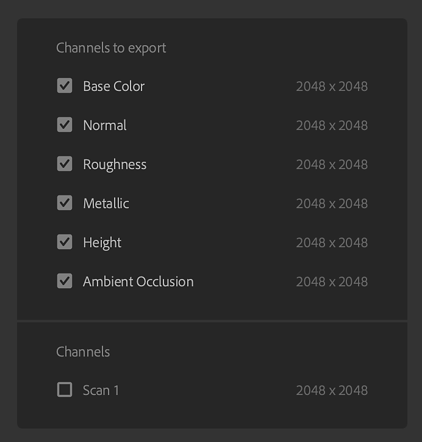

# Exportfenster

Sie können Ihr Asset aus dem Bereich <b>Exportieren</b> in der <b>rechten Leiste</b> exportieren.

Die Exportoptionen hängen vom Typ des zu exportierenden Elements ab.

Das Exportfenster für einen Material-Export.

>[!NOTE]
>
> Das Exportierenbedienfeld enthält auch Optionen zum Senden Ihres Assets an Substance 3D Designer, Painter oder Stager. Dadurch wird das Element automatisch mit den richtigen Einstellungen für andere Substance 3D-Anwendungen exportiert.

## Allgemeine Einstellungen

Die folgenden Einstellungen sind für alle Elementtypen verfügbar:

* <b>Name: </b>Dieses Feld definiert den Namen des Assets, das Sie exportieren. Es wird als Präfix im Dateinamen der exportierten Dateien verwendet.
* <b>Speichern unter: </b>Wählen Sie das Exportziel für Ihr Asset aus. Optional können Sie auch einen Unterordner am ausgewählten Speicherort erstellen. Der Unterordner wird nach Ihrem Element benannt, wenn diese Option aktiviert ist.

## Material Settings

Beim Exportieren von Materials stehen im Bedienfeld &quot;Material-Einstellungen&quot; des Exportfensters die folgenden Optionen zur Verfügung:

* <b>Format</b>: Wählen Sie ein Dateiformat für das exportierte Element aus.
  * <b>SBSAR</b>: Exportieren Sie das Material zur Verwendung in jeder Anwendung, die Substance-Material unterstützt.
  * <b>SBS</b>: Exportiere dein Material, damit es in Substance 3D Designer geöffnet werden kann.
  * <b>EXR, JPEG, PNG, TARGA, TIFF</b>: Exportiere dein Material als eine Sammlung von Bilddateien.

>[!NOTE]
>
> Die Bittiefe für die Kanäle &quot;Normal&quot; und &quot;Height&quot; muss 16 Bit betragen. Andere Kanäle werden in 8/16-Bit exportiert, abhängig von Ihren Materialien und den von Ihnen verwendeten Filtern. Je nach Dateiformat kann die Bittiefe geändert werden, da einige Dateiformate eine hohe Bittiefe nicht unterstützen.

{width="400px"}

* <b>Vorgabe </b> (EXR, JPEG, PNG, TARGA, TIFF): Wählen Sie eine Vorgabe aus, um den Dateiexport für eine bestimmte Anwendung oder Pipeline automatisch einzurichten.
  * Die Option <b>Standard (Projektarbeitsablauf)</b> zeigt eine Liste aller verfügbaren Kanäle Ihrer Material an, ohne dass eine Vorgabe angewendet wurde.
  * Verwenden Sie die Schaltfläche <b>Vorgaben verwalten </b> rechts neben dem Parameter Vorgaben, um Vorgaben zu bearbeiten oder eigene Vorgaben hinzuzufügen.<b> </b>
  * [Weitere Informationen zu Vorgaben finden Sie hier.](../managing-presets.md)

>[!NOTE]
>
> Die Vorgabenauswahl ist nicht verfügbar, wenn das Exportformat SBS oder SBSAR ist. Für diese Formate ist die Ausgabedatei bereits für die Verwendung in allen Substance-Produkten und Substance-Integrationen eingerichtet.

* <b>Material-Typ </b> (SBSAR, SBS): Wählen Sie aus, ob sich das exportierte Material wie ein Standard-Material, ein Aufkleber oder ein Atlas verhält. Diese Einstellung kann die Behandlung durch andere Anwendungen ändern, die SBSAR- und SBS-Dateien unterstützen.

* <b>Komprimierung </b>(SBSAR, SBS): Komprimierung der exportierten Datei auswählen
  * <b>Auto</b>: Erlauben Sie Sampler, die Komprimierungseinstellungen zu bestimmen.
  * <b>Beste</b>: Diese Option führt zu kleineren Dateien, kann jedoch auch zu längeren Lade- und Speicherzeiten führen, während die Datei codiert oder decodiert wird.
  * <b>Keine</b>: Ohne Komprimierung sind Dateien größer, werden jedoch schneller geladen und gespeichert.
* <b>Auflösung (</b>SBSAR, SBS<b>)</b>: Wählen Sie eine Ausgabeauflösung für das Material.
  * Standardmäßig basiert die Auflösung auf den globalen Parametern von Sampler. Wenn Sie eine andere Auflösung auswählen, berechnet Sampler alle Ihre Materials mit dieser neuen Auflösung neu. Dies kann sich auf das endgültige Aussehen Ihrer Materials auswirken.

* <b>Auflösung </b> (Bildformate): Wählen Sie aus, ob die Auflösung jeder Ebene unabhängig exportiert wird, oder überschreiben Sie die Auflösung, sodass alle Ebenen in einer einheitlichen Größe exportiert werden. Wenn Alle überschreiben ausgewählt ist, werden Optionen zum Ändern der Ausgabeauflösung angezeigt.
  * Standardmäßig basiert die Auflösung auf der Ausgabeauflösung jeder Ebene. Wenn Sie eine andere Auflösung auswählen, berechnet Sampler alle Ihre Materials mit dieser neuen Auflösung neu. Dies kann sich auf das endgültige Aussehen Ihrer Materials auswirken.

* **Materialmodell** (Alle Formate bei Standardvorgabe): Wählen Sie einen Shader-Standard für Ihre exportierten Texturen aus.
  * Wenn Sie das Materialmodell ändern, wirkt sich dies auf die Dateinamen der exportierten Dateien aus. OpenPBR verwendet beispielsweise &quot;Metalness&quot; im Gegensatz zu ASM, das &quot;Metallic&quot; verwendet.

### Weitere Informationen

Der verfügbare Speicherplatz auf dem ausgewählten Ziellaufwerk wird am unteren Rand des <b>Exportfensters</b> angezeigt.

>[!NOTE]
>
> <b>Physische Größe</b> ist während der Erstellung des Materials festgelegt und kann während des Exports nicht geändert werden.

### Kanäle

Auf der rechten Seite des <b>Kanaleinstellungsfensters</b> befindet sich eine Liste der Materialien, die exportiert werden können, und deren Auflösungen (Standardkanäle und benutzerdefinierte Kanäle).

Jede Vorgabe verfügt über einen anderen Satz von Kanälen für den Export, und der Name der exportierten Dateien basiert auf den Namen, die im Bereich <b>Kanäle für den Export</b> angezeigt werden. Sie können das Kontrollkästchen neben einem beliebigen Kanal verwenden, um den Export für diesen Kanal zu aktivieren oder zu deaktivieren.

