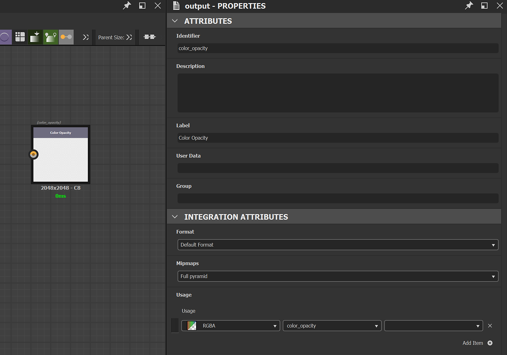

# Benutzerdefinierte Vorgaben erstellen und bearbeiten

Benutzerdefinierte Vorgaben können mit Substance 3D Designer erstellt werden.

Bei der Erstellung benutzerdefinierter Vorgaben werden dieselben Regeln beachtet wie beim Erstellen eines benutzerdefinierten Filters für Sampler. Die Dokumentation ist hier [verfügbar](../../filters/custom-filters.md).

## Kreation

## Diagramm erstellen.

Öffnen Sie den Substance Designer und erstellen Sie ein neues Substance-Diagramm.

Öffnen Sie die Diagrammeigenschaften und geben Sie die folgenden obligatorischen Informationen ein:

* Bezeichnung: Geben Sie den Namen Ihrer benutzerdefinierten Vorgabe ein, die in der Sampler-Oberfläche verwendet wird
* Benutzerdaten: <b>Alchemist::type=filter</b>

## Definition von Ein- und Ausgängen

### Eingaben

Die Eingaben repräsentieren die Materialkanäle, die Sie vor dem Export transformieren möchten.

Erstellen Sie einen Eingabefarbknoten (oder Graustufen) pro Materialkanal und fügen Sie jedem Eingabeknoten eine <b>Verwendung</b> in den Attributen hinzu, um sicherzustellen, dass die Verbindung zwischen Ihrem Material bzw. Ihren Materialien und Ihrer benutzerdefinierten Vorgabe hergestellt wird.

Beispiel: Definition der Grundfarbeingabe

{width="600px"}

### Ausgaben

Die Ausgaben stellen das Ergebnis Ihres Texturexports dar.

Erstellen Sie einen Ausgabeknoten pro Textur, und fügen Sie jedem Ausgabeknoten <b>Auslastung</b> und eine <b>Bezeichnung</b> in den Attributen hinzu. Das <b>Label</b> wird in der Kanalliste im Exporterfenster und im Namen Ihrer Texturdatei angezeigt.

Beispiel: Definition der benutzerdefinierten Textur Farbdeckkraft

{width="600px"}

#### Beispiel für Kanal-Packing und Kanal-Konvertierung

Packing von 3 Graustufen-Kanälen in einer RGB-Textur:

{width="600px"}

Kanalkonvertierung von PBR Metallic/Roughness zu PBR Specular/Glossiness:

{width="600px"}

## Importieren

So importieren Sie Ihre neue Vorgabe:

1. Klicken Sie auf die Schaltfläche <b>Vorgaben verwalten </b> rechts neben dem Dropdown-Menü <b>Vorgaben</b>.
1. Verwenden Sie die Schaltfläche <b>Vorgaben importieren</b> am unteren Rand der Liste <b>Vorgaben importieren</b>.

{width="400px"}
