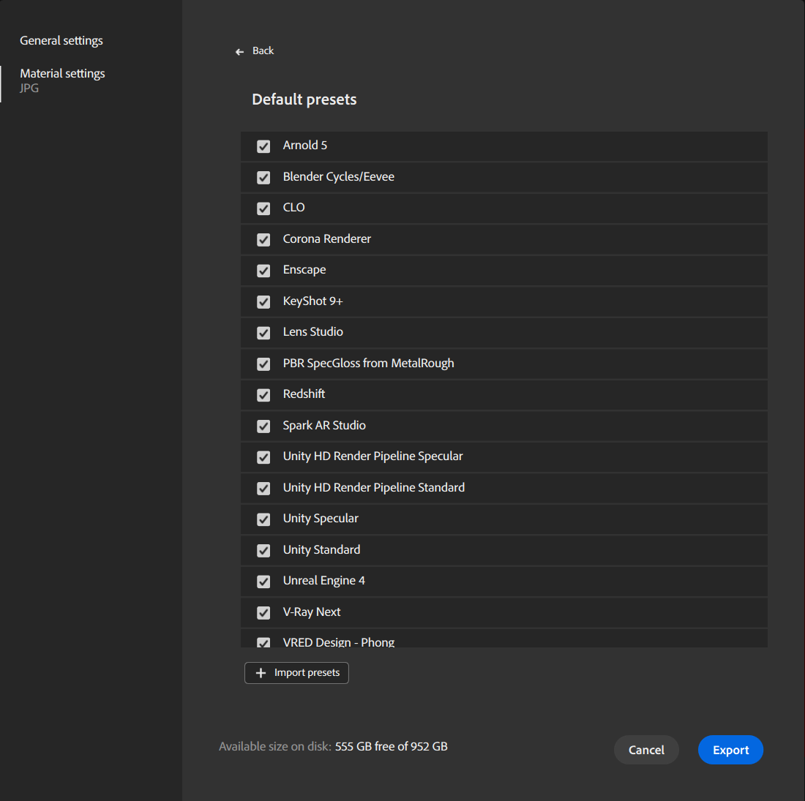

# Verwalten von Vorgaben

Mit Vorgaben können Sie die exportierte Datei für eine bestimmte Anwendung schnell konfigurieren. Sie können auch benutzerdefinierte Vorgaben erstellen, um Ihre Anforderungen zu erfüllen, wenn Sie eine Pipeline verwenden, die nicht von den Standardvorgaben abgedeckt wird.

## Vorgaben verwenden

Vorgaben sind nur beim Export in eine Bilddatei verfügbar. Beim Export in SBS oder SBSAR sind keine Vorgaben erforderlich.

So greifen Sie auf Vorgaben zu:

1. Öffnen Sie das Fenster <b>Export </b>:
   1. Verwenden Sie das <b>Exportierenbedienfeld</b> in der <b>rechten Leiste</b>.
   1. Verwenden Sie <b> Datei > Exportieren als...1</b>
   1. Tastaturbefehl <b>Strg + E.</b> verwenden
1. Wählen Sie links im Fenster &quot;<b>Material </b> exportieren&quot; die Option &quot;<b>Exporteinstellungen</b>&quot;.
1. Bildformat auswählen (EXR, JPEG, PNG, TARGA, TIFF)
1. Die Vorgabenliste wird angezeigt.

{width="400px"}

Wählen Sie im Dropdown &quot;Vorgaben&quot; eine Vorgabe aus oder verwenden Sie die Schaltfläche <b>Vorgaben verwalten </b> neben der Dropdown-Liste, um Ihre Vorgaben zu verwalten.

## Vorgaben verwalten

Wählen Sie im Dropdown &quot;Vorgaben&quot; eine Vorgabe aus oder verwenden Sie die Schaltfläche <b>Vorgaben verwalten </b> neben der Dropdown-Liste, um Ihre Vorgaben zu verwalten.

## Standardvorgaben

{width="400px"}

Für alle Standardvorgaben können Sie sie aktivieren/deaktivieren. Wenn eine Standardvorgabe deaktiviert ist, wird sie nicht in der Dropdown-Liste Vorgabe angezeigt.

Standardmäßig sind alle Vorgaben aktiviert.

## Benutzerdefinierte Vorgaben

Sie können benutzerdefinierte Vorgaben aktivieren/deaktivieren. Wenn eine benutzerdefinierte Vorgabe deaktiviert ist, wird sie nicht in der Dropdown-Liste Vorgabe angezeigt.

Sie haben außerdem folgende Möglichkeiten:

* <b>Umbenennen</b>: Ändern Sie den Namen der Vorgabe in der Benutzeroberfläche.
* <b>Ersetzen</b>: Ändern Sie die Datei Ihrer Vorgabe in eine neue Version.
* <b>Löschen</b>: Löschen Sie die Vorgabe.
