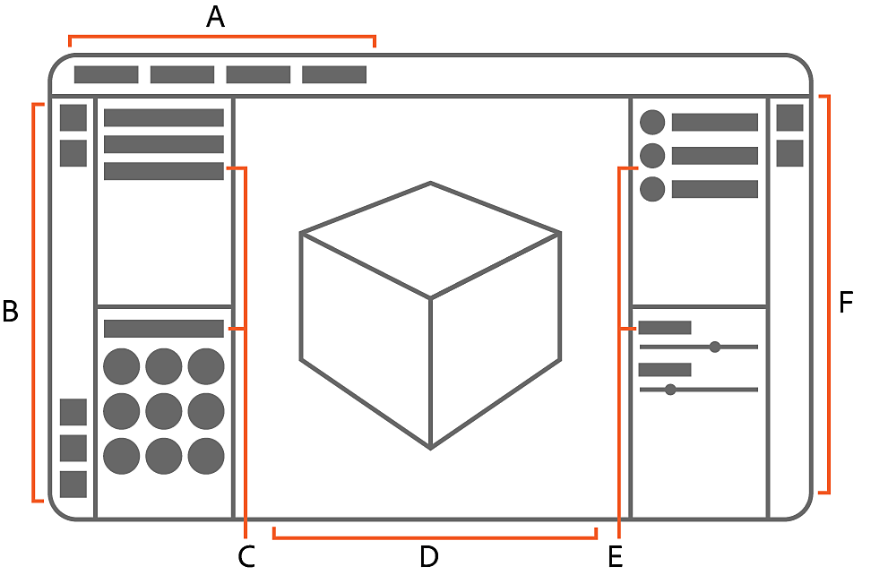

# Benutzeroberfläche

Der Arbeitsbereich von Sampler besteht aus den 2D- und 3D-Viewporten, der linken und rechten Seitenleiste sowie einer Reihe von Bedienfeldern. Jedes Bedienfeld ist einem bestimmten Zweck gewidmet, sodass verschiedene Bedienfelder während der verschiedenen Teile des kreativen Prozesses nützlich sind.

<table>
<tr style="border: 0;">
<td style="border: 0;" valign="top">

## Arbeitsbereich im Überblick

In diesem Arbeitsbereich verbringen Sie die meiste Zeit in Sampler. Standardmäßig besteht der Arbeitsbereich aus sechs Bereichen:</td>
<td style="border: 0;" valign="top">

{zoomable="yes"}

</td>
</tr>
</table>

A. In der <b>Anwendungsmenüleiste</b> wird der aktuelle Projektname angezeigt. Es enthält auch die Menüs &quot;Datei&quot;, &quot;Bearbeiten&quot;, &quot;Fenster&quot;, &quot;Hilfe&quot; und &quot;Lizenz&quot;.\
B. Von der **linken Seitenleiste** aus können Sie:

* Inhalte hinzufügen und importieren
* Auf dem Creative Cloud-Desktop können Sie 3D-Elemente durchsuchen.
* Greife auf Schnellaktionen zu.
* Greife schnell auf gängige Tools zu.
* Öffnen Sie den Bereich **Kanaleinstellungen**.

C. Die Bereiche &quot;<b>Projekt</b>&quot; und &quot;<b>Elemente&quot;.</b>
D. Die <b>2D </b>- und <b>3D-Viewport</b> zeigen das Element an, an dem Sie gerade arbeiten.\
E. Die Bereiche <b>Ebenen</b> und <b>Eigenschaften.</b>
F. Von der **rechten Seitenleiste** aus können Sie auf die folgenden Fenster zugreifen:

* Exponierte Parameter
* Physische Größe
* Metadaten
* Exportieren

Die <b>Anwendungsmenüs</b> werden im Folgenden ausführlicher behandelt. **[Fenster](panels/panels.md)**, der **[Viewport](2d-and-3d-viewport.md)** und die **[Seitenleisten](sidebars.md)** verfügen jeweils über eigene Artikel.

## Arbeitsbereich anpassen

Der Arbeitsbereich von Sampler ist vollständig anpassbar, sodass du ein Layout finden kannst, das für dich am besten funktioniert. Wenn Sie die Fenster auf das Standardlayout zurücksetzen möchten, verwenden Sie **Fenster > Auf Standardlayout zurücksetzen**.

## Neuanordnen von Bedienfeldern

Klicken und ziehen Sie den Titel eines Bedienfelds, um es zu verschieben.

Sie können ein Bedienfeld an den Kanten des Viewports oder anderer Bedienfelder andocken: Ziehe das Bedienfeld über die Kante, an der es angedockt werden soll. Eine blaue Hilfslinie wird eingeblendet. Wenn die Linie eingeblendet wird, legen Sie das Bedienfeld ab, um es anzudocken.

## Öffnen und Schließen von Bedienfeldern

Verwenden Sie das X rechts oben im Bedienfeld, um es zu schließen. Geschlossene Bedienfelder werden in den Seitenleisten gespeichert.

Um ein Bedienfeld erneut zu öffnen, klicken Sie auf das entsprechende Symbol für das Bedienfeld in der linken oder rechten Seitenleiste. Dadurch wird das Fenster vorübergehend geöffnet. Ziehen Sie das Bedienfeld heraus, um es dauerhaft geöffnet zu lassen.

<table>
<tr style="border: 0;">
<td style="border: 0;" valign="top">

Die linke Seitenleiste bietet Zugriff auf die folgenden Fenster, wenn sie geschlossen sind:

* Projektbedienfeld
* Elementbedienfeld
* Bedienfeld für Schnellaktionen

</td>
<td style="border: 0;" valign="top">

Die rechte Seitenleiste enthält die folgenden Fenster, wenn sie geschlossen sind:

* Ebenenbedienfeld
* Eigenschaften
* Exponierte Parameter
* Physische Größe
* Metadaten
* Exportieren

</td>
</tr>
</table>

## Anwendungsmenüs

In der **Anwendungsmenüleiste** wird der aktuelle Projektname angezeigt. Es enthält auch die Menüs **Datei**, **Bearbeiten**, **Fenster**, **Hilfe** und **Lizenz**.

Verwenden Sie das Menü <b>Datei</b>, um ein neues Projekt zu erstellen, ein vorhandenes Projekt zu öffnen oder Ihr aktuelles Projekt zu speichern oder zu exportieren.

Verwenden Sie das Menü <b>Bearbeiten</b>, um Aktionen rückgängig zu machen und zu wiederholen, oder öffnen Sie [Voreinstellungen](../interface/preferences/preferences.md).

Verwenden Sie das Menü <b>Fenster</b>, um den Arbeitsbereich auf das Standardlayout zurückzusetzen.

Verwenden Sie das Menü <b>Hilfe </b>, um mehr über Sampler zu erfahren oder um herauszufinden, wie Probleme behoben werden können.

| Hilfemenüelement | Beschreibung |
| --- | --- |
| Tutorials | Öffnet die Seite mit den Tutorials zu Sampler. Tutorials decken alles ab, von den Grundlagen der Verwendung von Sampler bis hin zu fortgeschrittenen Techniken, die deine Arbeit beschleunigen können. |
| Dokumentation | Siehe die Dokumentation. Die Dokumentation enthält Informationen zu allen Aspekten der Verwendung von Sampler. |
| Python-API-Dokumentation | Erfahren Sie, wie Sie die Python-API von Sampler zum Automatisieren von Aufgaben verwenden. |
| Tastenkombinationen | Hier finden Sie eine vollständige Liste der Tastaturbefehle. Die Verwendung von Tastaturbefehlen kann Ihnen helfen, schneller zu arbeiten, als sich allein auf den Cursor zu verlassen. |
| Willkommen | Öffnen Sie das <b>Begrüßungsfenster</b>, um mehr über die Möglichkeiten in Sampler zu erfahren. |
| Neue Funktionen | Öffnen Sie das Fenster <b>Neue Funktionen</b>, um die Änderungen in der neuesten Version von Sampler anzuzeigen. |
| Versionshinweise | Erfahre, was sich in den letzten Versionen von Sampler geändert hat. |
| Forum | Öffnen Sie die Foren, um an der Unterhaltung mit anderen Mitgliedern der Substance 3D Sampler-Community teilzunehmen, oder senden Sie Ihre eigenen Beiträge und Vorschläge. |
| Programmfehler melden | Problem mit Sampler melden |
| Protokoll exportieren | Dies kann nützlich sein, um Probleme zu beheben, die bei der Verwendung von Sampler auftreten können. |
| Substance 3D-Assets | Öffnen Sie die Substance Source, um auf eine riesige Bibliothek mit Materials und anderen Elementen zuzugreifen, die vom Substance 3D-Team erstellt und kuratiert wurden. |
| Substance 3D Community-Assets | Auf der Substance share findest du eine Bibliothek mit Materialien und anderen Elementen, die von Mitgliedern der Substance 3D-Community erstellt wurden. |
| Hardware-Informationen | Siehe Informationen zur Hardware Ihres Geräts. |
| Über Sampler | Hier finden Sie Informationen zu Ihrer installierten Version von Sampler. |

Verwenden Sie im Menü **Lizenz** die Option Mein Konto verwalten, um auf Ihr Adobe-Konto zuzugreifen. Melden Sie sich von Ihrem Adobe-Konto ab, indem Sie auf &quot;Abmelden&quot; klicken.
