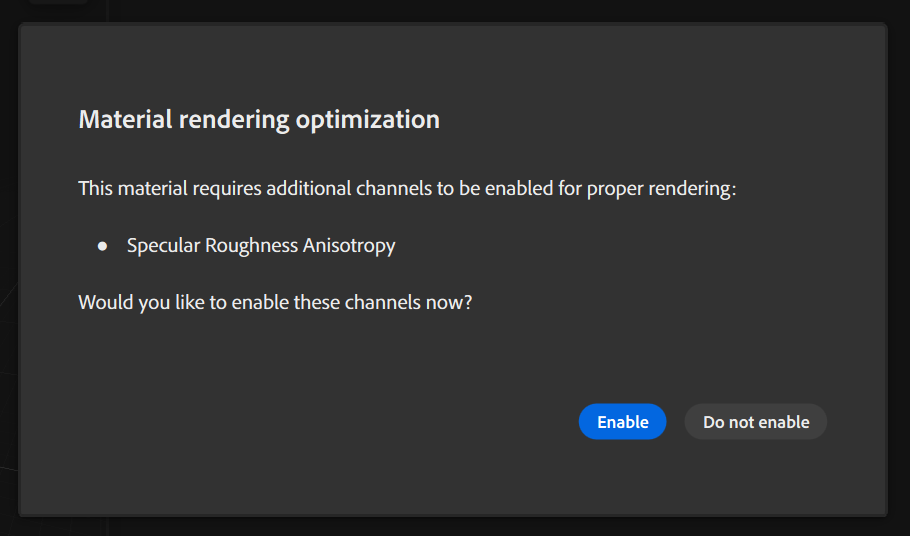

# Elementbedienfeld

Das Bedienfeld &quot;**Elemente&quot;** enthält Elemente, die Sie zum Erstellen Ihrer Kreationen verwenden können. Sampler bietet eine Sammlung von Materialien, Filtern und Texturgeneratoren, die Ihnen den Einstieg erleichtern.

Das **Bedienfeld &quot;Elemente&quot;** verfügt über einige Steuerelemente, die Sie beim Organisieren und Suchen von Elementen unterstützen:

* Verwenden Sie die Suchleiste, um Assets schnell zu finden.
* Elemente nach Typ filtern.
* Gruppieren Sie Elemente nach Typ oder Kategorie.
* Wechseln Sie zwischen Listen- und Symbolansicht.

## Elemente zum Bedienfeld &quot;Elemente&quot; hinzufügen

Um eigene Elemente zum Bedienfeld &quot;Elemente&quot; hinzuzufügen, klicken Sie rechts unten im Bedienfeld &quot;**Elemente&quot; auf &quot;**+**&quot;.** Navigieren Sie zum Speicherort des Assets, wählen Sie es aus, und klicken Sie auf **Öffnen**. Sie können benutzerdefinierte Elemente aus dem Bedienfeld **Elemente** entfernen, indem Sie sie über den Papierkorb ziehen.

## Zusätzliche Kanäle aktivieren

Wenn Sie Materialien aus dem Bedienfeld &quot;Elemente&quot; per Drag-and-Drop in Ihren Ebenenstapel ziehen, wird Ihnen möglicherweise angeboten, zusätzliche Kanäle zu aktivieren. Es wird angeboten, wenn das Material einen Kanal ausgibt, der derzeit nicht in Ihrem Asset aktiviert ist. Du kannst die Funktion aktivieren, wenn du von der komplexen Struktur des Materials (z. B. Anisotropie oder Beschichtung) profitieren möchtest.

>[!NOTE]
>
> Im Bedienfeld &quot;**Elemente&quot; können nur benutzerdefinierte Elemente gelöscht werden**. Die Standardelemente von Sampler können nicht gelöscht werden.
