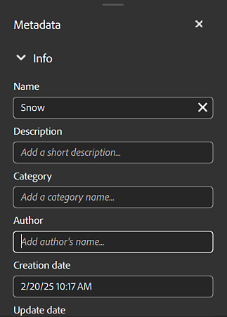

# Metadatenbedienfeld

{width="500px"}

Im Metadatenbedienfeld können Sie auf die Metadaten Ihres Assets zugreifen und diese ändern.

<b>Name</b>: Der Name des Assets.

<b>Beschreibung</b>: Beschreibung des im Substance-Material eingebetteten Assets oder der Beschreibung

<b>Kategorie</b>: Kategorie des im Substance-Material eingebetteten Stockmediums oder der Kategorie

<b>Autor</b>: Der Autor des Assets oder der Autor, der in das Substance-Material eingebettet ist. Standardmäßig ist der Name des Autors der Name Ihres Betriebssystemkontos.

<b>Erstellungsdatum</b>: Erstellungsdatum des Assets in Sampler oder Importdatum in Sampler. (Dies kann nicht bearbeitet werden.)

<b>Aktualisierungsdatum</b>: Das Datum, an dem Ihr Asset zuletzt aktualisiert wurde. (Dies kann nicht bearbeitet werden.)

<b>Tags</b>: Tags Ihres Assets oder Tags, die in das Substance-Material eingebettet sind.

<b>Physische Größe</b>: X-, Y- und Z-Größe des Elements.

<b>Bewertung</b>: Bewertung Ihres Stockmediums.

## Benutzerdefinierte Metadaten

Alle benutzerdefinierten Metadaten werden in die Materialdatei (SBSAR) aufgenommen, um einen effizienteren Arbeitsablauf für den anwendungsübergreifenden Austausch digitaler Materialien zu gewährleisten.

{width="350px"}

<b>Neues Textfeld </b> (Hinzufügen eines benutzerdefinierten Felds für Metadaten):

1. Name einfügen. Der Name eines benutzerdefinierten Metadaten muss ein gültiger XML-Elementname sein (z. B. : keine Leerzeichen oder Sonderzeichen, beginnt nicht mit einer Zahl...)
1. Beschreibung/Hinweis einfügen

Bewegen Sie den Cursor über das Feld und wählen Sie die angezeigte Schaltfläche &quot;Bearbeiten&quot; oder &quot;Löschen&quot; aus, um benutzerdefinierte Metadatenfelder zu ändern.
