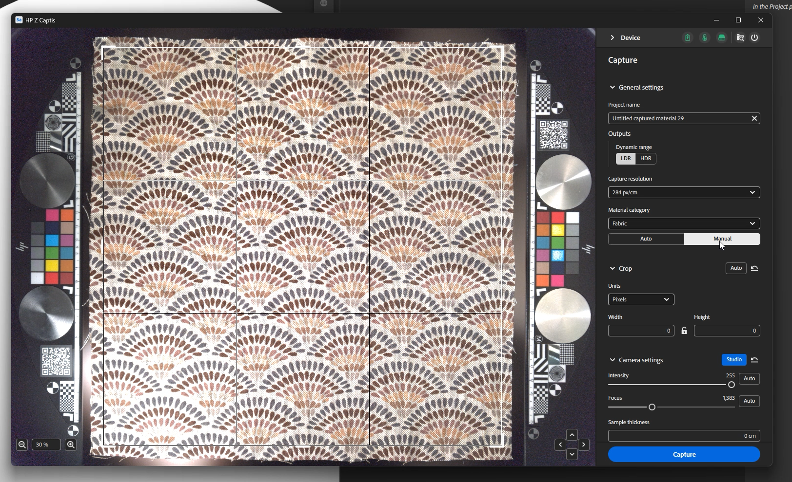

# Starten Sie Sampler und schalten Sie den HP Z Captis ein.

Sobald Sampler gestartet wurde und das HP Z Captis-Gerät an Ihren Computer angeschlossen wurde, klicken Sie auf das Captis/cone-Symbol in der linken Leiste.

Wenn Sie die HP Z Captis nicht in der Benutzeroberfläche sehen, lesen Sie bitte die FAQ.

Nachdem Sie auf HP Z Captis geklickt haben, wird ein spezielles Fenster mit 3 Optionen geöffnet:

1. <b>Inhalt durchsuchen</b>: Der Datei-Explorer wird geöffnet, um den lokalen Speicher Ihres HP Z Captis -Geräts zu durchsuchen.
1. <b>Scan starten</b>: Das HP Z Captis-Gerät wird initialisiert und der Erfassungsablauf wird gestartet.
1. <b>Herunterfahren</b>: Das Gerät wird heruntergefahren und das Fenster wird geschlossen.

## Fenster &quot;HP Z Captis&quot; wird geschlossen

Wenn Sie das HP Z Captis-Fenster schließen, werden Sie jederzeit gefragt, ob Sie <b>den Vorgang fortsetzen möchten</b> oder <b>Abbruch</b>.

Wenn Sie auf &quot;Weiter&quot; klicken, setzt das Gerät die aktuelle Aufgabe offline fort und hält am Ende des aktuellen Schritts an. Sie können Sampler später erneut verbinden, um mit dem nächsten Schritt der Aufnahmesitzung fortzufahren.

## Vorschauschritt

Sampler initialisiert die Vorschau des HP Z Captis-Geräts. Es wird empfohlen, <b> während der Initialisierung nicht mit der Ansicht zu interagieren.</b>

In diesem neuen Update gibt es zwei Modi: Auto und manuell.

### Allgemeine Einstellungen

#### Auto-Modus

Sie haben jetzt die Möglichkeit, die Aufnahme mit einem Klick zu starten: Sampler wird:

* einen Standardnamen zu definieren,
* automatisch den Fokusbereich- (ROI)/Zuschneidebereich mit der Hintergrundbeleuchtung definieren,
* den Schwerpunkt auf den vollen ROI zu legen und
* ändern Sie die Intensitätseinstellung auf eine, die an Ihr Material angepasst ist.

Wenn Sie zuvor Aufnahmen gemacht haben, sind die Material-Kategorie, die Ausgaben und die ausgewählte Aufnahmeauflösung dieselben wie bei Ihrer vorherigen Aufnahme.

#### Manueller Modus

Sie können auch einige der Einstellungen manuell definieren:

*Projektname*

Sie können einen Projektnamen der Aufnahme definieren und definieren, welche Art von Ausgaben Sie abrufen möchten.

*Ausgaben*

* Standardmäßig werden nur die PBR-Kanäle des Materials (Grundfarbe, Normal, Height und Deckkraft) gespeichert.\
  Sie haben die Möglichkeit, den Ausgabetyp zwischen LDR (Low Dynamic Range) und HDR (High Dynamic Range) zu wählen.

*Aufnahmelösung*

* 239 px/in - 94 px/cm (Vorschau: geringere Qualität, schnellerer Scan)
* px/in - 142 px/cm (Standard: hohe Qualität, in den meisten Workflows leicht zu verwalten - entspricht 4K für 30x30cm-Aufnahmen)
* 718 px/in - 284 px/cm (volle Auflösung - entspricht 8k für 30 x 30 cm Aufnahmen)

Hinweis: In Sampler werden nur PBR-Kanäle geladen.\
Die Standardordneraufnahmen werden in gespeichert und können in den Voreinstellungen geändert werden.

<b>Material-Kategorie</b>

Legen Sie hier den Typ des Materials fest, das Sie nach einer auf Ihr Material abgestimmten Kartengenerierung suchen.\
Die ausgewählte Standardkategorie ist &quot;Fabric&quot;. So können Sie das Ergebnis Ihrer Rauheit optimieren.

Wenn das gescannte Bild mehrere Typen von Materialien enthält, wählen Sie die Kategorie des größten Fotos aus.

<b>Zuschneiden</b>

Der Zuschnitt kann automatisch oder manuell erfolgen.

Beim automatischen Zuschneiden wird die Hintergrundbeleuchtung verwendet, um die Umrisse des Materials zu definieren, und der Fokusbereich (ROI) wird um das Bild herum platziert. Sie wird nicht angepasst, wenn mehrere Material-Samples gleichzeitig digitalisiert werden oder wenn das Material sehr transparent ist.
In diesem Fall kann der ROI durch Ziehen der Ecken des Zuschneide-Widgets in der Vorschau oder durch Festlegen einer definierten Auflösung oder Physische Größe definiert werden.

<b>Kamera </b>

* Intensität: Die Belichtung der Kamera anpassen.\
  Wenn Sie auf &quot;Automatisch&quot; klicken, wird der ROI-Center verwendet, um die beste Intensität für das Material zu definieren.

* Fokus: Dadurch wird der Fokus der Kamera angepasst.\
  Wenn Sie auf &quot;Automatisch&quot; klicken, wird der ideale Fokus unter Verwendung des vollen ROI definiert.
  Dieser neue Fokusalgorithmus, bei dem der Fokus nicht mehr auf einem einzigen Punkt liegt, ermöglicht eine gleichmäßigere Fokussierung auf das digitalisierte Material, was zu qualitativ hochwertigeren Scans führt, die leichter kachelbar sind.

Sie können beide von Hand einstellen, wenn Sie möchten.

<b>Weitere Einstellungen</b>

Andere Einstellungsarten <b> müssen nur bei Anlass </b> geändert werden: die Farb- und Ausrichtungskalibrierung.

* Farbkalibrierung

Kalibrieren Sie die Grundfarbe der Farbkarte mithilfe der technischen Bereiche des HP Z Captis. \
Das Ergebnis ist, dass das endgültige Material exakt dieselbe Farbe hat wie die Probe, die Sie im HP Z Captis-Fach hinzugefügt haben.\
Die technischen Bereiche mit den Farbfeldern werden automatisch erkannt und für die Kalibrierung verwendet. Sie müssen an ihren jeweiligen Stellen auf jeder Seite der Probe platziert werden.

Dies ist nur im Studio-Modus verfügbar. Bitte stellen Sie sicher, dass Sie den Fokus vor dieser Farbkalibrierung durchführen.

Diese Kalibrierung muss <b>alle paar Monate</b> durchgeführt werden. Es ist nicht erforderlich, dies für jeden Scan oder jedes Mal zu tun, wenn das Gerät verwendet wird.

* Kalibrierung der Ausrichtung

Diese Ausrichtung <b> muss </b> erfolgen, wenn Sie Ihr Gerät <b>erstmalig einrichten</b>, jedes Mal, wenn Sie es physisch verschieben, und dann alle paar Monate. Es ist <b>nicht erforderlich</b>, diesen Prozess <b>für jede Aufnahme durchzuführen</b>.

Bitte stellen Sie sicher, dass der Fokus vor dieser Ausrichtungskalibrierung erfolgt.

Um die Ausrichtung vorzunehmen, <b>legen Sie etwas mit scharfen und klaren Informationen, wie ein Blatt Papier mit gedrucktem Text, in die Mitte des Aufnahmeraums</b>, schließen Sie die Schublade und klicken Sie auf die Ausrichtungstaste. Sobald dies erledigt ist, können Sie sicherstellen, dass alles an Ort und Stelle ist, mit den technischen Bereichen auf jeder Seite des Scanraums, ein Material in der Mitte platziert und gegebenenfalls mit den Magneten, die mit dem HP Z Captis Gerät geliefert werden, an Ort und Stelle gehalten wird, und Sie können mit dem Scannen Ihrer Materialien beginnen.

Wenn alles bereit ist: <b>Starten Sie den Scan</b>.

## Schritte zum Erfassen, Verarbeiten und Kopieren

Sobald der Scan gestartet wurde, werden in der Vorschau die während des Vorgangs aufgenommenen Fotos angezeigt.

Der Verarbeitungsteil ist in drei Teile geteilt:

* <b>Aufnahme</b>: Alle erforderlichen Fotos aufnehmen

* <b>Verarbeitung</b>: Verarbeiten der Fotos zum Generieren von PBR-Kanälen (Grundfarbe, Normal, Height, Deckkraft)

* <b>Kopieren</b>: Kopieren der Ergebnisse vom HP Z Captis-Gerät auf Ihren Computer

Während der Aufnahme und Verarbeitung können Sie Metadaten hinzufügen (dieselben Metadaten, die Sie im Sampler-Metadatenbedienfeld finden).

Während der Verarbeitung werden Sie sehen, dass das Ergebnis Kachel für Kachel erstellt wird.

## Zusammenfassungsschritt

In diesem Schritt können Sie die Ergebnisse des Scans überprüfen. Alle erstellten Kanäle werden angezeigt (im Explorer-Modus wird keine Deckkraft erstellt, da der Explorer-Ring keine Hintergrundbeleuchtung hat).

Sie können festlegen, dass Ihr Material an Sampler gesendet wird, um es Ihrem Projekt hinzuzufügen und mit der Verarbeitung zu beginnen.
Sie können auch direkt eine neue Aufnahme starten, ohne sie dem Projekt hinzuzufügen.
In beiden Fällen finden Sie Ihre gescannten Karten in dem entsprechenden Ordner auf Ihrem Computer: C:\Users\username\Documents\Adobe\Adobe Substance 3D Sampler\Captis\Material

## Material Edition

Nach dem Beenden des Fensters &quot;HP Z-Kapazität&quot; werden die Kanäle (Grundfarbe, Normal, Height, Rauheit und Deckkraft, falls zutreffend) als Ebene im Ebenenbedienfeld hinzugefügt.

Verwenden Sie Sampler-Filter (Ausgleichen, Perspektive zuschneiden, Kachelung ...), um Ihr Material zu verarbeiten und zu bereinigen.

Wenn Sie fertig sind, können Sie:

* Sampler-Projekt speichern: Datei > Speichern unter ... (Strg + S)

* Material exportieren: Datei > Exportieren ... (Strg + E)

