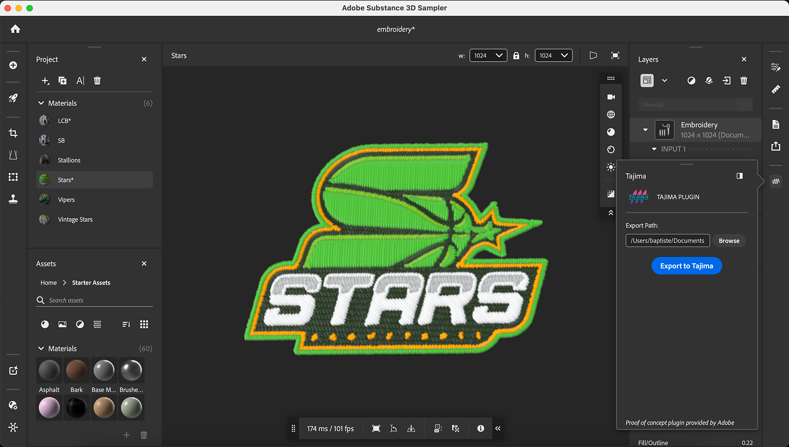

# Tajima Exporter plugin of Embroidery files

Mit diesem ersten Konzeptnachweis können Sie jetzt Ihre digital bestickten Designs von Adobe Substance 3D direkt in die Stickerei-Software <b>Tajima DG17</b> übertragen. Dadurch entfällt die Notwendigkeit einer zeitaufwendigen manuellen Digitalisierung.

Schauen wir uns Schritt für Schritt an, wie man das Programm verwendet.

## Herunterladen

Laden Sie das Sampler Tajima-Plugin hier herunter:

[Plug-in hier herunterladen](https://www.adobe.com/go/sampler-tajima-plugin)

## Installation

*Über die Sampler-Benutzeroberfläche:*

Gehen Sie zu Voreinstellungen > Plug-ins und Skripten > Plug-in hinzufügen .

Wählen Sie den Entpackungsordner des Downloads aus

*Von Ihrem Datei-Explorer:*

Navigieren Sie zu Dokumente > Adobe > Adobe Substance 3D Sampler > Plug-ins

Kopieren/Einfügen hier den Entpackungsordner des Downloads

## Installation

Öffnen Sie Ihr Sampler-Projekt (5.0.3 oder höher) mit einem Stickereimaterial.

Öffne das Tajima-Plug-in und exportiere es an den gewünschten Speicherort

<b>Tajima-Software </b>

<b>1</b>- Starten des Substance 3D-Assistenten

<b>2</b>- Wählen Sie den entsprechenden <b>Datenordner</b> aus (Sampler-Exportordner).

<b>3</b>- Wählen Sie das Threaddiagramm Stickerei aus.

<b>4</b>- Anwenden einer Formatvorgabe für optimale Fabric-Einstellungen

<b>5</b>- Bearbeiten Sie Formen nach Bedarf, um die besten Ergebnisse zu erzielen.

<b>6</b> - Vorschau des Entwurfsarbeitsblatts, komplett mit einem vom Computer scannbaren Barcode

