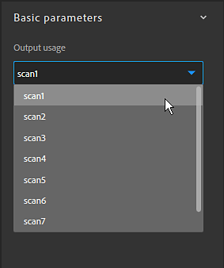

# Version 2019.1

Mit **Substance Alchemist 2019.1 &quot;Sesam&quot;** können Sie Ihre Assets mit dem neuen Projektmanagement freigeben. Der Ebenenstapel wurde vollständig neu erstellt, um den Arbeitsablauf zu verbessern. Dem Viewport wurden zusätzliche Steuerelemente und Informationen hinzugefügt. Eine neue Version unseres Delighters verbessert die Qualität und Genauigkeit Ihrer Materialien.

Freigabedatum: *4. November 2019*

>[!NOTE]
>
> **Hinweis:** Inhalte, die mit der Betaversion 0.8.1 oder älter erstellt wurden, sind nicht mit Version 2019.1 kompatibel. Es geht jedoch nichts verloren und auf diese Daten kann noch durch Starten der Version 0.8.1 zugegriffen werden.

## Wichtigste Funktionen

### Neuer Startbildschirm

Substance Alchemist verfügt jetzt über einen Begrüßungsbildschirm, auf dem Sie schnell zu Ihrem neuesten Projekt wechseln, aber auch neue erstellen können. Der Begrüßungsbildschirm enthält auch einige Links zu unseren vorhandenen Plattformen, z. B. [Substance Academy](https://academy.substance3d.com/).

### Projektmanagement

Version 2019.1 führt die Idee von Projekten ein, die Materialsammlungen sammeln können. Projekte können auch exportiert und für andere Computer freigegeben werden.

Weitere Informationen zu Projekten finden Sie unter: [Projektmanagement](../../getting-started/project-management.md).

### New Delighter

Wir haben unseren Delighter verbessert, mit dem Sie Schatten aus Ihren Fotos entfernen können. Es bewahrt nun Details und die Originalfarben der verschiedenen Oberflächen, was die Genauigkeit der erzeugten Materialien verbessern soll.

### Neuer Ebenenstapel

Der Ebenenstapel wurde von Grund auf neu erstellt, um seine Möglichkeiten und Aktionen zu erweitern. Bemerkenswerte Änderungen sind:

* Auf **Materialien und Masken kann jetzt direkt über ihr dediziertes Symbol zugegriffen werden**\
  Wenn du ein Material zu einem Ebenenstapel hinzufügst, wird automatisch ein neues Maskensymbol angezeigt. Wenn Sie auf dieses zweite Symbol klicken, werden die Parameter zum Mischen des Materials angezeigt.

  
* **Der Mischmodus kann direkt über die Symbolleiste geändert werden**\
  Wenn du nun eine Materialebene auswählst, kann ihre Füllmethode direkt in der Werkzeugleiste &quot;Ebenenstapel&quot; geändert werden, ohne dass du auf die Maske klicken musst.

  
* **Bitmap bestimmten Sucheingaben zuweisen**\
  Wenn Sie eine Bitmap importiert haben, um Ihre Materialien aus einem Scan zu erstellen, können Sie der Bitmap die richtige Verwendung zuweisen.

  

### Viewport-Verbesserungen

Der Viewport wurde um einige neue Funktionen erweitert, die die Nutzung des Viewports verbessern. Auf diese neuen Einstellungen kann im Bereich &quot;[Viewer-Einstellungen&quot; zugegriffen werden.](https://helpx.adobe.com/de/substance-3d/unlisted/documentation/sadoc/viewer-settings-188973164.html)

* **Kameramodus**\
  Im Kameraprojektionsmodus können Sie zwischen Perspektive und Orthografie wählen.

  
* **Kamerafeld der Ansicht**\
  Sie können jetzt das Sichtfeld (Field of View, FOV) der Kamera des Ansichtsports ändern. Mit diesem Wert kannst du deine Materialien realistisch visualisieren. Das Blickfeld kann nur im perspektivischen Projektionsmodus gesteuert werden.

  
* **Auflösung und Bittiefe pro Kanal**\
  In der 2D-Ansicht werden jetzt die Texturauflösung und die Bittiefe der einzelnen Kanäle angezeigt.

  

## Versionshinweise

### 2019.1.4 Sesam

*(veröffentlicht am 30. Januar 2020)*

**Hinzugefügt:**

* [Resources] Bestätigungsmeldung beim Löschen eines Ressourcenordners

**Fest:**

* [Ebenen] Ebenen in zwei oder mehr Ebenen unter oder über verschieben
* [Erstellen] Zuweisung eines ausreichenden VRAM-Budgets für eine gute Leistung

**Bekannte Probleme:**

* Substance Alchemist kann durch den Import vieler Ressourcen verlangsamt werden
* Inhaltsbasierte Füllfilter sind bei hoher Auflösung langsam
* Die Verwendung mehrerer Delighter in einem Material wird nicht empfohlen
* Delighter stürzt mit älteren NVIDIA-Treibern ab (weniger als 400.x)
* Koma oder Punkt können ignoriert werden, wenn Sie einen bestimmten Wert in einen Schieberegler eingeben
* Filter &quot;Normal zu Height&quot; kann auf MacOS abstürzen

### 2019.1.3 Sesam

*(veröffentlicht am 28. Januar 2020)*

**Hinzugefügt:**

* [Workflow] Unterstützung mehrerer Workflows
* [Workflow] Unterstützung des PBR Specular Glossiness-Workflows
* [Workflow] Neues Bedienfeld &quot;Kanaleinstellungen&quot;
* [Workflow] Arbeitsablaufauswahl bei Projekterstellung
* [Kanaleinstellungen] Aktivierung/Deaktivierung der Kanalberechnung
* [Kanaleinstellungen] Liste der benutzerdefinierten Kanäle anzeigen, die im aktuellen Material verfügbar sind
* [Kanaleinstellungen] Automatische Berechnung benutzerdefinierter Kanäle, falls erforderlich
* [Kanaleinstellungen] Berechnung benutzerdefinierter Kanäle erzwingen/blockieren
* [Ebenen] Neue Benutzeroberfläche für Platzhalter für Materialeingabe in den Atlas Scatter- und Farbspritzer-Filtern
* [Ebenen] Der Bildeingabeparameter eines Filters kann über die darunter liegenden Ebenen eingegeben werden.
* [Ebenen] Eine Benachrichtigung anzeigen, wenn einige Ebenen veraltet sind
* [Ebenen] Möglichkeit, über die Benachrichtigung auf die neueste Version veralteter Ebenen zu aktualisieren
* [Projekt] Neue Metadatenfelder bei der Projekterstellung
* [Inspiration] Generierte Varianten sind projektspezifisch
* [2D-Ansicht] Wechseln zwischen den Ebeneneingängen, Ebenenausgängen und den Materialausgängen
* [Begrüßungsbildschirm] Option &quot;Importprojekt hinzufügen (.alch)&quot;
* [Voreinstellungen] Neues Fenster &quot;Voreinstellungen&quot; zum Festlegen des Cachespeicherorts und der Datenschutzeinstellungen für die Analyse
* [UI] Neue UI-Schaltflächen
* [Performance] Gesamtverbesserung des Parallelisierungssystems
* [Performance] Optimierung der Anzahl der Materialberechnungen
* [Engine] Substance Engine-Update
* [Framework] Upgrade auf Qt 5.13
* [MacOS] Globale Verbesserungen der Unterstützung für macOS Catalina
* [Inhalt] Einstellungsfilter - Normale Intensität und Umkehrparameter

**Fest:**

* [Ebenen] Parameter &quot;Bildeingabe&quot; beim Löschen der Ebene aufheben
* [Ebenen] Beheben eines Absturzes beim Hinzufügen einer Klonpatchebene
* [Ebenen] Beheben von Abstürzen beim Mischen von Ebenen, in denen Materialien in anderen Ebenen gestapelt werden
* [Export] Die Kanalauswahl für den Export wird jetzt berücksichtigt.
* [Ressourcen] Nicht abstürzen, wenn Sie im Bedienfeld &quot;Ressourcen&quot; navigieren
* [Ressourcen] Absturz beim Importieren beschädigter Substance-Dateien beheben
* [Ressourcen] Reduzieren der Anzahl von Abstürzen beim Laden großer Ordner
* [Miniaturansicht] Die Miniaturenberechnung friert die Benutzeroberfläche nicht ein
* [Bildimport] Einheitlichkeit des in der Anwendung unterstützten Bildtyps
* [Vorgabe] Speichern Sie die Beschreibung beim Erstellen einer Vorgabe aus einem SBSAR
* [Inspirieren] Problembehebung für Drag &amp; Drop von Bildern
* [Anwendung] Abstürze beim Beenden beheben
* [Anwendung] Abstürze am Ausgang beim Exportieren von Materialien beheben
* [UI] Korrekturen und Verbesserungen
* [UI] Temporäres Element in &quot;nicht gespeichertes Material&quot; umbenennen
* [Inhalt] Globale Aktualisierung und Bereinigung aller Filter

**Bekannte Probleme:**

* Substance Alchemist kann durch den Import vieler Ressourcen verlangsamt werden
* Inhaltsbasierte Füllfilter sind bei hoher Auflösung langsam
* Die Verwendung mehrerer Delighter in einem Material wird nicht empfohlen
* Delighter stürzt mit älteren NVIDIA-Treibern ab (weniger als 400.x)
* Koma oder Punkt können ignoriert werden, wenn Sie einen bestimmten Wert in einen Schieberegler eingeben
* Filter &quot;Normal zu Height&quot; kann auf MacOS abstürzen

### 2019.1.2 Sesam

*(veröffentlicht am 11. Dezember 2019)*

**Hinzugefügt:**

* [Workflow] Unterstützung mehrerer Workflows
* [Workflow] Unterstützung des PBR Specular Glossiness-Workflows
* [Workflow] Neues Bedienfeld &quot;Kanaleinstellungen&quot;
* [Workflow] Arbeitsablaufauswahl bei Projekterstellung
* [Kanaleinstellungen] Aktivierung/Deaktivierung der Kanalberechnung
* [Kanaleinstellungen] Liste der benutzerdefinierten Kanäle anzeigen, die im aktuellen Material verfügbar sind
* [Kanaleinstellungen] Automatische Berechnung benutzerdefinierter Kanäle, falls erforderlich
* [Kanaleinstellungen] Berechnung benutzerdefinierter Kanäle erzwingen/blockieren
* [Ebenen] Neue Benutzeroberfläche für Platzhalter für Materialeingabe in den Atlas Scatter- und Farbspritzer-Filtern
* [Ebenen] Der Bildeingabeparameter eines Filters kann über die darunter liegenden Ebenen eingegeben werden.
* [Ebenen] Eine Benachrichtigung anzeigen, wenn einige Ebenen veraltet sind
* [Ebenen] Möglichkeit, über die Benachrichtigung auf die neueste Version veralteter Ebenen zu aktualisieren
* [Projekt] Neue Metadatenfelder bei der Projekterstellung
* [Inspiration] Generierte Varianten sind projektspezifisch
* [2D-Ansicht] Wechseln zwischen den Ebeneneingängen, Ebenenausgängen und den Materialausgängen
* [Begrüßungsbildschirm] Option &quot;Importprojekt hinzufügen (.alch)&quot;
* [Voreinstellungen] Neues Fenster &quot;Voreinstellungen&quot; zum Festlegen des Cachespeicherorts und der Datenschutzeinstellungen für die Analyse
* [UI] Neue UI-Schaltflächen
* [Performance] Gesamtverbesserung des Parallelisierungssystems
* [Performance] Optimierung der Anzahl der Materialberechnungen
* [Engine] Substance Engine-Update
* [Framework] Upgrade auf Qt 5.13
* [MacOS] Globale Verbesserungen der Unterstützung für macOS Catalina
* [Inhalt] Einstellungsfilter - Normale Intensität und Umkehrparameter

**Fest:**

* [Ebenen] Parameter &quot;Bildeingabe&quot; beim Löschen der Ebene aufheben
* [Ebenen] Beheben eines Absturzes beim Hinzufügen einer Klonpatchebene
* [Ebenen] Beheben von Abstürzen beim Mischen von Ebenen, in denen Materialien in anderen Ebenen gestapelt werden
* [Export] Die Kanalauswahl für den Export wird jetzt berücksichtigt.
* [Ressourcen] Nicht abstürzen, wenn Sie im Bedienfeld &quot;Ressourcen&quot; navigieren
* [Ressourcen] Absturz beim Importieren beschädigter Substance-Dateien beheben
* [Ressourcen] Reduzieren der Anzahl von Abstürzen beim Laden großer Ordner
* [Miniaturansicht] Die Miniaturenberechnung friert die Benutzeroberfläche nicht ein
* [Bildimport] Einheitlichkeit des in der Anwendung unterstützten Bildtyps
* [Vorgabe] Speichern Sie die Beschreibung beim Erstellen einer Vorgabe aus einem SBSAR
* [Inspirieren] Problembehebung für Drag &amp; Drop von Bildern
* [Anwendung] Abstürze beim Beenden beheben
* [Anwendung] Abstürze am Ausgang beim Exportieren von Materialien beheben
* [UI] Korrekturen und Verbesserungen
* [UI] Temporäres Element in &quot;nicht gespeichertes Material&quot; umbenennen
* [Inhalt] Globale Aktualisierung und Bereinigung aller Filter

**Bekannte Probleme:**

* Substance Alchemist kann durch den Import vieler Ressourcen verlangsamt werden
* Inhaltsbasierte Füllfilter sind bei hoher Auflösung langsam
* Die Verwendung mehrerer Delighter in einem Material wird nicht empfohlen
* Delighter stürzt mit älteren NVIDIA-Treibern ab (weniger als 400.x)
* Koma oder Punkt können ignoriert werden, wenn Sie einen bestimmten Wert in einen Schieberegler eingeben
* Filter &quot;Normal zu Height&quot; kann auf MacOS abstürzen

### 2019.1.1 Sesam

*(veröffentlicht am 26. November 2019)*

**Hinzugefügt:**

* [Angleichen] Neue Füllmethode für Deckkraft
* [Engine] Neue Substance Engine-Version

**Fest:**

* [Ebenen] Beheben Sie den Absturz beim Löschen einer Ebene, die noch berechnet wird
* [Ebenen] Beheben Sie den Absturz beim Entfernen der unteren Ebene
* [Ebenen] Beheben Sie den Absturz, während der Materialname Sonderzeichen enthält
* [Ebenen] Beenden Sie die Berechnung aller Filter, die ein Widget verwenden
* [Ebenen] Vermeiden Sie Abstürze bei der Verwendung von Klonpatch und inhaltsbasierten Füllfiltern
* [Ebenen] Beheben Sie den Absturz beim Ziehen und Ablegen eines Filters in einem Splatter-Eingabebereich
* [Ressourcen] Absturz beim Verknüpfen lokaler Ordner oder Importieren von Ressourcen auf dem Substance Alchemist beheben
* [Collection] Beheben Sie Abstürze beim schnellen Wechsel zwischen Materialien
* [UI] Absturz beheben, während der Wert null ist oder nicht gültig in Kacheln, Versatz-Schieberegler im Viewport
* [Inspiration] Beheben Sie den Absturz beim Zugriff auf die Registerkarte &quot;Inspiration&quot;
* [Inspiration] Beheben Sie den Absturz beim Inspirieren für ein gerade gespeichertes Ebenen-Stapelmaterial
* [Performance] Schnellere Rechenleistung bei starken Substance-Materialien und -Filtern (Kacheln)
* [Hilfe] Fixieren der Exportprotokolldatei
* [Inhalt] Randomizer-Filter funktioniert auf allen Kanälen
* [Inhalt] Beim Arbeitsablauf für mehrere Winkel werden alle Scans berücksichtigt.
* [Inhalt] AO Mischen mit richtiger Füllmethode
* [Inhalt] Kurvenüberblendung - korrekte Überblendung
* [Inhalt] Farb-ID - Richtige Füllmethode
* [Inhalt] Benutzerdefinierte Maskenüberblendung - korrekte Überblendung
* [Inhalt] Korrekturfilter für Raueitsänderung korrigieren
* [Inhalt] Basismaterial-Filter für benutzerdefinierten Upload über normale Kanäle beheben
* [Inhalt] Benutzerdefiniertes Importmuster des Prägefilters korrigieren

**Bekannte Probleme:**

* Die Verwendung mehrerer Delighter in einem Material wird nicht empfohlen
* Delighter stürzt mit älteren NVIDIA-Treibern ab (weniger als 400.x)
* Koma oder Punkt können ignoriert werden, wenn Sie einen bestimmten Wert in einen Schieberegler eingeben
* Filter &quot;Normal zu Height&quot; kann auf MacOS abstürzen

### 2019.1 Sesam

*(veröffentlicht am 04. November 2019)*

**Hinzugefügt:**

* [Projekt] Erstellung eines Projekts
* [Project] Einführung des .alch-Dateiformats, das Projektdaten enthält
* [Projekt] Exportieren eines .alch-Projekts mit den Sammlungen und ihren Materialien
* [Project] Importieren eines .alch-Projekts
* [Projekt] Zuletzt verwendete Projekte öffnen
* [Begrüßungsbildschirm] Ein Begrüßungsbildschirm wird beim Start angezeigt
* [Begrüßungsbildschirm] Erstellen eines Projekts vom Begrüßungsbildschirm aus
* [Begrüßungsbildschirm] Greifen Sie auf die Liste all Ihrer Projekte auf dem Begrüßungsbildschirm zu
* [Begrüßungsbildschirm] Quick-Links zum Zugriff auf die Dokumentation, das Info-Popup und die Lizenzverwaltung
* [Dateimenü] Integration eines Dateimenüs
* [Dateimenü] Zugriff auf die Projektbefehle über die Registerkarte &quot;Datei&quot; und das Speichern des Ebenenstapels
* [Dateimenü] Zugriff auf die Befehle &quot;Rückgängig&quot; und &quot;Wiederholen&quot; auf der Registerkarte &quot;Bearbeiten&quot;
* [Dateimenü] Das vorherige Hilfemenü wurde in das Dateimenü auf der Registerkarte &quot;Hilfe&quot; verschoben.
* [Ebenen] Neue Architektur des Ebenenstapels
* [Ebenen] Neue Benutzeroberfläche des Ebenenstapels
* [Ebenen] Wählen Sie den Mischmodus direkt auf der Symbolleiste aus.
* [Ebenen] Greifen Sie separat auf die Überblendungsparameter und die Materialparameter zu
* [Ebenen] Fügen Sie Materialien direkt in die dedizierten Eingaben des Splatter-Filters im Ebenenstapel hinzu
* [Ebenen] Ändern der Scanreihenfolge direkt in der Bildimportebene
* [Viewport] Steuerung des Kamerafelds
* [Viewport] Möglichkeit, zwischen orthogonaler oder perspektivischer Kamera zu wechseln
* [Viewport] Informationen zur Auflösung und Bittiefe für jeden Kanal anzeigen
* [Ressourcen] Basismaterialien werden standardmäßig geöffnet
* [Cache] Suche nach dem Miniatur-Cache-Ordner
* [Cache] Finden Sie Ihren Render-Cache-Ordner
* [Fenster] Das Bedienfeld &quot;Materialeinstellungen&quot; ist vorübergehend ausgeblendet.
* [Workflow] Specular/Glossiness vorübergehend deaktiviert
* [MacOS] Catalina OS-Versionsprüfung
* [Inhalt] Neue Version des Delighter-Filters
* [Inhalt] Neuer Filter &quot;Inhaltsbasierte Füllung&quot;
* [Inhalt] Neuer Materialinhaltsbasierter Füllfilter
* [Inhalt] Der Transformationsfilter verfügt über eine sichere Transformationsoption.

**Fest:**

* Alle vorherigen Fehler im Zusammenhang mit Create sind heute mit der neuen Benutzeroberfläche und dem neuen Architekturrelease ungültig.
* QuickInfos blenden die Symbole in der oberen Leiste nicht aus (3D, 2D, 2D/3D)
* [Inhalt] Splatter-Filter akzeptiert Atlas mit vollständiger Height-Map.
* [Inhalt] Transformieren-Filter funktioniert für Bilder (scan1, scan2,...)

**Bekannte Probleme:**

* Die Verwendung mehrerer Delighter in einem Material wird nicht empfohlen
* Delighter stürzt mit älteren NVIDIA-Treibern ab (weniger als 400.x)
* Koma oder Punkt können ignoriert werden, wenn Sie einen bestimmten Wert in einen Schieberegler eingeben
* Filter &quot;Normal zu Height&quot; kann auf MacOS abstürzen

**Hinzugefügt:**

* [Angleichen] Neue Füllmethode für Deckkraft
* [Engine] Neue Substance Engine-Version

**Hinzugefügt:**

* [Angleichen] Neue Füllmethode für Deckkraft
* [Engine] Neue Substance Engine-Version

**Hinzugefügt:**

* [Workflow] Unterstützung mehrerer Workflows
