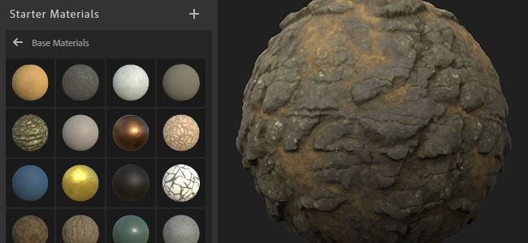

# Version 2020.1 (2.1)

Mit **Substance Alchemist 2020.1 &quot;Tiramisu&quot;** können Sie Ihre Materialien direkt verpackt für Renderer und Game-Engines exportieren. Standardmäßig stehen 15 Exportvorgaben zur Verfügung, darunter Unity HDRP, Unreal Engine 4, Blender, Vray-Next und weitere.

Es enthält eine neue Konfigurationsdatei und Steuerelemente für den Update Checker.

Freigabedatum: *12. März 2020*

## Wichtigste Funktionen

### Fenster &quot;Neuer Exporteur&quot;

Das Exportfenster wurde überarbeitet, um eine neue Oberfläche mit mehreren neuen Funktionen einzuführen:

* **Exportvorgaben zum Packen von Texturen für einen bestimmten Renderer oder ein bestimmtes Spieleprogramm verwenden** Es ist jetzt möglich, während des Exportvorgangs eine Engine aus einer Liste von Exportvorgaben auszuwählen, die die Texturen für eine bestimmte Anwendung eines Drittanbieters konvertieren, packen und benennen. Das Ergebnis dieser Konvertierung wird in der Kanalliste auf der rechten Seite der Benutzeroberfläche angezeigt.\
  Der neue Exporter enthält standardmäßig die folgenden Vorgaben:

  * Unreal Engine 4
  * Unity Standard
  * Unity HDRP
  * Mischzyklen/Evee
  * Arnold 5
  * Corona Render
  * Enscape
  * Keyshot 9
  * Redshift
  * Nächste variieren
  * Lens Studio
  * Spark AR Studio
  * PBR Specular/Glanz von PBR Metallic Roughness

  
* **Einen Unterordner mit dem Namen des Materials erstellen**\
  Beim Exportieren mehrerer Materialien an einen gemeinsamen Speicherort können Sie jetzt einen Unterordner erstellen
* **Exporteinstellungen werden gespeichert und beim nächsten Export wiederhergestellt**\
  Wenn Sie das Exportfenster erneut öffnen, werden auch die zuvor verwendeten Exporteinstellungen verwendet, um den Vorgang komfortabler zu gestalten. So können Sie ein Material einfacher und schneller erneut exportieren.
* **Benutzerdefinierte Exportvorgaben erstellen, importieren und verwalten**\
  Es ist auch möglich, benutzerdefinierte Exportvorgaben zu erstellen. Um zu erfahren, wie Sie sie erstellen und verwalten, sehen Sie sich die folgenden Dokumentationsseiten an:

  * [Verwalten benutzerdefinierter Vorgaben](https://helpx.adobe.com/de/substance-3d/unlisted/documentation/sadoc/creating-and-importing-custom-presets-188976295.html)
  * [Verwalten von Vorgaben](../../getting-started/export/managing-presets.md)

### Anwendungskonfiguration

(Foto von [Fabian Grohs](https://unsplash.com/@grohsfabian?utm_source=unsplash&utm_medium=referral&utm_content=creditCopyText) auf [Unsplash](https://unsplash.com/?utm_source=unsplash&utm_medium=referral&utm_content=creditCopyText))

Es ist jetzt möglich, Substance Alchemist mit einer Konfigurationsdatei zu konfigurieren. Dies erleichtert die Einrichtung der Anwendung auf allen Computern, z. B. in einem Studio. Die Konfigurationsdateien definieren die Standardressourcen und die Liste der verknüpften Ordner.

Weitere Informationen zum Erstellen und Verwenden einer Konfigurationsdatei finden Sie auf der dedizierten [Dokumentationsseite](https://helpx.adobe.com/de/substance-3d/unlisted/documentation/sadoc/resources-configuration-file-188976187.html).

### Verschiedene Verbesserungen

In dieser Version sind einige neue Workflow-Verbesserungen verfügbar:

* **Fokus der 2D-Ansicht**\
  Mit dem Tastaturbefehl &quot;F&quot; ist es nun möglich, die 2D-Ansicht zurückzusetzen und zu zentrieren, wie auch bei der 3D-Ansicht.
* **Letztes Projekt erneut öffnen**\
  Um die Erstellung von Inhalten zu vereinfachen und zu beschleunigen, öffnet die Anwendung jetzt das zuletzt verwendete Projekt erneut. Das Labor Erstellen ist jetzt auch der Standardmodus beim Öffnen der Anwendung.
* **Konfiguration von Update Checker**\
  Legen Sie fest, ob Sie benachrichtigt werden möchten, wenn eine neue Version verfügbar ist. Weitere Informationen finden Sie auf der dedizierten [Dokumentationsseite &#x200B;](../../technical-support/configuration/update-checker.md).

### Neue Inhalte

Wir haben einige Filter verbessert und auch den Starter-Inhalt aktualisiert:

* **Neue Startmaterialien**\
  Wir haben einige bestehende Material durch neue ersetzt. Hier ist die Liste der neuen Material:
  * Alcantara Mikrofaser
  * Teppich-Basis
  * Cliff Rock
  * Kupfer
  * gebrochener Dirt
  * grob
  * Terrakota
  * Wollstoff
  * Gewebe
* **Metallic Steuerelement mit Bitmap 2-Materialfilter**\
  Der Bitmap 2-Materialfilter wurde aktualisiert, um mehr Kontrolle über den metallic Kanal zu bieten. Es ist jetzt möglich, eine benutzerdefinierte Bitmapeingabe dafür zu verwenden oder eine einheitliche Farbe zu definieren.
* **Verbesserter Korrekturfilter**\
  Der Anpassungsfilter kann jetzt mit dem Projektset arbeiten, um den PBR-Workflow Specular/Glanz zu verwenden.
* **Neue Atlas Scatter-Parameter**\
  Wir haben einige neue Parameter hinzugefügt, um besser kontrollieren zu können, wie sich die Elemente mit dem Höhen-Map des Materials unten vermischen.

## Tutorials

Diese Version enthält eine Reihe neuer Einträge in unserem Tutorial zum Substance Alchemist:

## Versionshinweise

### 2.1.0 Tiramisu

*(veröffentlicht am 12. März 2020)*

**Hinzugefügt:**

* [Exportieren] Exportieren Sie die Vorgabe, um Ihre Texturen für Renderer und Game-Engine zu verpacken
* [Exportieren] Exportieren der Vorgabe in Unreal Engine 4
* [Exportieren] Exportieren einer Vorgabe in Unity Standard
* [Exportieren] Exportieren einer Vorgabe in Unity HDRP
* [Exportieren] Exportieren der Vorgabe in Mischzyklen/Gleichmäßig
* [Exportieren] Exportieren einer Vorgabe nach Arnold 5
* [Export] Vorgabe in Corona Renderer exportieren
* [Exportieren] Exportieren einer Vorgabe in Enscape
* [Exportieren] Exportieren einer Vorgabe in Keyshot 9
* [Exportieren] Vorgabe in Redshift exportieren
* [Exportieren] Exportieren einer Vorgabe in &quot;Nächste Variante&quot;
* [Exportieren] Exportieren einer Vorgabe in Lens Studio
* [Exportieren] Exportieren einer Vorgabe in Spark AR Studio
* [Exportieren] Exportieren einer Vorgabe in den PBR-Specular-Glanz aus der PBR-Metallische Rauheit
* [Export] Neue Export-Benutzeroberfläche
* [Exportieren] Exporteinstellungen speichern
* [Exportieren] Importieren und verwalten Sie Ihre benutzerdefinierten Exportvorgaben
* [Exportieren] Löschen und ersetzen Sie Ihre benutzerdefinierten Exportvorgaben
* [Exportieren] Benennen Sie Ihre benutzerdefinierten Exportvorgaben um
* [Exportieren] Legen Sie die Standard-Exportauflösung auf die aktuelle Auflösung fest.
* [Exportieren] Fügen Sie die Option hinzu, um einen Unterordner zum Exportspeicherort zu erstellen.
* [Export] Warnmeldung vor dem Ersetzen vorhandener Dateien
* [Anwendung] Neues Versionsnummerierungsschema
* [Anwendung] Öffnen Sie &quot;Beim Start erstellen&quot; und ändern Sie die Reihenfolge der Labors.
* [Begrüßungsbildschirm] Neues Begrüßungsbanner
* [Projekt] Letztes Projekt beim Start öffnen
* [UI] Neuer Kombinationsfeldstil
* [2D-Ansicht] F Tastaturbefehl in 2D-Ansicht fokussieren
* [Filter] Neue Unterstützung für das alchemist::parameterVisibility-Tag in Substance-Grafen
* [Filter] Sie haben eine globale Anpassung, um die Parametersichtbarkeit basierend auf Ihrem Workflow zu verwalten.
* [Ressourcen] Neue Befehlszeilenoption zum Einrichten von Ressourcen und verknüpften Ordnern mit einer Konfigurationsdatei
* [Versionsprüfung] Konfiguration der Versionsprüfung
* [Inhalt] Neue Starter-Materialien
* [Inhalt] Bitmap zu Material - Fügen Sie die Möglichkeit hinzu, den metallic Kanal zu definieren (Uniform, benutzerdefinierter Bildimport, Farbauswahl).
* [Content] Anpassung - Unterstützung des PBR-Specular/Glanz-Workflows hinzufügen
* Atlas Scatter [Inhalt] - Neue Parameter

**Fest:**

* Absturz [Project] beim zweimaligen Importieren desselben Projekts
* [Project] Behobener Absturz beim mehrmaligen Importieren und Öffnen von Projekten
* [Anwendung] Absturz beim Laden eines unbenannten Materials
* [Anwendung] Erkennen fehlender Dateien beim erneuten Importieren
* [Anwendung] Beheben von zufälligem Absturz beim Herunterfahren
* [Anwendung] Seltener Absturz beim Entladen eines Materials in Create behoben
* [Anwendung] Zufälliger Absturz bei Verwendung von UI-Steuerelementen behoben
* [UI] Das Exportierenbedienfeld hat die falsche Größe, wenn Sie es in Erstellen öffnen
* [UI] Projekt mit einem Klick öffnen
* [UI] Korrekte Festlegung von minimalen und maximalen Reglerwerten
* [UI] Bezeichnung der Kanalnutzung anstelle von IDs anzeigen
* [UI] Durch Klicken auf ein Material wird immer das Tweak-Bedienfeld geöffnet/geschlossen
* [UI] Farben von ausgeblendeten Ebenen korrigieren
* Verbesserungen an den [UI]-Begrüßungsbildschirmschaltflächen
* [Ebenen] Weniger unnötige Neuberechnungen
* [Ebenen] Absturz bei Verwendung von Klon Patch
* [Ebenen] Wenn Sie eine Bildimportebene auswählen, wird kein Computer mehr ausgelöst.
* [Kanaleinstellungen] Das Aktivieren oder Deaktivieren von Benutzern löst jetzt ein Rendering aus
* [Ressourcen] Einfrieren verhindern, wenn Sie auf einen Stapel in der Bibliothek massenhaft klicken
* [Ressourcen] Leistungseinbußen beim erneuten Hinzufügen eines zuvor hinzugefügten verknüpften Ordners
* [Resources] Es wurde ein Absturz beim Öffnen einer gelöschten .sbsar-Datei behoben.
* [Performance] Vermeiden Sie das Laden von Materialien, um auf deren Parameter zuzugreifen.
* [Performance] Sichern von Assets nur bei Verwendung in einem Projekt oder in einem erstellten Material
* [Exportieren] Behobene Material in der Exportwarteschlange werden manchmal übersprungen oder mit falschen Parametern exportiert
* [2D-Ansicht] Wiederhergestelltes Schwenken und Zoomen
* [Inhalt] Das Parquet Pattern berücksichtigt den Ambient occlusion-Kanal
* [Inhalt] Malen - Maskeneingabe anzeigen, wenn benutzerdefinierte Maske aktiviert wird
* [Content] Stonewall Pattern - Entfernen Sie mögliche Streifeneffekte in der Normalen-Map
* [Content] Height Modulation - Korrigieren von doppelten Grundfarben in der 2D-Ansicht

**Bekannte Probleme:**

* Inhaltsbasierte Füllfilter sind bei hoher Auflösung langsam
* Die Verwendung mehrerer Delighter in einem Material wird nicht empfohlen
* Delighter stürzt mit älteren NVIDIA-Treibern ab (weniger als 400.x)
* Koma oder Punkt können ignoriert werden, wenn Sie einen bestimmten Wert in einen Schieberegler eingeben
