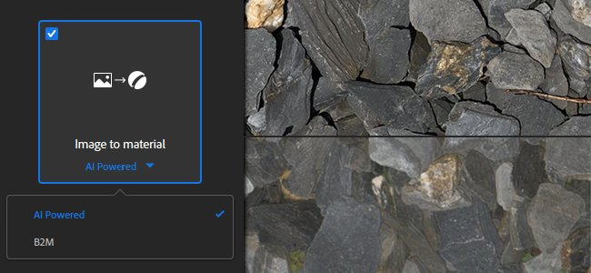
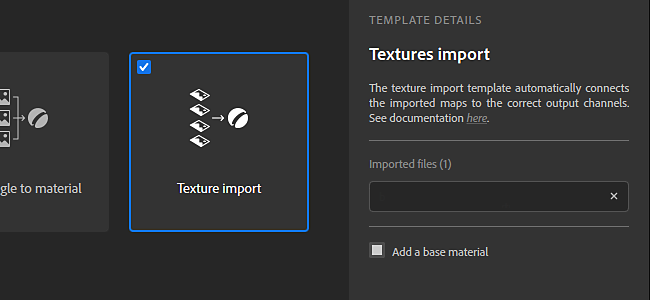
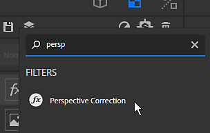

# Version 2020.2 (2.2)

**Substance Alchemist 2020.2 &quot;Udon&quot;** führt einen neuen KI-gestützten Image-to-Material-Prozess ein, um eine einzelne Bildeingabe in ein vollständig PBR-Material zu transformieren, eine verbesserte Materialerstellungsvorlage, viele Workflow- und Nutzbarkeitsverbesserungen sowie neue Inhalte wie neue Filter.

Freigabedatum: *15. Juni 2020*

## Wichtigste Funktionen

### Von Bild zu Material (KI-gestützt)

Die Vorlage **Bild zu Material** hat eine neue Einstellung mit dem Namen **KI-gestützt**. Diese neue Einstellung bietet bessere Ergebnisse beim Generieren eines hochwertigen PBR-Materials aus einem einzigen Eingabebild.

Die KI-gestützte Einstellung nutzt maschinelles Lernen, um Formen und Objekte zu erkennen und Height- und Normalinformationen präzise zu generieren. Diese Einstellung enthält auch den Filter &quot;Delighter&quot;, mit dem Schatten und Glanzlichter entfernt werden. Diese neue Einstellung funktioniert am besten mit Outdoor-Materialien, da der Algorithmus mit Böden, Kieselsteinen, Rinde, Steinen und anderen Oberflächen trainiert wurde, die mit natürlicher Beleuchtung beleuchtet sind. Weitere Updates werden mehr Flexibilität und Vielseitigkeit der unterstützten Materialien bringen. Weitere Informationen finden Sie auf der [Seite der dedizierten Dokumentation](../../filters/tools/image-to-material.md).

Im Folgenden werden die von den beiden Heights erzeugten Algorithmusinformationen mit ihren Standardwerten verglichen:

{width="800px"}

>[!NOTE]
>
> Die KI-gestützte Einstellung erfordert bestimmte Hardware. Es ist nur unter Windows und Linux mit einer Nvidia-GPU verfügbar. Weitere Informationen finden Sie in den [technischen Anforderungen](../../getting-started/system-requirements.md).

### Neue Texturimportvorlage

Das Popupfenster für den Bildimport wurde in mehrfacher Hinsicht verbessert. Es ist auch ein neuer Prozesstyp mit dem Namen **Texturimport** verfügbar.

* **Verbesserte Schnittstelle**\
  Die Benutzeroberfläche wurde aktualisiert, um die Bedienung und das Lernen zu vereinfachen, mit detaillierten Erläuterungen zu jeder verfügbaren Option.
* **Neue Texturimportoption**\
  Es ist jetzt eine neue Option mit dem Namen **Texturimport** verfügbar, mit der Sie Bilder als Gruppe direkt in die richtigen Ausgabekanäle importieren und verbinden können, basierend auf ihren Namen. Es bietet eine einfache Möglichkeit, ein Material aus einer vorhandenen Gruppe von Bildern einzurichten. Weitere Informationen finden Sie auf der [Seite der dedizierten Dokumentation](../../features-and-workflows/texture-import.md).

### Neues 2D-Malen für Filtermasken-Eingänge

In dieser Version ist es nun möglich, Filtermasken direkt in der 2D-Ansicht zu malen und zu bearbeiten, ohne ein externes Bild importieren zu müssen. Das Gemälde kachelt automatisch, um die Erzeugung von nahtlosem Material zu ermöglichen.

{width="450px"}

* **2D-Malmodus aufrufen**\
  Um den 2D-Malmodus zu starten, klicken Sie einfach auf das Pinselsymbol neben dem Maskennamen in den Filtereigenschaften.

  
* **2D-Malsymbolleiste**\
  Im Malmodus wird in der 2D-Ansicht oben eine neue Symbolleiste mit den folgenden Funktionen angezeigt:

  * **Pinselfarbe**: den Graustufenwert des Pinsels zum Malen der Maske anpassen.
  * **Größe des Pinselstifts**: Passen Sie die Pinselgröße zum Malen der Maske an.
  * **Maske zurücksetzen**: Wenn Sie die aktuelle Maske auf Schwarz setzen, gehen alle Malinformationen verloren.
  * **Zeichnen beenden**: Beenden Sie den 2D-Malmodus.

  
* **Tastaturbefehle**\
  Der Malmodus unterstützt die folgenden Tastenkombinationen, um den Malvorgang zu beschleunigen:

  * **X**: den aktuellen Graustufenwert des Pinsels umzukehren.
  * **Strg + Mausrad**: Ändern Sie die Pinselgröße.
  * **[ oder ]**: Ändern Sie die Pinselgröße.

### Neue Tastaturbefehle für den Erstellungsmodus &quot;Atlanten und Aufkleber&quot;

Es wurden zwei neue Erstellungsmodi hinzugefügt, um neue Arten von Substance-Materialien zu nutzen und ihre Einrichtung im Ebenenstapel zu erleichtern:

* **Aufklebermodus**\
  **Alt + Ziehen und Ablegen**: Wenn Sie ein Material aus einer Sammlung ziehen und ablegen, drücken und halten Sie **Alt**, um das Material automatisch im Aufkleberprojektionsmodus zu erstellen.
* **Atlas-Modus**\
  **Umschalt + Ziehen und Ablegen**: Wenn du ein Material aus einer Sammlung per Drag-and-Drop platzierst, drücke die Umschalttaste, um das Material automatisch im Modus &quot;Atlas Scatter&quot; zu erstellen.

### Neues Perspektivkorrektur-Werkzeug

Ein neues Werkzeug mit dem Namen **Perspektivische Korrektur** wurde der Filterliste hinzugefügt und ermöglicht es, die Perspektive eines Bildes anzupassen oder zu kompensieren.

* **Perspektivische Korrektur**\
  Mit diesem Filter ist es möglich, Standardeinstellungen von Scans und Fotografiebildern zu korrigieren, um sie besser für die Materialerstellung geeignet zu machen. Der Filter bietet vier Kontrollpunkte, die die Anfangsecken des Bildes darstellen. Verschieben Sie die Punkte, um die Perspektive anzupassen/auszugleichen.

  

### Verbessertes Farb-Widget

Das Farb-Widget, das im Bedienfeld &quot;Parameter&quot; angezeigt wird, bietet jetzt weitere Steuerelemente:

* **Farbwert-QuickInfo**\
  Wenn der Mauszeiger über ein Farb-Widget bewegt wird, wird jetzt eine QuickInfo angezeigt, die den aktuellen Farbwert (Hexadezimalformat) beschreibt.
* **Aktionen mit Rechtsklick**\
  Wenn Sie mit der rechten Maustaste auf ein Farb-Widget klicken, wird ein neues Kontextmenü mit den folgenden Aktionen angezeigt:
  * **Löschen**: setzen Sie die Farbe auf Schwarz und den Alpha-Wert auf Null.
  * **Kopieren**: den aktuellen Farbwert des Widgets in den Speicher kopieren.
  * **Einfügen**: den aktuellen Farbwert im Speicher in das Widget einfügen.

### Neue Inhalte

Diese Version bietet viele neue und vielfältige Inhalte:

* **Neue Standardgitter**\
  Es sind drei neue Gitter verfügbar, um Materialien im Viewport zu präsentieren:
  * Schuhform
  * Männliches T-Shirt
  * T-Shirt einer Frau
* **Neue Filter**\
  In dieser Version sind fünf neue Filter verfügbar:
  * Risse
  * Moos
  * Steppstiche
  * Bodenfliesen
  * PBR-Validierung
* **Neuer Mischmodus**
* Filter und andere Werkzeuge unterstützen jetzt einen neuen Mischmodus mit dem Namen **Pro Kanal-Mischmodus**. Wenn dieser Modus aktiviert ist, können Sie die Füllmethode für jeden Kanal im Eigenschaftenfenster anpassen.
* **Vorgaben exportieren**\
  Diese Version enthält neue und aktualisierte Exportvorgaben:
  * VStitcher
  * CLO
  * DetailMap-Unterstützung in Unity HDRP-Vorlagen
