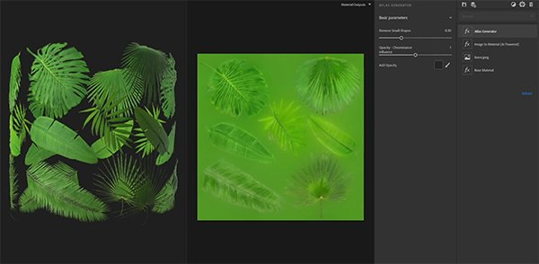

# Version 2020.3 (2.3)

**Substance Alchemist 2020.3 &quot;Vermicelli&quot;** führt neue Inhalte und neue Arbeitsabläufe wie die Atlaserstellung aus einem einzigen Bild ein. Wir haben auch die Miniaturansichtsqualität unserer Materials verbessert und die Benutzeroberfläche auf Chinesisch lokalisiert.

Freigabedatum: *26. Oktober 2020*

## Wichtigste Funktionen

### Bild-zu-Material (KI-gestützt)

* Neue Parameter
  * Verfeinern Sie die Geometrie (Normal- und Height-Kanäle), indem Sie die verschiedenen Detailstufen (Mikro, Mittel und Groß) anpassen.
  * Passe die Intensität der Blitze an, damit deine Grundfarbe nicht überbelichtet wird.
  * Es stehen Variations- und Weichheitsparameter zur Verfügung, um einen präziseren Rauheit-Kanal zu erzeugen.
* Unterstützung für NVIDIA RTX 3000-Serie

### Workflow zur Atlaserstellung

Mit zwei neuen Filtern wird die Atlaserstellung aus einem einzigen Bild innerhalb von Substance Alchemist vereinfacht.

Atlasgenerator: Der Filter generiert automatisch aus der Grundfarbe einen Deckkraftkanal. Es erstellt auch Farb-Diffusion auf der Grundfarbe. Es wird empfohlen, ein Bild mit einem einheitlichen Hintergrund zu verwenden.

Atlas Splitter: Mit dem Filter können Sie ein bestimmtes Element Ihres Atlas isolieren und seine Größe ändern.

### Miniaturansichten

Die Miniaturansichten werden jetzt mit dem neuen Umgebungs-Map Studio\_06 über den PBR-Rendering-Knoten des Substance Designers generiert.

Wenn die Miniaturansicht in die Substance-Archivdatei (\*.sbsar) eingebettet ist, liest Substance Alchemist jetzt die Miniaturansicht und generiert sie nicht neu.

In den Voreinstellungen steht ein neuer Parameter zur Verfügung, mit dem Sie die Miniaturansichtsqualität ändern können, um Zeit zu sparen. Standardmäßig ist die Qualität auf &quot;Hoch&quot; festgelegt.

### Chinesische Lokalisierung

Substance Alchemist ist jetzt auf Chinesisch lokalisiert. Sie können die Sprache der Benutzeroberfläche in den Voreinstellungen ändern.

### Neue und aktualisierte Inhalte

* **Technische Filter**

Verkrümmen: Verformen Sie Ihr Material, um Muster zu brechen oder Ihr Material lebendiger zu gestalten.

Surface Relief: Reliefs und Variationen zum Material hinzufügen (Height-Modulationsfilter ersetzen).

Umkehren: Kanäle Ihrer Wahl umkehren

* **Filter für Verwitterung**

Scratches: Kratzer auf dem Material hinzufügen. Nützlich für Holz und Metalle zum Beispiel.

Fingerabdrücke: Füge Fingerabdrücke auf Metallen oder glänzenden Materialien hinzu.

Abgeworfene Gummen: Streuung alten Zahnfleisch auf einem Boden

* **Farbfilter**

Einfärben: Tint eines Teils oder des gesamten Materials

Farbvariation: Jetzt können Sie auswählen, wie Sie Ihr Material segmentieren möchten. Zusätzlich zur Grundfarbe können Sie das Height, den ambient occlusion, metallic und die Rauheit verwenden.

Farbe ersetzen: Wähle eine Farbe auf deiner 2D-Ansicht aus, und wähle eine neue aus.
