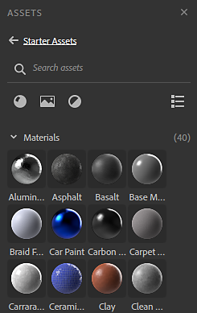
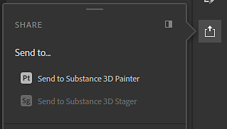

# Version 3.0

**Substance 3D Sampler 3.0.0** ist der neue Name für den Substance Alchemist, der jetzt mit Adobe Creative Cloud verbunden ist. Es bietet eine komplette Überarbeitung der Benutzeroberfläche, Unterstützung für die Erstellung von Umgebungsbeleuchtungen, vollständig überarbeitete und neue Filter, die Funktion &quot;Senden an&quot; und Unterstützung für ASM-Shader.

Freigabedatum: *23. Juni 2021*

## Wichtigste Funktionen

### Neue Benutzeroberfläche und Bedienfeldverwaltung

Mit einem neuen Namen kommt ein neuer Look. Die Benutzeroberfläche von Sampler wurde vollständig überarbeitet, um eine stärkere Anpassung und einen einfacheren Zugriff zu ermöglichen.

{width="600px"}

Bedienfelder können an- und abgedockt werden, sodass Sie die Einrichtung von zwei Bildschirmen vollständig nutzen können.

### Neuer Projekt-Workflow

Sampler funktioniert jetzt mit Projekten. Im [Projektfenster](../../interface/panels/project-panel.md)können Sie Ihre Assets pro Projekt verwalten und gruppieren. Projekte werden in Substance Sampler-Dateien gespeichert, die sich leicht freigeben lassen.

### Neues Bedienfeld &quot;Elemente&quot;

Das [Asset-Bedienfeld](../../interface/panels/assets-panel.md) ist ein neues und allgemeines Design des Ressourcen-Bedienfelds, das mit Ihren Sammlungen kombiniert wird.

* 3 Abschnitte: Starter-Elemente + Ihre Elemente + verbundene lokale Ordner
* Unterstützung für neue Elementtypen: Filter und Bilder
* Schmale/Weitwinkelansicht
* Filter- und Suchfilter

### Authoring von New Environment Light

{width="600px"}

Mit Sampler kannst du jetzt mehr als nur Materialien erstellen. Umgebungslichter sind ein neuer Elementtyp mit einem [eigenen Filtersatz](../../filters/hdri-tools/hdri-tools.md). Beginnen Sie mit [Fotos der Serie 360](../../filters/hdri-tools/hdr-merge.md), erstellen Sie eine Umgebungsbeleuchtung [von Grund auf](../../filters/hdri-tools/shape-light.md), oder [bearbeiten Sie eine vorhandene HDR-Datei](../../filters/hdri-tools/nadir-patch.md).

### Überarbeitete und neue Filter

{width="600px"}

Alle vorhandenen Filter wurden überarbeitet:

* Unterstützung für Spec-/Gloss-Kanäle.
* Unterstützung für benutzerdefinierte Masken
* Standardisierte Parameternamen
* Symbole für fast jeden Filter

Der Anpassungsfilter wurde basierend auf der Funktion in separate Filter aufgeteilt, um Photoshop nachzuahmen:

Es wurden einige neue Filter hinzugefügt:

* [Verkrümmen](../../filters/tools/warp-transform.md)
* [Weben](../../filters/generators/weave.md)
* [Bedienfeld](../../filters/generators/panel.md)

### Neue Funktion &quot;Senden an&quot;

Sampler kann jetzt mit Substance 3D Painter und Stager mit nur einem Klick [Materialien und leichte Umgebungen](../../interface/panels/share-panel.md)einfach austauschen.

### Neue Echtzeit-Rendering-Engine

* Unterstützung von ASM-Materialien, die konsistente Looks zwischen Anwendungen mit mehr Materialkanälen ermöglichen.
* Wechseln zwischen 2 [Echtzeit-Engines](https://helpx.adobe.com/de/substance-3d/unlisted/documentation/sadoc/viewer-settings-188973164.html)
* Möglichkeit zum Steuern von Standardtexturen in einem Gitter

### Allgemeine Verbesserungen

* Neue Sprachen
* Reaktionsfähigkeit der Anwendung
* Unterstützung für nicht quadratische Texturen
* Werkzeuge Rückgängig/Wiederholen
* Bildern in der Bildimportebene benutzerdefinierte Verwendungsmöglichkeiten zuweisen
* Parameterwert zurücksetzen
* Exportfortschritt auf der Windows-Taskleiste

## Tutorials

Im Folgenden finden Sie unsere Videotutorials zu den neuen Funktionen:

## Versionshinweise

### 3.0.0 Waffel

*(veröffentlicht am 23. Juni 2021)*

**Hinzugefügt:**

* [Branding] Substance Alchemist wird zu Adobe Substance 3D Sampler
* [Branding] Neue Anwendungssymbole
* [UI] Neues Benutzererlebnis und neue Benutzeroberfläche
* [UI] Neuer Splashscreen
* [UI] Bedienfelder können in der Benutzeroberfläche abgedockt und angedockt werden
* [UI] Bis zu drei Bedienfelder in derselben Spalte andocken
* [UI] Andocken von bis zu 3 Bedienfeldern im selben Bedienfeld (Registerkarten)
* [UI] Abdocken von Bedienfeldern, um ein separates Fenster auf demselben oder einem anderen Bildschirm zu erstellen
* [UI] Popup-Fenster mit geschlossenen Fenstern, wenn auf die Symbole geklickt wird
* [UI] Ordnen Sie die linke und rechte Leiste neu an, indem Sie die Bedienfeldsymbole verschieben
* [UI] Neue Symbolleiste für den direkten Zugriff auf bestimmte Filter (Zuschneiden, Transformieren, Perspektivisches Transformieren, Kopierstempel)
* [UI] Neue Schaltfläche &quot;Inhalt abrufen&quot; in der linken Leiste
* [UI] Importieren von Dateien direkt in Ihre Assets mit der Schaltfläche &quot;Inhalt abrufen&quot;
* [UI] Importieren von Dateien direkt in Ihre Ebenen mit der Schaltfläche Inhalt abrufen
* [UI] Direkter Zugriff auf die Adobe Substance 3D Assets-Website über die Schaltfläche &quot;Inhalt abrufen&quot;
* [UI] Das Auflösungs-Widget ist jetzt direkt im Viewport verfügbar
* [UI] Alle UI-Elemente werden jetzt dynamisch geladen.
* [UI] Tastaturbefehl - Verwenden Sie &quot;2&quot;, um die Sichtbarkeit der 2D-Ansicht zu ändern.
* [UI] Tastaturbefehl - Verwenden Sie &quot;3&quot;, um die Sichtbarkeit der 3D-Ansicht zu ändern.
* [Begrüßungsbildschirm] Erstellen Sie ein Projekt mit einem Klick mit der Schaltfläche Neu
* [Begrüßungsbildschirm] Neues Bildmaterial-Banner
* [Projekt] Alle Projekte sind jetzt einer eindeutigen Datei zugeordnet.
* [Project] Neue Projektdateierweiterung .ssa
* [Projekt] Beim Speichern als Projekt müssen Sie auswählen, wo das Projekt gespeichert werden soll.
* [Projekt] Beim Schließen von Sampler werden Sie aufgefordert, Ihr Projekt zu speichern, wenn es nicht gespeichert wurde
* [Projekt] Wenn Sie Sampler schließen, werden Sie aufgefordert, Ihr Projekt zu speichern, wenn seit dem letzten Speichern Änderungen vorgenommen wurden
* [Projekt] Der Name Ihres Projekts wird über dem Viewport angezeigt
* [Projekt] Der Projektname ist kursiv mit einem Stern gekennzeichnet, wenn er nicht gespeichert ist oder wenn er Änderungen seit dem letzten Speichern enthält
* [Projekt] Öffnen Sie eine .ssa-Projektdatei direkt aus dem Betriebssystem-Explorer
* [Projekt] Öffnen Sie eine .sbsar-Datei von Ihrem Betriebssystem-Explorer aus, um Sampler mit einem neuen Projekt mit dieser .sbsar-Datei zu starten, die sofort verwendet werden kann
* [Projekt] Öffnen Sie eine .alch-Datei (ältere Substance Alchemist-Datei) im Betriebssystem-Explorer.
* [Projektfenster] Neues Fenster, das alle in einem Projekt erstellten Elemente enthält
* [Projektfenster] Erstellen eines Assets (Material- oder Umgebungslicht) mit dem Symbol +
* [Projektfenster] Durch Rechtsklick auf Element wird ein Kontextmenü geöffnet.
* [Projektfenster] Im Kontextmenü mit der rechten Maustaste können Sie ein Element löschen
* [Projektfenster] Im Kontextmenü mit der rechten Maustaste können Sie ein Element duplizieren
* [Projektfenster] Im Kontextmenü mit der rechten Maustaste können Sie ein Element umbenennen
* [Projektfenster] Beim Wechseln zwischen Elementen gehen Änderungen nicht verloren
* [Auflösung] Sie können jetzt eine nicht quadratische Auflösung für alle Ihre Assets festlegen
* [Auflösung] Der Auflösungswert wird von einem Asset innerhalb eines Projekts gespeichert.
* [Umgebungslicht] Erstellen von Umgebungslicht in Substance 3D Sampler
* [Umgebungslicht] Beim Erstellen eines Umgebungslichts wird durch Ziehen und Ablegen von Bildern das Vorlagenfenster für die Erstellung von Umgebungslicht angezeigt.
* [Umgebungslicht] Wählen Sie in der Vorlage Umgebungslicht erstellen die Option Umgebungsimport aus, um das Bild der Umgebung in der 3D-Ansicht zuzuweisen.
* [Umgebungslicht] Wählen Sie in der Vorlage zur Erstellung von Umgebungslicht die Option HDR-Zusammenfügung aus, um ein Umgebungslicht aus mehreren 360-Grad-Bildern mit unterschiedlicher Belichtung zu erstellen.
* [Umgebungslicht] Wählen Sie in der Vorlage für die Erstellung von Umgebungslicht die Option &quot;Als Bitmap verwenden&quot; aus, um Ihre Bilder vor dem Erstellen einer Umgebungsbeleuchtung zu bearbeiten.
* [Umgebungslicht] Weisen Sie die Umgebungsnutzung in der Bildimportebene zu, um das Bild der Umgebung in der 3D-Ansicht direkt zuzuweisen.
* [Umgebungslicht] In der 2D-Ansicht für den Umgebungskanal gibt es eine automatische Farbkorrektur, damit das Rendering genauso angezeigt wird wie in der 3D-Ansicht.
* [Umgebungslicht] Neuer dedizierter Inhalt für die Erstellung von Umgebungslicht
* [Bedienfeld &quot;Elemente&quot;] Die Bedienfelder &quot;Ressourcen&quot; und &quot;Filter&quot; werden in einem neuen Bedienfeld &quot;Elemente&quot; zusammengeführt
* [Bedienfeld &quot;Elemente&quot;] Das Bedienfeld &quot;Elemente&quot; unterstützt jetzt die folgenden Elementtypen: Materialien, Filter und Bilder
* [Bedienfeld &quot;Elemente&quot;] Auf alle Starter-Elemente kann im Abschnitt Starter-Elemente zugegriffen werden.
* [Bedienfeld &quot;Elemente&quot;] Der Abschnitt &quot;Starter-Elemente&quot; ist schreibgeschützt.
* [Bedienfeld &quot;Elemente&quot;] Neuer Abschnitt &quot;Ihre Elemente&quot;
* [Bedienfeld &quot;Elemente&quot;] Der Bereich &quot;Ihre Elemente&quot; ist der Bereich, in den Sie alle Ihre Ressourcen importieren können
* [Bedienfeld &quot;Elemente&quot;] Alle Elemente unter &quot;Ihre Elemente&quot; werden einem bestimmten Ordner in Ihren Dokumenten hinzugefügt
* [Bedienfeld &quot;Elemente&quot;] Verknüpfen Sie lokale Ordner im Bedienfeld &quot;Elemente&quot;, um neue Abschnitte hinzuzufügen
* [Bedienfeld &quot;Elemente&quot;] Die Suche erfolgt im aktuellen Ordner und seinen Unterordnern.
* [Bedienfeld &quot;Elemente&quot;] Mit Breadcrumbs zwischen Ordnern und Unterordnern navigieren
* [Bedienfeld &quot;Elemente&quot;] Filtern Sie den aktuellen Ordner nach Material, Filter oder Bild
* [Bedienfeld &quot;Elemente&quot;] Mehrere Filter kombinieren, um nur Materialien und Bilder zu erhalten
* [Bedienfeld &quot;Elemente&quot;] Anzeige ändern, indem zwischen Raster oder Listen gewechselt wird
* [Bedienfeld &quot;Elemente&quot;] Filter werden mit ihrem Symbol dargestellt
* [Bedienfeld &quot;Elemente&quot;] Bilder werden in der Vorschau angezeigt
* [Bedienfeld &quot;Elemente&quot;] Wenn Sie die Breite erhöhen, wird das Layout des Bedienfelds mit einer bestimmten Ansicht geändert, um zwischen Ordnern zu navigieren.
* [Bedienfeld &quot;Elemente&quot;] In nicht schreibgeschützten Bereichen löschen Sie ein Element, indem Sie es auf das Ablagesymbol ziehen und dort ablegen
* [Bedienfeld &quot;Elemente&quot;] Durch Rechtsklick auf ein Element wird ein Kontextmenü geöffnet.
* [Bedienfeld &quot;Elemente&quot;] Greifen Sie über das Kontextmenü mit der rechten Maustaste auf die Asset-Metadaten (Name, Kategorie, Speicherort) zu
* [Bedienfeld &quot;Elemente&quot;] Löschen Sie im Kontextmenü mit der rechten Maustaste das Element (nur in nicht schreibgeschützten Bereichen verfügbar).
* [Bedienfeld &quot;Elemente&quot;] Durchsuchen Sie Ihr Element im Kontextmenü mit der rechten Maustaste in Adobe Bridge
* [Ebenenbedienfeld] Neues Symbol zum direkten Hinzufügen eines Basismaterials über Ihren Ebenen
* [Ebenenbedienfeld] Tastaturbefehl - Umschalt + B fügt ein Basismaterial über Ihren Ebenen hinzu
* [Ebenenbedienfeld] Ebenen verfügen jetzt über eine Miniaturvorschau (Material-Miniaturansicht, Filtersymbol oder Bildvorschau)
* [Eigenschaftenbedienfeld] Neues Design des Titels des Eigenschaftenbedienfelds mit dem Elementnamen und der Miniaturansicht des Elements
* [Eigenschaftenbedienfeld] Filterebenen unterstützen jetzt Vorgaben
* [Eigenschaftenbedienfeld] Klicken Sie auf der Bildimportebene mit der rechten Maustaste auf die Bildvorschau, um das Bild in Photoshop zu bearbeiten.
* [Adobe Bridge] Durchsuchen Sie Ihr Asset in Adobe Bridge und starten Sie Bridge am Speicherort des Assets.
* [Adobe Photoshop] Bei der Bearbeitung in Adobe Photoshop wird das Bild in Photoshop geöffnet und kann bearbeitet werden.
* [Adobe Photoshop] Bei jedem Speichern in Adobe Photoshop wird das bearbeitete Bild in Sampler neu geladen
* [Substance 3D Designer] Von Adobe Substance 3D Designer gesendete Elemente werden direkt im Bereich &quot;Ihre Elemente&quot; des Bedienfelds &quot;Elemente&quot; angezeigt
* [Exportieren] Elemente direkt an Adobe Substance 3D Painter und Adobe Substance 3D Stager senden
* [Exportieren] Senden von Materialien und Umgebungslichtern an Adobe Substance 3D Painter
* [Exportieren] Umgebungslichter an Adobe Substance 3D Stager senden
* [Rendering] Neue Materialeigenschaften werden jetzt unterstützt und in 3D gerendert
* [Rendering] Hinzufügen von Unterstützung für Glanz (Glanzfarbe, Deckkraft des Glanzes und Raueit des Glanzes)
* [Rendering] Hinzufügen von Beschichtungsunterstützung (Beschichtungsfarbe, Raueit der Beschichtung, Normale Beschichtung, Specular level der Beschichtung und IOR der Beschichtung)
* [Rendering] Hinzufügen von Anisotropie-Unterstützung (Anisotropie und Anisotropie)
* [Rendering] Hinzufügen von Specular edge color-Unterstützung
* [Rendering] Aktivieren Sie diese neuen Eigenschaften im Bereich Kanaleinstellungen .
* [Rendering] Einführung eines neuen Echtzeit-Engine-Renderers (2021) in der Beta-Version
* [Rendering] Wechseln zwischen den beiden Renderer-Versionen im Bedienfeld Anzeigeeinstellungen
* [Rendering] Der Renderer der Realtime Engine (2021) unterstützt Transparenzeigenschaften, Absorption und Streuungseigenschaften
* [Rendering] Der Renderer der Realtime Engine (2021) bietet eine neue Möglichkeit, Schatten aus dem Umgebungslicht zu berechnen
* [Rendering] Der Renderer der Echtzeit-Engine (2021) berechnet in Echtzeit die Bestrahlung des Umgebungslichts
* [Bedienfeld für Shader-Einstellungen] Neues Bedienfeld für Shader-Einstellungen zum Anpassen bestimmter Parameter für Material-Shader
* [Shader Settings Panel] Neue Parameter (Normal-Skala, Height-Skala, Height-Level, Emissionsintensität, IOR, Coat-Normalintensität und Coat-IOR)
* [Bedienfeld für Shader-Einstellungen] Spezifische Parameter für die Realtime Engine 2021 (Unterflächen-Streuung, Streuungsentfernung, Rote Verschiebung und Rayleigh-Streuung)
* [Bedienfeld für Shader-Einstellungen] Die Einstellungswerte werden pro Asset gespeichert.
* [Bereich &quot;Viewer-Einstellungen&quot;] Eine Vorschau der Standard-Umgebungslichter wurde hinzugefügt.
* [Bedienfeld &quot;Anzeigeeinstellungen&quot;] Eine Vorschau der Standardgitter wurde hinzugefügt.
* [Bereich &quot;Viewer-Einstellungen&quot;] Neuer Parameter für die Umgebungsdeckkraft
* [Bedienfeld &quot;Viewer-Einstellungen&quot;] Neuer Parameter für die Umgebungsweichzeichnung (spezifisch für den Renderer &quot;Realtime Engine 2021&quot;)
* [Lokalisierung] Neue Übersetzungen in Deutsch und Französisch
* [Inhalt] Neue Standard-Startmaterialien
* [Inhalt] Neue Standard-Umgebungslichter
* [Inhalt] Alle Filter wurden aktualisiert, bereinigt und optimiert.
* [Inhalt] Der Korrekturfilter wurde in mehrere Filter aufgeteilt
* [Inhalt] Neuer Helligkeits-/Kontrastfilter
* [Inhalt] Neuer Filter &quot;Farbton/Sättigung&quot;
* [Inhalt] Neuer Dynamikfilter
* [Inhalt] Neuer Scharfzeichnungsfilter
* [Inhalt] Neue Normal-/Height-Anpassung
* [Inhalt] Filter &quot;Neue Fenster&quot;
* [Inhalt] Neuer Verwisch-Filter
* [Inhalt] Neuer Webfilter
* [Inhalt] Neuer Verkrümmungstransformationsfilter
* [Inhalt] Neues Height für AO-Filter
* [Inhalt] Neuer Filter &quot;Height zu Normal&quot;
* [Content] Color Replace - Ersetzen in neuen unterstützten Kanälen (Glanz, Beschichtung, Anisotropie,...)
* [Inhalt] Farbvariation - Manueller Modus zur Auswahl genau der zu ändernden Farben
* [Content] Kachelung - Option zur Visualisierung der Nahtschnitte
* [Content] Kachelung - Option, um die Nähte für eine perfekte Kachelung zu schneiden
* [Inhalt] Übereinstimmung: Option, um ein Material hinzuzufügen, das seiner Farbe und seiner Raueit entspricht
* [Inhalt] Abgleichen: Kann jetzt für Bilder verwendet werden, die der Farbe eines anderen Bildes entsprechen.
* [Inhalt] Umgebungslicht - Neuer Farbtemperaturfilter
* [Inhalt] Umgebungslicht - Neuer Belichtungsfilter
* [Inhalt] Umgebungslicht - Neuer Belichtungsvorschaufilter
* [Inhalt] Umgebungslicht - Neuer Nadir Patch-Filter
* [Inhalt] Umgebungslicht - Neuer Nadir Extract-Filter
* [Inhalt] Umgebungslicht - Neue Lichtfilter (Kugel, Linie, Form, Ebene)
* [Inhalt] Umgebungslicht - Neuer Panorama-Ausbesserungsfilter
* [Inhalt] Umgebungslicht - Neuer Filter &quot;Horizont begradigen&quot;
* [Inhalt] Umgebungslicht - Neuer HDR-Mergefilter

**Bekannte Probleme:**

* [Realtime Engine 2021] Ändern des Layouts, Absturz der Anwendung
* [Realtime Engine 2021] Starke Berechnung, Absturz der Anwendung
* [Fenster] MacOS - Nicht angedockte Fenster befinden sich vor allen Anwendungen
* [Widgets] Transformieren- und Positions-Widgets können verschwinden. Blende die Ebenen ein- und aus, um sie sichtbar zu machen.
* [Export] SBSAR-Export einer Umgebungsbeleuchtung verliert die 32-Bittiefen-Präzision
* [Bedienfeld &quot;Elemente&quot;] Elemente können beim Öffnen eines Ordners hervorgehoben werden
* [Eigenschaftenbedienfeld] Durch das Zurücksetzen der Parameter wird die Benutzeroberfläche des Kombinationsfelds nicht zurückgesetzt
* [Lokalisierung] Das Ändern der Sprache wirkt sich erst auf das Projektfenster aus, wenn es neu erstellt wird
