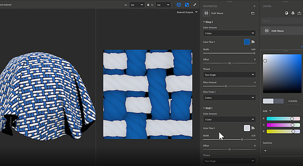

# Version 3.2

Mit **Substance 3D Sampler 3.2** wird ein End-to-End-Workflow zur Materialdigitalisierung eingeführt, der die Materialfilterung erfasst und verarbeitet, neue Physische Größen wie &quot;Stoffgewebe&quot; und &quot;Kanalwechsel&quot; hinzufügt und die Möglichkeit bietet, benutzerdefinierte Metadaten zu erstellen.

Freigabedatum: 25. *Januar, 2022*

## Wichtigste Funktionen

### Physische Größe

Mit dieser Version wird ein neuer Arbeitsablauf für das Scannen von Materialien eingeführt, der die Physische Größe von Materialien erfasst und verarbeitet.

Stimmen Sie die [Physische Größe](../../features-and-workflows/end-to-end-physical-size-workflow.md) Ihrer Samples/Images in einem Digitalkontext ab, um physikalisch akkurate Materialien in jeder Software zu erstellen.

{width="400px"}

### Tuchgewebe

Brandneuer Generator wird in dieser Version hinzugefügt. Mit dem Tuchweber können Sie Tuchstoffe mit benutzerdefinierten Webmustern erstellen und gestalten.

<table>
<tr style="border: 0;">
<td style="border: 0;" valign="top">

{width="390px"}

</td>
<td style="border: 0;" valign="top">

{width="400px"}

</td>
</tr>
</table>

### Benutzerdefinierte Metadaten

Fügen Sie Ihren Materialien benutzerdefinierte Metadaten hinzu. Alle benutzerdefinierten Metadaten werden in die Materialdatei (SBSAR) aufgenommen, um einen effizienteren Arbeitsablauf für den anwendungsübergreifenden Austausch digitaler Materialien zu gewährleisten.

{width="264px"}

### Kanalschalter

Mit dem Kanalschalter können Sie jetzt die Kanäle der Ausgabemaps des Materials wechseln.

{width="300px"}

### Exportieren

Neue Exportfunktionen wurden zu dieser Version hinzugefügt.

* Komprimierungseinstellung für .sbsar-Dateien festlegen

  {width="400px"}
* Festlegen des Diagrammtyps beim Exportieren einer .sbs(ar)-Datei
* Physisches Seitenverhältnis für EXR, JPEG, PNG, TARGA, TIFF beibehalten

  {width="400px"}

## Versionshinweise

### 3.2.0 Jakitori

*(veröffentlicht am 25. Januar 2022)*

**Hinzugefügt:**

* [Physische Größe] Neues Bedienfeld &quot;Physische Größe&quot;
* [Physische Größe] Optionen für die Physische Größe zum Fenster &quot;Materialerstellungsvorlage&quot; hinzufügen
* [Physische Größe] Werkzeug zum Messen von Physische Größen hinzufügen
* [Physische Größe] Werkzeug für automatische Messung von Physische Größen hinzufügen
* [Physische Größe] Physische Größe-Diagnosetool hinzufügen
* [Physische Größe] Einstellung des z-Werts der Physische Größe zulassen
* [Physische Größe] Dropdown-Widget zum Festlegen des Zoomfaktors in der 2D-Ansicht
* [Physische Größe] Neue Option &quot;Anzeige mit physischem Verhältnis&quot; in der Zoom-Dropdown-Liste
* [Physische Größe] Neue Option &quot;An Physische Größe anpassen&quot; auf der Ebene der Zoom-Dropdown-Liste
* [Physische Größe] Physische Größe in der 2D-Ansicht anzeigen
* [Physische Größe] Physische Größe im 3D-Viewport anzeigen
* [Physische Größe] Zeigen Sie im Dialogfeld &quot;Bildimport&quot; die Tiefe &quot;Physische Größe&quot; an, wenn eine importierte Height-Map vorhanden ist.
* [Physische Größe] Physische Größe im Kontextmenü des Elements anzeigen
* [Physische Größe] Legen Sie die Längeneinheit in den Voreinstellungen fest.
* [Physische Größe] Exportieren von Texturen, die das physische Verhältnis einhalten
* [Metadaten] Möglichkeit, einem vom Benutzer erstellten Asset benutzerdefinierte Metadaten hinzuzufügen
* [Exportieren] Exportieren benutzerdefinierter Metadaten in .sbs(ar)-Dateien
* [Exportieren] Exportieren von Beschreibung, Kategorie, Autor und Tagmetadaten in .sbs(ar)-Dateien
* [Exportieren] Exportieren der Physische Größe in .sbs(ar)-Dateien
* [Export] Festlegen der Komprimierungseinstellung für .sbsar-Dateien
* [Exportieren] Exportieren der Asset-Miniaturansicht in .sbs(ar)-Dateien
* [Export] Festlegen des Diagrammtyps beim Exportieren einer .sbs(ar)-Datei
* [Anwendung] Realtime Engine 2021 ist nicht mehr verfügbar
* [Anwendung] &quot;Rückgängig/Wiederholen&quot; unterstützt jetzt Änderungen an den Teilungseinstellungen (U,V) und am Height-Skalierungsregler.
* [Rendering] Generieren des Disk-Cache beim Speichern des erstellten Assets
* [Elemente] Verwenden Sie Strg + Klicken, um mehrere Elementtypfilter im Bedienfeld &quot;Ressourcen&quot; zu aktivieren
* [UI] Funktion zum Sperren der Kachelregler (U,V)
* [UI] Kontextmenü mit &quot;Kopieren&quot;, &quot;Ausschneiden&quot;, &quot;Einfügen&quot;, &quot;Alle kopieren&quot; und &quot;Alle ausschneiden&quot; in Textfeldern hinzufügen
* [UI] Längeneinheit (Meter, Zoll, Parsec, ...) Unterstützung für Beschriftungen und Textfelder
* [UI] Der Benutzer kann die Dezimalpräzision festlegen, die zur Anzeige von Zahlen verwendet wird.
* [UI] Verwendet Einheiten in Measure-Popups, wo immer sie relevant sind
* [Lokalisierung] Der Standard-Name des neuen Assets ist jetzt lokalisiert
* [Inhalt] Neuer Gewebewebgenerator
* [Inhalt] Neuer Kanalwechselfilter
* [Inhalt] Alle entsprechenden Filter kennen jetzt die Physische Größe
* [Inhalt] Neue Symbole für Holzbearbeitung
* [Inhalt] Alle Filter sind jetzt mit Adobe Standard Materials (ASM)-Kanälen kompatibel.
* [Inhalt] Filter können jetzt eine &quot;Umgebungsvariation&quot; haben.

**Fest:**

* [2D-Ansicht] Kanal bleibt in der Liste, wenn er entfernt wird
* [Anwendung] Ein aus dem Dateiexplorer des Betriebssystems geladenes Asset kann nicht dupliziert werden.
* [Anwendung] Absturz beim Beenden
* [Anwendung] Absturz manchmal beim Klicken auf &quot;Starter-Elemente&quot; im Bedienfeld &quot;Elemente&quot;
* [Anwendung] Absturz beim Löschen eines Materials
* [Anwendung] Die Umgebungsvariable &quot;SUBSTANCE\_DISABLE\_SPECIFIC\_FEATURES&quot; ist noch aktiv, wenn sie auf &quot;0&quot; oder &quot;&quot; festgelegt ist.
* [Anwendung] Einfrieren beim Speichern eines Projekts mit mehreren Materialien
* [Anwendung] Das Importieren eines Bildes kann zu einem Absturz führen
* [Anwendung] Beim ersten Start fehlen einige Starterelemente
* [Export] Das Exportieren eines Assets führt manchmal zu einem Absturz
* [Ebenen] Bilder können nicht importiert werden, wenn das Ebenenfenster geschlossen oder unsichtbar ist
* [Ebenen] Wenn Sie die Sprache ändern, wird das aktuelle Asset neu berechnet.
* [Ebenen] Wenn Sie die Verwendung eines importierten Bildes ändern, wird nicht aktualisiert, welche Filtervariante verwendet werden soll
* [Ebenen] Bild-zu-Material (AI) wird manchmal nicht berechnet, wenn Ebenen darunter angepasst werden
* [Ebenen] &quot;Bild zu Material&quot; (AI) wird manchmal neu berechnet, wenn es nicht benötigt wird
* [Ebenen] Wenn ein benutzerdefinierter Filter auf der Festplatte aktualisiert wird, wird keine Aktualisierung vorgeschlagen.
* [Ebenen] Normaler Kanal hat manchmal das falsche Pixelformat
* [Ebenen] Einige Ebenen werden immer noch berechnet, auch wenn sie nicht sichtbar sind
* [Ebenen] Beim Umschalten der Ebenensichtbarkeit können die Werkzeuge der 2D-Ansicht unterbrochen werden
* [Ebenen] Die Benutzeroberfläche friert ein, wenn Bild zu Material (AI) verwendet wird
* [Ebenen] Wenn Sie die Sichtbarkeit der Filterebene &quot;Transformieren&quot; umschalten, wird das Werkzeug für die 2D-Ansicht beschädigt und kann zu einem Absturz führen
* [Ebenen] Zu viele Neuberechnungen beim Entfernen einer Ebene aus dem Ebenenstapel
* [Ebenen] Wenn ein zusammengesetzter Filter eine ungewöhnliche oder benutzerdefinierte Eingabe/Ausgabe enthält, wird diese von Sampler nicht berechnet
* [Leistung] Bedienfeld &quot;Asset&quot; öffnet sich langsam
* [Leistung] Vermeiden Sie einige unnötige Neuberechnungen des Ebenenstapels.
* [Leistung] Das Laden von Projekt-Assets dauert zu lange
* [Leistung] Der Render-Cache auf dem Datenträger kann nicht verwendet werden.
* [Leistung] Das Wechseln zwischen Ebenen ist langsam
* [Performance] Das Anpassen eines Materials oder Filters ist langsam
* [Projekt] Das Speichern eines Projekts beim Beenden kann zu einem Absturz führen
* [Rendering] Beim Entfernen eines Bildes werden möglicherweise alle Ausgaben entfernt
* [Rendering] Die im Viewport angezeigte Rendering-Zeit ist beim Anpassen falsch
* [UI] Bei Bedarf kann im Popup &quot;Export&quot; nicht vertikal gescrollt werden
* [UI] Es ist möglich, das Export-Popup zu öffnen, wenn es nichts zu exportieren gibt
* [UI] Einige Popups scrollen nicht, wenn ihr Inhalt überläuft
* [UI] Textfelder sind nicht ausgewählt, wenn darauf geklickt oder ein Menü geöffnet wird
* [UI] Der Name des Mischmodus im Eigenschaftenfenster ist manchmal nicht korrekt
* [UI] Die Option Speichern im Menü Datei ist manchmal ausgegraut
* [UI] Das Textfeld verschwindet nach dem Umbenennen von zwei Materialien nicht
* [UI] Tippfehler im Voreinstellungs-Popup

**Bekannte Probleme:**

* [Farbwähler] Die Auswahl einer Farbe auf einem zweiten Monitor mit einer anderen Auflösung funktioniert möglicherweise nicht
