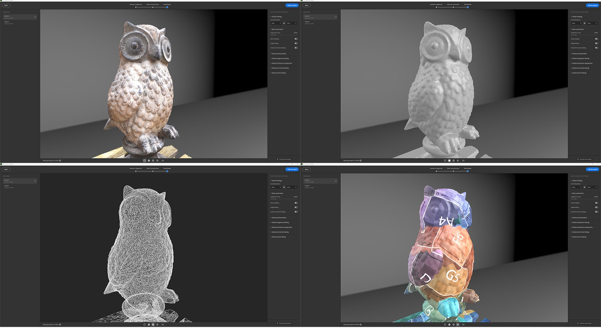

# Version 4.0

Mit **Substance 3D Sampler 4.0** können Sie 3D-Objekte mithilfe von Bildern aus der realen Welt mit automatischer Motivmaskierung, Texturzuordnung und Geometriedezimierung erstellen. Diese Version führt einige UX-Verbesserungen als neue Möglichkeiten in der Python-API ein.

*Freigabedatum: 31. Januar 2023*

## 3D-Aufnahme

In Substance 3D Sampler 4.0 können Sie jetzt 3D-Objekte aus Bildern erstellen.

Wir verfügen über integrierte Funktionen für Photogrammmetrie. Die Fotogrammetrie ist der technische Prozess, bei dem Messungen anhand von Bildern vorgenommen werden. So erzeugt Sampler 3D-Meshes aus einer Fotostrecke.

Alles, was du brauchst, ist eine Fotoreihe, die die sichtbaren Oberflächen eines Objekts einfängt - ein Smartphone oder eine DLSR-Kamera funktionieren hervorragend.

Entdecken Sie hier [&#128279;](../features-and-workflows/3d-capture.md) den Arbeitsablauf mit schrittweiser Anleitung .

## Lichter

### Automatische Maskierung.

Entfernen Sie den Hintergrund des zu 3D-Erfassung Objekts. Erstellen Sie eine automatisch generierte Maske des Objekts, nachdem Sie Ihre Bilder über die Registerkarte Maske importiert haben.

Die Verwendung von Masken hat viele Vorteile. Es ermöglicht, Merkmale zu erkennen und nur nicht maskierte Bereiche zu rekonstruieren.

{width="500px"}

### Definieren des Rekonstruktionsbereichs

Aktiviere einen Begrenzungsrahmen durch Umschalten des Fokusbereichs, nachdem die Bilder ausgerichtet wurden. Legen Sie den genauen Bereich fest, den Sie rekonstruieren möchten, und richten Sie ihn aus.

{width="500px"}

### Vernetzte Nachbearbeitung

Sobald Ihr 3D-Objekt rekonstruiert ist, optimieren Sie das Ergebnis mit automatischer Dezimation, UV-Entpackung und Backen.

Die Nachbearbeitung hilft Ihnen dabei, Ihre Gitter und Texturen an Ihre Bedürfnisse und die Art und Weise, wie Sie sie verwenden möchten, anzupassen und zu optimieren.

Das Ergebnis der Rekonstruktion kann ein Netz mit Millionen von Polygonen und bis zu 16K Texturen erzeugen. Oft ist dies nicht für Rendering, Echtzeit oder AR-Erlebnisse optimiert.

Der Nachbearbeitungsschritt verkettet automatisch 4 Schritte:

* Dezimation
* UV-Entpackung
* Reprojektion
* Baking

{width="500px"}

### Export in gängige Dateiformate

Exportiere deine rekonstruierten 3D-Objekte in allen gängigen Dateiformaten, um sie überall verwenden zu können.

{width="500px"}

## Ansichtsfenster

Die Größe von 2D- und 3D-Viewports kann geändert, ausgetauscht und vertikal gestapelt werden.

{width="500px"}

## Skripterstellung

Wir haben die Exportfunktion in 4 Bereiche unterteilt:

* Exportmaterial: `export_material`
* Exportumgebungslichter: `export_environment_light`
* Exportieren von Gittern mit oder ohne Texturen: `export_mesh` oder `export_3d_object`

Wir haben eine neue Funktion zum Importieren von Texturen mit einer bestimmten Verwendung hinzugefügt: `import_textures`

Sampler wird jetzt beim Start von Skripten und Plug-ins geladen, die in Pfaden gespeichert sind, die durch zwei Umgebungsvariablen definiert sind:

* `SAMPLER_PLUGIN_PATH`
* `SAMPLER_SCRIPT_PATH`

## Tutorials

## Versionshinweise

1. **0.0 Banane**

   *(veröffentlicht am 31. Januar 2022)*

   **Hinzugefügt**

* [3D-Erfassung] Erstellen von 3D-Objekten aus Bildern
* [3D-Erfassung] Dedizierter Assistent für 3D-Erfassungen
* [3D-Erfassung] Importieren oder generieren Sie Schwarzweißmasken auf Ihrem Datensatz.
* [3D-Erfassung] Ausrichtungsergebnis - Alle übereinstimmenden Funktionen als Punktwolke anzeigen
* [3D-Erfassung] Ausrichtungsergebnis - Kameras anzeigen und mit ihnen interagieren, die jedem ausgerichteten Foto zugeordnet sind
* [3D-Erfassung] Definieren des Wiederaufbaubereichs mit einem Begrenzungsrahmen-Widget
* [3D-Erfassung] Skalieren, Verschieben und Drehen auf allen Achsen des Begrenzungsrahmen-Widgets
* [3D-Erfassung] Festlegen der Geometriepräzision für das rekonstruierte Gitter
* [3D-Erfassung] Optimieren Sie Ihr Gitter und Ihre Texturen durch Erstellen einer neuen Version
* [3D-Erfassung] Jede der Versionen wird automatisch auf den Zielflächennummernsatz dezimiert
* [3D-Erfassung] Bei der Nachbearbeitung werden Texturen automatisch ausgepackt, neu projiziert und anschließend die üblichen Height- und AO-Informationen aus dem High-Poly-Gitter verbacken.
* [3D-Erfassung] Originalergebnis oder Originalversion zum Sampler-Projekt hinzufügen
* [3D-Erfassung] Neue Mesh-Nachbearbeitungsebene zum automatischen Dezimieren, Ausgliedern, Neuprojektieren von Texturen und Backen von Details der zugrunde liegenden Mesh-Ebene
* [3D-Erfassung] Neue Mesh-Transformationsebene zum Skalieren, Drehen oder Verschieben der zugrunde liegenden Mesh-Ebene
* [Export] Neues Exportfenster
* [Export] Dedizierte Einstellungen und Benutzeroberfläche je nach Elementtyp (Material, Umgebungslicht, Gitter)
* [Exportieren] Exportieren Sie das Gitter als USD, USDA, USDZ, glTF, glb, obj, fbx, stl
* [Exportieren] Definieren Sie den Materialtyp beim Exportieren von Substance-Dateien (SBSAR, SBS).
* [UI] Cache-Einstellungen in eine neue Registerkarte im Popup &quot;Voreinstellungen&quot; verschieben
* [Anwendung] 2D- und 3D-Viewports können jetzt vertikal skaliert, ausgetauscht und gestapelt werden.
* [Anwendung] Neue SAMPLER\_RESOURCES\_PATH-Umgebungsvariable zum Hinzufügen zusätzlicher Starter-Assets
* [Scripting] SAMPLER\_PLUGIN\_PATH- und SAMPLER\_SCRIPT\_PATH-Umgebungsvariablen zum Importieren von Plug-ins und Skripten beim Start hinzugefügt
* [Scripting] Hinzugefügte Exportfunktionen für Materialien, Umgebungslichter und 3D-Objekte
* [Scripting] Bezeichner, Standardwert, Minimal- und Maximalwerte, Beschriftungen und Enumerationswerte zu Parametern hinzugefügt
* [Skripterstellung] Funktion import\_textures hinzugefügt, um beim Importieren von Bildern eine benutzerdefinierte Verwendung einzugeben

**Fest**

* [Anwendung] Absturz beim Öffnen eines zuletzt verwendeten Projekts und Speichern im Bestätigungsdialogfeld
* [Anwendung] Dialogfeld &quot;Datei&quot; verhindert das Öffnen von .ssa-Dateien
* [Anwendung] Dateidialogfelder können in einem Hintergrundfenster in macOS angezeigt werden
* [Anwendung] Potenzieller Absturz beim Öffnen von 3.2-Projekten
* [Anwendung] Beim Auswählen einer Datei wird das Dialogfeld &quot;Datei&quot; geschlossen, bevor Warnungen angezeigt werden.
* [Verfügbare Parameter] Das Exportieren parametrischer Umgebungslichter funktioniert nicht
* [Ebenen] Der Link &quot;Zum Durchsuchen hier klicken&quot; im Ebenenstapel funktioniert nicht mehr
* [Ebenen] Das Malen mehrerer Bilder innerhalb derselben Ebene funktioniert manchmal nicht
* [Ebenen] Wenn Sie ein Bild in den Ebeneneigenschaften festlegen, wird die Miniaturansicht der Bildauswahl nicht aktualisiert
* [Ebenen] Das Anpassen eines als Ebene hinzugefügten Sampler-Elements funktioniert nicht
* [Projekt] Unerwünschte Aktualisierung von Elementen beim Öffnen eines Projekts
* [Scripting] Das Durchsuchen des Plug-in-Ordners schlägt unter Windows manchmal fehl
* [Scripting] Absturz bei Verwendung von &#39;open\_project()&#39; in einem Python-Skript
* [Scripting] JPEG-Export fehlt in der API
* [Skripterstellung] Das Protokollfenster ist nicht schreibgeschützt.
* [Skripterstellung] Der Parameterwert image\_picker funktioniert nicht
* [UI] Symbol für fehlende Elemente für Umgebungslichter im Projektfenster
* [UI] Dropdown-Liste &quot;An Designer-Format senden&quot; im Popup &quot;Voreinstellungen&quot; kann leer sein
* [UI] Einige Schaltflächen haben einen falschen Stil
* [UI] Die Beschriftung überlappt die Schaltflächen in Schaltflächengruppen-Widgets.
* [UI] Die QuickInfo-Position ist für &quot;Tools&quot; im Menü &quot;Physische Größe festlegen&quot; falsch
* [UI] Beim Ändern der Sprache ist das Dateimenü falsch ausgerichtet

**Bekannte Probleme**

* [3D-Erfassung] Bei Verwendung von Masken kann die Texturprojektion unterbrochen werden.
* [3D-Erfassung] Kleine Artefakte können auf Ihrem Objekt erscheinen, wenn Ihre Skalierung in der Gittertransformation zu klein ist
* [3D-Erfassung] Das exportierte Gitter kann sehr klein sein. Skalierung der Gittertransformation zurücksetzen und erneut exportieren
* [Farbwähler] Die Auswahl einer Farbe auf einem zweiten Monitor mit einer anderen Auflösung funktioniert möglicherweise nicht
* [Inhalt] Shape Light-Widget funktioniert nicht im sphärische Projektion-Modus
* [Interoperabilität] Material mit Versatz, der an Stager gesendet wird, verliert die Versatz-Steuerelemente.
