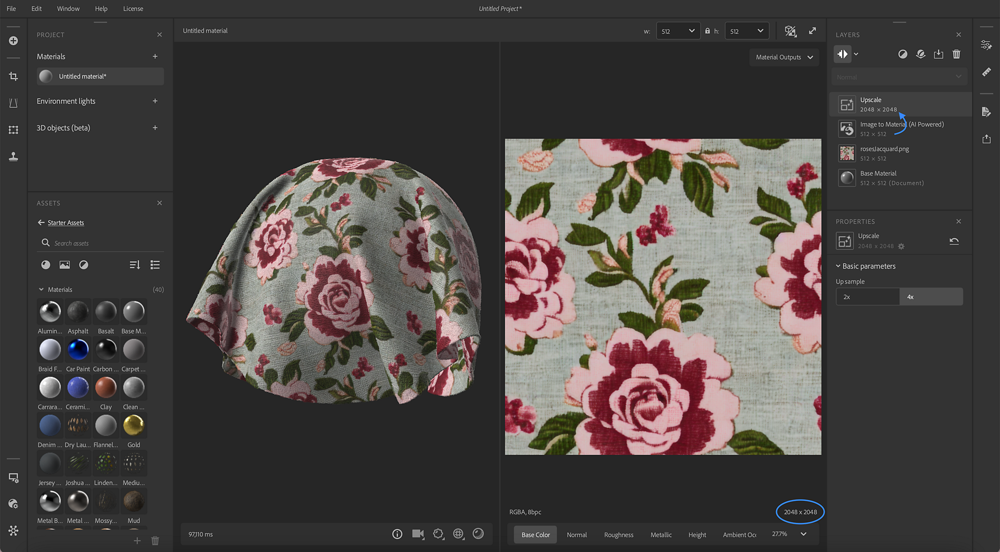

# Version 4.2

<b>Substance 3D Sampler 4.2</b> führt eine neue KI-gestützte Version von <b>Image auf Material</b> und eine neue <b>KI-Hochskalierung</b>-Funktion ein. Diese Version bietet die vollständige Kontrolle über die Auflösung pro Ebene.

*Freigabedatum: 05. September 2023*

## Bild auf Material - Neue Version

&quot;Bild zu Material&quot; generiert aus einem einzigen Material Videokanäle (Grundfarbe, Rauheit, Normal, Versatz und metallic) für Sie.

Die aktualisierte Version von &quot;Bild zu Material&quot; verbessert die Generierung des Materials und den Bereich der unterstützten Materialien.

&quot;Bild zu Material&quot; wurde jetzt für alle Material-Typen geschult und erzielt bessere Ergebnisse für Stoff, Kunststoff, Holz usw.

Die aktualisierte Version verfügt über einen neuen Parameter, mit dem Sie den Kanaltyp auswählen können, um alle Materialien genau zu generieren und den Bereich automatisch anzupassen.

## KI-Upscale

Dank der neuen Ebene &quot;Hochskalieren&quot; verbessert Sampler die Funktionen Ihres Materials oder Bildes, indem die Auflösung Ihres Elements (Material oder Bild) mit 2 oder 4 multipliziert wird.

Dies ermöglicht es, die Qualität und den Detailgrad von Texturen mit niedriger Auflösung zu erhöhen, um bei der Kartenvergrößerung die Kohärenz der Funktionen zwischen den Texturen zu wahren.

Der Hochskalierungsfilter verbessert die Grundfarbe, die Normale, das Height, die Rauheit und die metallic Kanäle Ihres Materials.

Um die Ergebnisqualität zu maximieren, sollte der Hochskalierungsfilter für Daten (Material und Bild) mit ihrer Originalauflösung verwendet werden, ohne dass zuvor eine Auflösungsänderung vorgenommen wurde.

## Ebenenauflösung

Mit dem neuen System der Ebenenauflösung haben Sie die volle Kontrolle über die Auflösung jeder Ebene. Eine Ebene nimmt die Auflösung Ihrer Dokumentgröße oder die Auflösungen der darunter liegenden Ebene an.

Die Auflösung wird auf jeder Ebene angezeigt, um den Einfluss Ihrer Arbeit auf die Auflösung Ihres Materials ganz einfach zu visualisieren.

Auf diese Weise können Sie die Qualität Ihrer Materials, aber auch die Leistung beim Bearbeiten Ihrer Elemente erhöhen.

## Tutorials

## Versionshinweise

<b>4.2 DORAYAKI</b>

*(Freigegeben: 05. September 2023)*

<b>Hinzugefügt</b>:

* [Content] Wesentlich verbesserte Filter &quot;Bild zu Material&quot; (AI) und &quot;Delighter&quot;
* [Inhalt] Neuer Hochskalierungsfilter
* [Inhalt] Der Zuschneidefilter hat jetzt eine dynamische Ausgabeauflösung.
* [Vorlage zur Erstellung von Materialien] Einstellung &quot;Dokumentgröße hinzufügen&quot;.
* [Vorlage für Material-Erstellung] Neue Umschalttaste &quot;Zuschnitt hinzufügen&quot;.
* [Vorlage für Material-Erstellung] Neuer Schalter &quot;Material hochskalieren&quot;
* [Vorlage zum Erstellen von Materialien] Importierte Bildgröße anzeigen
* [Bilderstellungsvorlage] Feedback geben, wenn einige importierte Materialien nicht verwendet werden können
* [Vorlage zur Bilderstellung] Warnung bei inkonsistenten Bildgrößen
* [Vorlage zum Erstellen von Materialien] Neue Warnhinweise und QuickInfos
* [Ebenen] Zeigt die Auflösung der Ebenen im Ebenenstapel an.
* [Ebenen] Die Ebenenberechnungsauflösung kann jetzt entweder auf Dokumentgröße oder Eingabegröße eingestellt werden.
* [Ebenen] Anzeigen der Ebenenauflösung im Ebenenstapel
* [Ebenen] Ändern Sie ggf. eine Richtlinie zur Ebenenauflösung auf &quot;Dokument&quot; oder &quot;Ebeneneingabe&quot;.
* [Ebenen] Warnt den Benutzer, wenn manuell ein Hochskalieren-Filter hinzugefügt wird, und stellt eine Dokumentation bereit.
* [Ebenen] Warnt den Benutzer, wenn eine lineare Hochskalierung durchgeführt wird, und bietet an, stattdessen den Filter Hochskalieren zu verwenden
* [Ebenen] Die Berechnung einer AI-Ebene (Image to Material) kann jetzt schneller abgebrochen werden, um die Renderzeiten bei der Anpassung des Ebenenstapels zu verbessern
* [Ebenen] Die Berechnung einer Hochskalierungsebene kann jetzt schneller abgebrochen werden, um die Renderzeiten beim Anpassen des Ebenenstapels zu verbessern
* [Exportieren] Außerkraftsetzungsauflösung für exportierte Texturen zulassen
* [Export] Kanäle in die Exportliste sind jetzt sortiert
* [Exportieren] Anzeigen der Kanalauflösung in der Liste der zu exportierenden Kanäle
* [Anwendung] Neue Voreinstellung zum Aktivieren oder Deaktivieren von GPU-beschleunigten neuronalen Netzwerken
* [UI] Dropdown-Listen mit verbesserter Auflösung
* [UI] Neue Symbole für die Filter &quot;Mesh Transformieren&quot;, &quot;Mesh Post Process&quot; und &quot;Weave&quot;
* [UI] Benennen Sie das Bedienfeld &quot;Freigeben&quot; in &quot;Exportieren&quot; um.
* [Scripting] Unterstützung der Ebenenausgabe-Auflösung zur Export-API hinzufügen
* [Scripting] Der Bildimport-API wurden Zuschneiden, Hochskalieren und Dokumentgröße hinzugefügt
* [Onboarding] Neue Tutorials
* [Onboarding] Update des Begrüßungsbildschirms und der Bildschirminhalte zu Neuerungen
* [Engine] Substance Engine auf Version 9.0.1 aktualisieren

<b>Fest:</b>

* [3D-Erfassung] Verbessern der Benennung von Genauigkeits-Optionen in den Ausrichtungseinstellungsparametern
* [Anwendung] Das Importieren von Bildern mit nicht mehreren 16 Dimensionen kann zu einem Absturz führen
* Absturz [Anwendung] beim Duplizieren eines Assets im Projektfenster
* Absturz [Anwendung] beim Wechseln von Elementen im Projektfenster
* [Inhalt] Das Malen einer benutzerdefinierten Maske für den Snow-Filter funktioniert nicht richtig
* [Freigelegte Parameter] Änderungen an Freigelegten Parametern können beim Wechseln von Materialien verloren gehen.
* [Interoperabilität] Das Senden eines Materials aus dem Exportbedienfeld kann zu einem Absturz führen
* [Ebenen] Die inhaltsbasierte Füllung wird nicht mehr berechnet, wenn von einem einzelnen Bildeingang zu einem Material-Eingang gewechselt wird
* [Ebenen] Absturz nach dem Duplizieren eines Umgebungslichts, das ein Material enthält
* [Ebenen] Die Bildimportebene zeigt im Eigenschaftenfenster einen falschen Bildnamen an, wenn die Bilddatei umbenannt wurde
* [Ebenen] Manchmal wird ein Spinner auf einer inaktiven Ebene angezeigt
* [Ebenen] Manchmal funktioniert das Ändern der Ausgabenutzung eines Bildes in einer Bildimportebene nicht
* [Ebenen] Tippfehler im Fenster &quot;Erstellungsvorlage&quot;
* [UI] 3D-Viewport-Onboarding-QuickInfo hat Fokusprobleme
* [UI] Der Bildname kann überlaufen, wenn der Dateiname zu lang ist
* [UI] Geringfügige Probleme mit dem Layout der Pinselsymbolleiste bei Verwendung des Radiergummis
* [UI] Zeichenfolgen werden in einigen Sprachen im Bedienfeld &quot;Anzeigeeinstellungen&quot; abgeschnitten
* [UI] Während das Viewport-Tooltip angezeigt wird, wird durch Drücken von &quot;Leertaste&quot; ein neues Projekt erstellt
