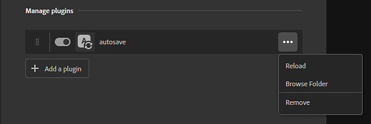

# Installierte Plug-ins und Skripte verwalten

Um Plug-ins zu installieren, zu ändern oder zu entfernen, verwenden Sie Bearbeiten > Voreinstellungen und wählen Sie dann Plug-ins und Skripten.

Im Bedienfeld Plug-ins und Skripte können Sie das Protokollbedienfeld aktivieren, in dem die Ausgabe von Plug-ins angezeigt wird. Dies kann bei der Fehlerbehebung und beim Debuggen nützlich sein. Nach der Aktivierung können Sie das Protokollfenster über die rechte Leiste in der Hauptoberfläche von Sampler öffnen. Das Protokollfenster kann wie andere Sampler-Fenster angedockt werden.

## Plug-ins und Skripte

Der Hauptunterschied zwischen Plug-ins und Skripten besteht darin, dass Plug-ins UI-Elemente enthalten, die von Skripten nicht unterstützt werden. Plugins benötigen mindestens eine PY- und eine QML-Datei. Die QML-Datei definiert die UI-Elemente, während die PY-Datei das Verhalten des Plug-ins definiert. Skripte hingegen bestehen nur aus einer PY-Datei.

Die UI-Elemente eines Plug-ins bedeuten, dass das Verhalten des Plug-ins durch die Verwendung von Parametern geändert werden kann. Beispielsweise verfügt das Beispiel-Plug-in für das automatische Speichern über Steuerelemente, mit denen Sie die Zeit zwischen dem automatischen Speichern ändern können. Plug-ins werden Teil der Sampler-Oberfläche und können wie herkömmliche Sampler-Bedienfelder angedockt und verschoben werden.

Skripte lassen dieses Maß an Flexibilität nicht zu, führen aber stattdessen eine bestimmte Aufgabe aus. Beispielsweise verhält sich das Skript Alle exportieren immer auf die gleiche Weise, wenn es aufgerufen wird. Auf Skripte kann über die obere Menüleiste zugegriffen werden. Das Menü &quot;Skript&quot; ist nur verfügbar, wenn Skripte zu Sampler hinzugefügt wurden.

## Plug-ins verwalten

Standardmäßig ist die einzige verfügbare Option &quot;Plug-in hinzufügen&quot;. Daraufhin wird ein Explorer geöffnet, in dem Sie eine zu ladende PY-Datei auswählen können.

>[!NOTE]
>
> Für Plug-ins ist sowohl eine PY- als auch eine QML-Datei erforderlich. Wenn Sie eine zu importierende PY-Datei auswählen, durchsucht Sampler den Ordner nach einer QML-Datei. Wenn keine QML-Datei gefunden wird, schlägt das Laden des Plug-ins fehl.

Sobald ein Plug-in installiert wurde, sind einige Optionen verfügbar:

* Plugins können neu angeordnet werden, indem Sie den Griff auf der linken Seite des Plugins ziehen.
* Mit dem Umschalter Plug-ins aktivieren oder deaktivieren.
* Verwenden Sie die Menüschaltfläche rechts neben jedem Plug-in, um den Ordnerpfad des Plug-ins neu zu laden, zu entfernen oder zu öffnen.

Installierte Plug-ins werden anfänglich in der rechten Leiste der Hauptbenutzeroberfläche von Sampler angezeigt. Von dort aus können Sie das Plug-in-Bedienfeld genau wie die standardmäßigen Sampler-Bedienfelder öffnen, andocken und verschieben.

## Verwalten von Skripten

Skripte können ähnlich wie Plug-ins verwaltet werden.

Sobald ein Skript installiert wurde, stehen einige Optionen zur Verfügung:

* Ordnen Sie Skripte mit dem Griff auf der linken Seite des Skripts neu an.
* Schalten Sie das Skript mit dem Umschalter ein oder aus.
* Verwenden Sie die Menüschaltfläche rechts neben jedem Skript, um das Skript zu entfernen, oder öffnen Sie den Speicherort des Ordners, in dem sich das Skript befindet.
* Beim Import werden Skripte in **%\AppData\Roaming\Adobe\Adobe Substance 3D Sampler\scripts** kopiert
* Um das Skript zu bearbeiten, sollten Sie das von Sampler kopierte Skript ändern
