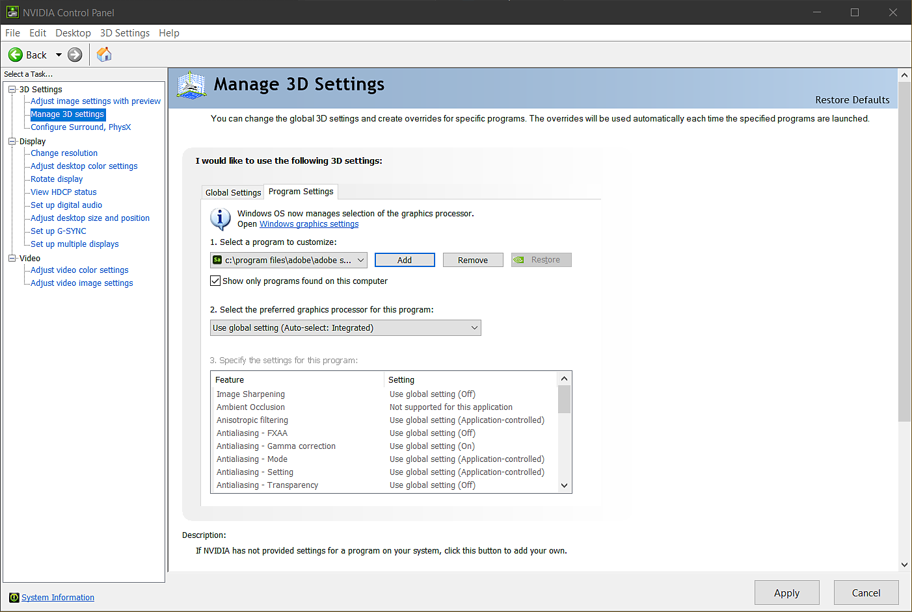

# NVIDIA-Treibereinstellungen

Wenn Sie eine NVIDIA-GPU verwenden, aber feststellen, dass die Leistung langsam ist, gibt es zwei häufige Ursachen:

1. Treiber fehlen oder sind nicht aktuell.
1. Sampler verwendet die falsche GPU

## Treiber aktualisieren

Aktualisieren Ihrer NVIDIA-Treiber:

1. Rufen Sie die Seite zum Herunterladen von NVIDIA-Treibern auf: <https://www.nvidia.com/Download/index.aspx?lang=en-us>
1. Wählen Sie Ihr GPU-Modell aus und laden Sie die Treiber herunter.
1. Installieren Sie die Treiber mit der heruntergeladenen Datei.

Sobald die neuesten Treiber installiert sind, öffnen Sie Sampler, um zu sehen, ob sich die Leistung verbessert hat. Wenn die Leistung langsam ist, verwendet Sampler möglicherweise die falsche GPU.

## Sampler konfigurieren

Gehen Sie wie folgt vor, um zu überprüfen, welche GPU Sampler verwendet:

1. Öffnen Sie die NVIDIA-Systemsteuerung. Führen Sie einen der folgenden Schritte aus, um die NVIDIA-Systemsteuerung zu öffnen:
   1. Suchen Sie über das Startmenü nach der NVIDIA-Systemsteuerung.
   1. Klicken Sie in der Taskleiste mit der rechten Maustaste auf das Geforce-Symbol und wählen Sie NVIDIA-Systemsteuerung aus.
1. Wählen Sie in der NVIDIA-Systemsteuerung im linken Menü 3D-Einstellungen verwalten aus.
1. Wählen Sie die Registerkarte Programmeinstellungen.
1. Über die Dropdown-Liste unter Wählen Sie ein Programm zum Anpassen aus können Sie nach Sampler suchen.
1. Wenn Sampler nicht in der Dropdown-Liste aufgeführt ist, verwenden Sie die Option Hinzufügen.
   1. Suchen Sie nach dem Installationsordner von Sampler (der Standardinstallationsordner ist **C:/Programme/Adobe/Adobe Substance 3D Sampler**).
   1. Wählen Sie **Adobe Substance 3D Sampler.exe** am Installationsort aus.
1. Wählen Sie bei ausgewähltem Sampler unter &quot;Bevorzugten Grafikprozessor für dieses Programm auswählen:&quot; die Option &quot;NVIDIA-Hochleistungsprozessor&quot;.
1. Klicken Sie auf Anwenden.

Wenn Sie diesen Vorgang ausgeführt haben, öffnen Sie Sampler, um zu sehen, ob sich die Leistung verbessert hat.
